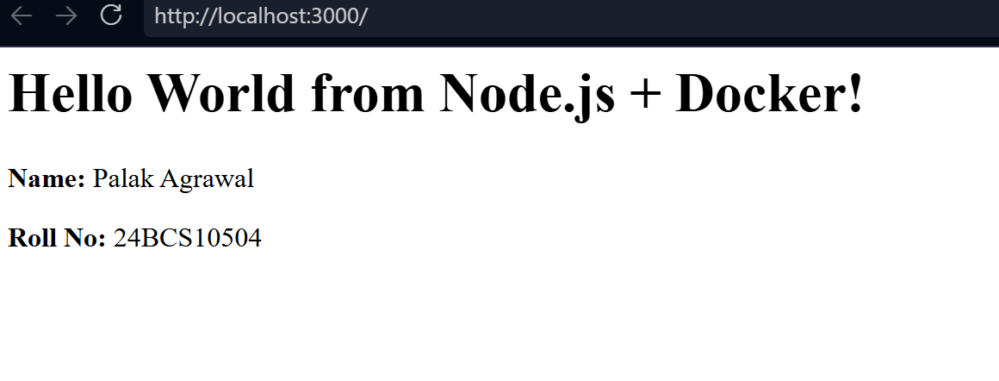
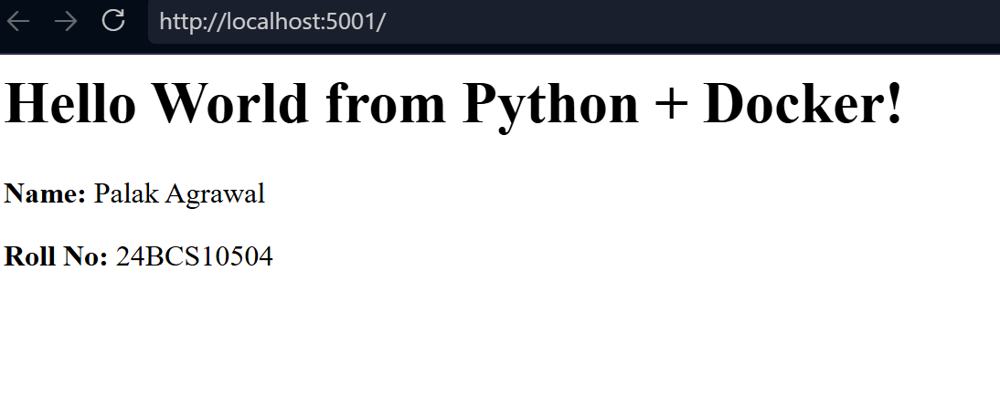
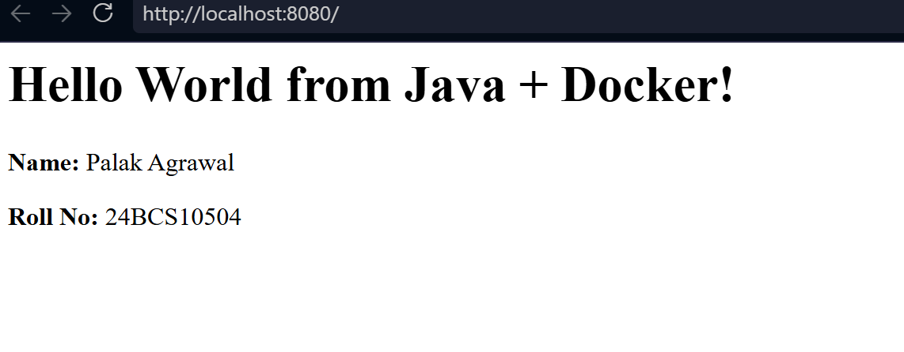
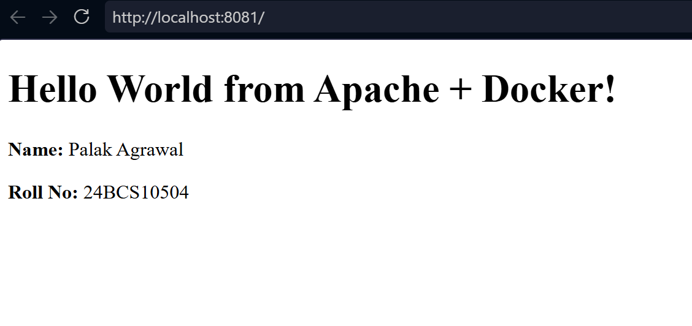
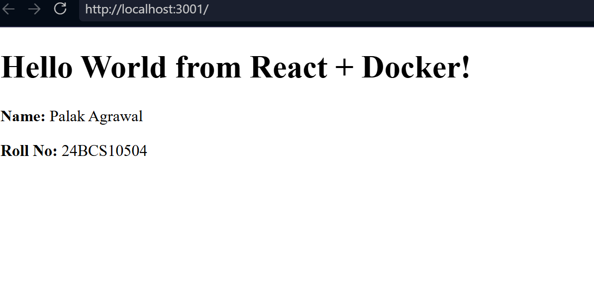
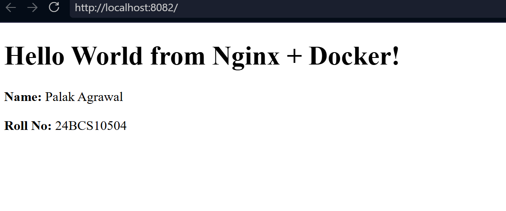

# Docker Images — Hello World Applications

**Name:** Palak Agrawal
**Roll No.:** 24BCS10504

## Overview

This practical focused on creating and running simple Hello World web
applications using Docker.

Six different applications were containerized:

1. Node.js
2. Python
3. Java
4. Apache HTTP Server
5. React
6. Nginx

Each application has its own folder, its own application code and its own
Dockerfile. Every image was built, run as a container, and verified in a
browser.

## Applications and Ports

| Application | Folder | Image | Host port | Container port |
|---|---|---|---|---|
| Node.js | `nodejs-app/` | `node` | 3000 | 3000 |
| Python (Flask) | `python-app/` | `hello-python` | 5001 | 5000 |
| Java | `java-app/` | `hello-java` | 8080 | 8080 |
| Apache | `apache-app/` | `hello-apache` | 8081 | 80 |
| React | `React-app/` | `hello-react` | 3001 | 80 |
| Nginx | `nginx-app/` | `hello-nginx` | 8082 | 80 |

---

# 1. Node.js Application

## Objective

Create a simple Node.js web application, containerize it using Docker, and
access it through a browser.

## Application Code

    const http = require("http");

    const server = http.createServer((req, res) => {
        res.writeHead(200, { "Content-Type": "text/html" });

        res.end(`
            <h1>Hello World from Node.js + Docker!</h1>
            
<strong>Name:</strong> Palak Agrawal

            
<strong>Roll No:</strong> 24BCS10504

        `);
    });

    server.listen(3000, () => {
        console.log("Server running on port 3000");
    });

## Dockerfile

    FROM node:22-alpine

    WORKDIR /app

    COPY package.json .
    COPY server.js .

    EXPOSE 3000

    CMD ["npm", "start"]

## Build and Run

    docker build -t node .
    docker run -d --name node-container -p 3000:3000 node

The application was accessed at `http://localhost:3000`.

## Output

The Node.js application successfully displayed the Hello World webpage.

---

# 2. Python Application

## Objective

Create a simple Python web application using Flask, containerize it using
Docker, and access it through a browser.

## Application Code

    from flask import Flask

    app = Flask(__name__)

    @app.route("/")
    def hello():
        return """
        <h1>Hello World from Python + Docker!</h1>
        
<strong>Name:</strong> Palak Agrawal

        
<strong>Roll No:</strong> 24BCS10504

        """

    app.run(host="0.0.0.0", port=5000)

## Requirements

    flask

## Dockerfile

    FROM python:3.12-slim

    WORKDIR /app

    COPY requirements.txt .
    RUN pip install --no-cache-dir -r requirements.txt

    COPY app.py .

    EXPOSE 5000

    CMD ["python", "app.py"]

## Build and Run

Port `5001` was used on the host because port `5000` was already in use.

    docker build -t hello-python .
    docker run -d --name hello-python-container -p 5001:5000 hello-python

The application was accessed at `http://localhost:5001`.

## Output

The Python application successfully displayed the Hello World webpage.

---

# 3. Java Application

## Objective

Create a simple Java web application, containerize it using Docker, and access
it through a browser.

## Application Code

The application uses Java's built-in `HttpServer` to create a lightweight HTTP
server, so no external framework is needed.

    import com.sun.net.httpserver.HttpServer;
    import java.io.IOException;
    import java.io.OutputStream;
    import java.net.InetSocketAddress;

    public class Main {
        public static void main(String[] args) throws IOException {
            HttpServer server = HttpServer.create(new InetSocketAddress(8080), 0);

            server.createContext("/", exchange -> {
                String response = """
                    <h1>Hello World from Java + Docker!</h1>
                    
<strong>Name:</strong> Palak Agrawal

                    
<strong>Roll No:</strong> 24BCS10504

                    """;

                exchange.sendResponseHeaders(200, response.getBytes().length);

                try (OutputStream os = exchange.getResponseBody()) {
                    os.write(response.getBytes());
                }
            });

            server.start();

            System.out.println("Java server running on port 8080");
        }
    }

## Dockerfile

    FROM eclipse-temurin:21-jdk-alpine

    WORKDIR /app

    COPY Main.java .

    RUN javac Main.java

    EXPOSE 8080

    CMD ["java", "Main"]

The `RUN javac Main.java` step compiles the source during the image build, so
the container starts an already-compiled class.

## Build and Run

    docker build -t hello-java .
    docker run -d --name hello-java-container -p 8080:8080 hello-java

The application was accessed at `http://localhost:8080`.

## Output

The Java application successfully displayed the Hello World webpage.

---

# 4. Apache Web Server

## Objective

Create a simple webpage and serve it using the Apache HTTP Server running
inside a Docker container.

## HTML Application

    <!DOCTYPE html>
    <html>
      <head>
        <title>Apache Docker App</title>
      </head>
      <body>
        <h1>Hello World from Apache + Docker!</h1>
        
<strong>Name:</strong> Palak Agrawal

        
<strong>Roll No:</strong> 24BCS10504

      </body>
    </html>

## Dockerfile

    FROM httpd:2.4-alpine

    COPY index.html /usr/local/apache2/htdocs/

    EXPOSE 80

Apache serves files from `/usr/local/apache2/htdocs/`, so copying the HTML
file there is all that is required. There is no `CMD` because the base image
already starts Apache.

## Build and Run

    docker build -t hello-apache .
    docker run -d --name hello-apache-container -p 8081:80 hello-apache

The application was accessed at `http://localhost:8081`.

## Output

The Apache web server successfully served the Hello World webpage.

---

# 5. React Application

## Objective

Create a React application, containerize it using Docker, and access it
through a browser.

## Application Code

`src/App.jsx`:

    export default function App() {
      return (
        

          <h1>Hello World from React + Docker!</h1>
          

            <strong>Name:</strong> Palak Agrawal
          

          

            <strong>Roll No:</strong> 24BCS10504
          

        

      );
    }

`src/main.jsx` mounts the component into the page:

    import React from "react";
    import { createRoot } from "react-dom/client";
    import App from "./App.jsx";

    createRoot(document.getElementById("root")).render(<App />);

## Dockerfile (multi-stage)

React source code cannot be served directly to a browser — it has to be
compiled first. That makes this a two-stage build.

    # ---------- Stage 1: build the React app ----------
    FROM node:22-alpine AS build

    WORKDIR /app

    COPY package.json .
    RUN npm install

    COPY vite.config.js .
    COPY index.html .
    COPY src ./src

    RUN npm run build

    # ---------- Stage 2: serve the built files ----------
    FROM nginx:alpine

    COPY --from=build /app/dist /usr/share/nginx/html

    EXPOSE 80

Stage 1 installs the dependencies and runs `vite build`, which compiles the
JSX into plain JavaScript in a `dist/` folder. Stage 2 starts from a clean
Nginx image and copies **only** `dist/` across.

The result is that Node.js, npm and `node_modules` never appear in the final
image — it contains just Nginx and the compiled files.

## Build and Run

    docker build -t hello-react .
    docker run -d --name hello-react-container -p 3001:80 hello-react

The application was accessed at `http://localhost:3001`.

## Output

The React application successfully displayed the Hello World webpage.

Something I noticed while testing: `curl http://localhost:3001` returns only an
empty `

` and a `<script>` tag, not the heading. That is
correct behaviour — React builds the page in the browser by running
JavaScript, so the text only appears once the script executes. The browser
shows it; `curl` does not run JavaScript, so it cannot.

---

# 6. Nginx Application

## Objective

Create a simple webpage and serve it using Nginx running inside a Docker
container.

## HTML Application

    <!DOCTYPE html>
    <html>
      <head>
        <title>Nginx Docker App</title>
      </head>
      <body>
        <h1>Hello World from Nginx + Docker!</h1>
        
<strong>Name:</strong> Palak Agrawal

        
<strong>Roll No:</strong> 24BCS10504

      </body>
    </html>

## Dockerfile

    FROM nginx:alpine

    COPY index.html /usr/share/nginx/html/

    EXPOSE 80

## Build and Run

    docker build -t hello-nginx .
    docker run -d --name hello-nginx-container -p 8082:80 hello-nginx

The application was accessed at `http://localhost:8082`.

## Output

Nginx successfully served the Hello World webpage.

## Apache vs Nginx

Both are web servers and both Dockerfiles are three lines, but the web root
differs:

| | Apache | Nginx |
|---|---|---|
| Base image | `httpd:2.4-alpine` | `nginx:alpine` |
| Web root | `/usr/local/apache2/htdocs/` | `/usr/share/nginx/html/` |

Copying the HTML file to the wrong path gives the default welcome page instead
of an error, which makes the mistake easy to miss.

---

# Docker Concepts Practiced

## Dockerfile

A Dockerfile contains the instructions used to build a Docker image.

| Instruction | Purpose |
|---|---|
| `FROM` | Specifies the base image |
| `WORKDIR` | Sets the working directory inside the container |
| `COPY` | Copies files into the image |
| `RUN` | Executes a command during image build |
| `EXPOSE` | Documents the port the application uses |
| `CMD` | The default command run when the container starts |
| `AS` / `COPY --from` | Names a build stage and copies files between stages |

## RUN vs CMD

This tripped me up until I compared the Java and React Dockerfiles:

- `RUN` executes while the **image is being built**. `RUN javac Main.java` and
  `RUN npm run build` both happen once, at build time, and their results are
  baked into the image.
- `CMD` is what runs when the **container starts**, every time.

## Build

    docker build -t <image-name> .

The `.` at the end is the build context — the folder Docker sends to the
daemon and reads files from.

## Run

    docker run -d --name <container-name> -p <host-port>:<container-port> <image-name>

`-d` runs in the background, `--name` gives the container a fixed name instead
of a random one, `-p` maps the ports.

## Port Mapping

Port mapping connects a port on the host machine to a port inside the
container. The order is **host:container**.

For example, the Python application used:

    Host Port 5001 → Container Port 5000

The application inside the container still listens on 5000. Only the outside
address changed, which is how two containers that both use port 80 internally
(Apache and Nginx) can run at the same time on 8081 and 8082.

---

# Verification

Images built:

    docker images

Running containers:

    docker ps

All six containers ran at the same time, each on its own host port, and each
application was confirmed in a browser.

---

# Directory Structure

    Docker-Fundamental/

    ├── nodejs-app/
    │   ├── Dockerfile
    │   ├── package.json
    │   └── server.js
    │
    ├── python-app/
    │   ├── Dockerfile
    │   ├── app.py
    │   └── requirements.txt
    │
    ├── java-app/
    │   ├── Dockerfile
    │   └── Main.java
    │
    ├── apache-app/
    │   ├── Dockerfile
    │   └── index.html
    │
    ├── React-app/
    │   ├── Dockerfile
    │   ├── .dockerignore
    │   ├── package.json
    │   ├── vite.config.js
    │   ├── index.html
    │   └── src/
    │       ├── App.jsx
    │       └── main.jsx
    │
    ├── nginx-app/
    │   ├── Dockerfile
    │   └── index.html
    │
    ├── images/
    │   ├── NodeApp.png
    │   ├── PythonApp.png
    │   ├── JavaApp.png
    │   ├── ApacheApp.png
    │   ├── ReactApp.png
    │   └── NginxApp.png
    │
    └── readme.md

---

# What I Learned

1. A Dockerfile is a recipe — the same six instructions handle six very
   different technology stacks.
2. Static sites (Apache, Nginx) need only a base image and a `COPY`. No `CMD`
   is needed because the base image already starts the server.
3. Compiled and bundled applications (Java, React) need a `RUN` step to build
   during the image creation.
4. Multi-stage builds keep build tools out of the final image. The React image
   ships Nginx and static files only, with no Node.js inside.
5. Port mapping is what allows several containers using the same internal port
   to run side by side.
6. A container without a port mapping is unreachable from the browser even
   though it is running perfectly.

---

# Result

Six applications were successfully containerized, run and verified through a
web browser:

- Node.js
- Python (Flask)
- Java
- Apache HTTP Server
- React
- Nginx

---

# Author

**Palak Agrawal**

**Roll No.: 24BCS10504**
