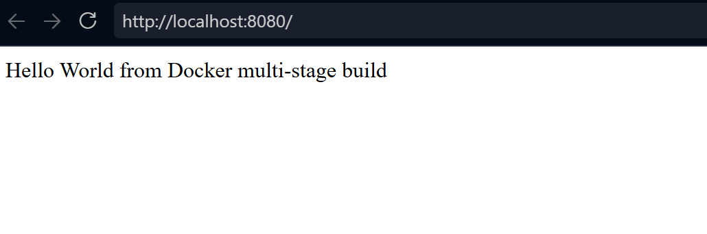
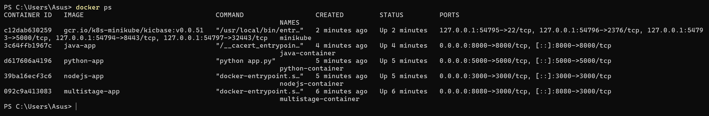

# Task 1 — Run a Multi-Stage Dockerfile

**Name:** Palak Agrawal
**Enrollment Number:** 24BCS10504

## Objective

Build an image from a multi-stage Dockerfile, run a container from it, access
the application, and confirm with `docker ps` that it is running on port 8080.

The application should display:

```
Hello World from Docker multi-stage build
```

## What the Dockerfile does

The build is split into two stages:

- **Stage 1 (`build`)** — starts from `node:18-alpine` and runs `npm install`
  to fetch the dependencies.
- **Stage 2 (`runtime`)** — starts from a *fresh* `node:18-alpine` and copies
  over only `node_modules`, `server.js` and `package.json` from stage 1.

Because stage 2 begins from a clean image, nothing from the build stage ends
up in the final image except the three things explicitly copied. No npm cache,
no build tooling, no dev dependencies.

The two stages are linked by naming the first one:

```dockerfile
FROM node:18-alpine AS build
...
COPY --from=build /app/node_modules ./node_modules
```

## 1. Build the image

From inside `task1-multistage-build/`:

```bash
docker build -t multistage-app .
```

The `-t` flag tags the image with a name. The `.` is the build context — the
folder Docker reads the Dockerfile and source files from.

## 2. Run the container

```bash
docker run -d --name multistage-container -p 8080:3000 multistage-app
```

| Flag | Meaning |
|---|---|
| `-d` | Detached — runs in the background |
| `--name` | Fixed container name instead of a random one |
| `-p 8080:3000` | Host port 8080 → container port 3000 |

The application inside the container listens on port 3000. The mapping is what
makes it reachable on 8080 from the browser.

## 3. Access the application

```
http://localhost:8080
```

Output:

```
Hello World from Docker multi-stage build
```



## 4. Verify the running container

```bash
docker ps
```

The row for `multistage-container` shows `PORTS` as `0.0.0.0:8080->3000/tcp`,
confirming the application is running on port 8080.



## Why use a multi-stage build

The dependencies have to be installed somewhere, but `npm install` also leaves
behind a cache and tooling that the running application never uses. A
single-stage image would ship all of it.

With two stages, the build happens in a container that is discarded once the
image is built. Only the files named in `COPY --from` survive. The result is a
smaller image with a smaller attack surface, because anything not present
cannot be exploited.

The same pattern appears elsewhere in this repository:

- `Docker-Fundamental/React-app/` — Node builds the React bundle, then Nginx
  serves the compiled output with no Node in the final image
- `task3-multi-app-deployment/java-app/` — the JDK compiles `Main.java`, then
  the smaller JRE runs the compiled class

## Cleanup

```bash
docker stop multistage-container
docker rm multistage-container
```

---

**Palak Agrawal**
**24BCS10504**
