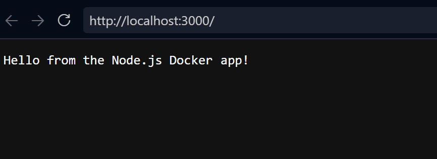
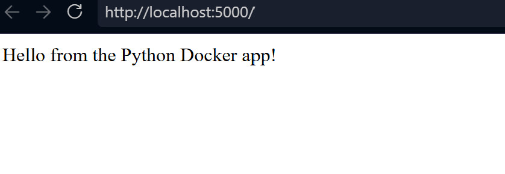
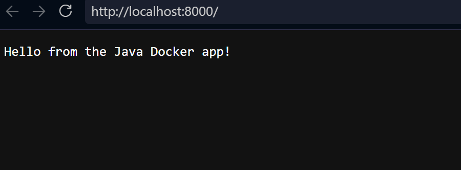

# Task 3 — Deploying 3 Different Application Types with Docker

**Name:** Palak Agrawal
**Enrollment Number:** 24BCS10504

## Objective

Deploy at least three different types of application using Docker, each in its
own container, running at the same time.

| App | Folder | Base image | Port |
|---|---|---|---|
| Node.js | `nodejs-app/` | `node:18-alpine` | 3000 |
| Python (Flask) | `python-app/` | `python:3.12-slim` | 5000 |
| Java | `java-app/` | `eclipse-temurin:17` | 8000 |

Run each block from inside its own folder.

## Node.js app

```bash
cd nodejs-app
docker build -t nodejs-app .
docker run -d --name nodejs-container -p 3000:3000 nodejs-app
curl http://localhost:3000
```

Output: `Hello from the Node.js Docker app!`

The app uses Node's built-in `http` module, so it has no dependencies and the
Dockerfile needs no `npm install` — just copy `server.js` and run it.



## Python app

```bash
cd python-app
docker build -t python-app .
docker run -d --name python-container -p 5000:5000 python-app
curl http://localhost:5000
```

Output: `Hello from the Python Docker app!`

This one does have a dependency — Flask — so the Dockerfile copies
`requirements.txt` and runs `pip install` before copying the application code.
Copying the requirements file first means Docker can cache that layer: if only
`app.py` changes later, the install step is not repeated.



## Java app

```bash
cd java-app
docker build -t java-app .
docker run -d --name java-container -p 8000:8000 java-app
curl http://localhost:8000
```

Output: `Hello from the Java Docker app!`

Java is the most involved of the three because the source has to be compiled
before it can run. The Dockerfile uses a multi-stage build:

```dockerfile
FROM eclipse-temurin:17-jdk-alpine AS build
COPY Main.java ./
RUN javac Main.java

FROM eclipse-temurin:17-jre-alpine
COPY --from=build /app/Main.class ./
CMD ["java", "Main"]
```

The **JDK** (Java Development Kit) contains `javac` and is needed to compile.
The **JRE** (Java Runtime Environment) only runs compiled classes and is
considerably smaller. Since compilation happens at build time, the final image
only needs the JRE.



## Verify all three running together

```bash
docker ps
```

`nodejs-container`, `python-container` and `java-container` all show as `Up`,
each with its own port mapping. This is the key evidence for the task.

## What I understood from this

Each application needs a completely different runtime — a JavaScript engine, a
Python interpreter, a Java Virtual Machine. Installing all three directly on
one machine means managing three sets of versions and dependencies that can
conflict.

In containers they do not interact at all. Each image carries its own runtime,
and they share only the host kernel. The Java app cannot break the Python app,
because from inside each container the other does not exist.

The three Dockerfiles also show three levels of complexity:

| App | Build step needed? | Why |
|---|---|---|
| Node.js | None | Interpreted, no dependencies |
| Python | `pip install` | Interpreted, but needs Flask |
| Java | `javac` | Compiled — source cannot run directly |

## Cleanup

```bash
docker stop nodejs-container python-container java-container
docker rm nodejs-container python-container java-container
```

---

**Palak Agrawal**
**24BCS10504**
