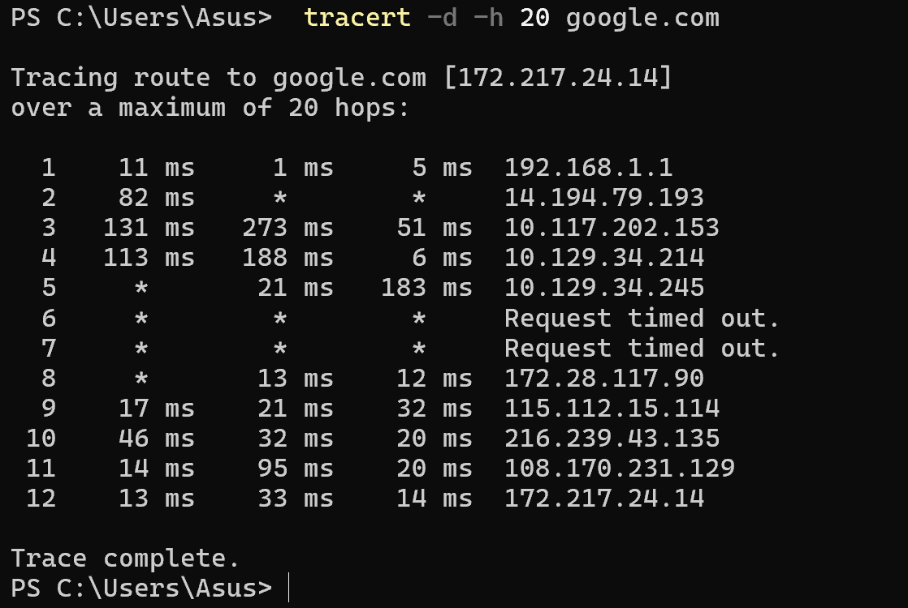
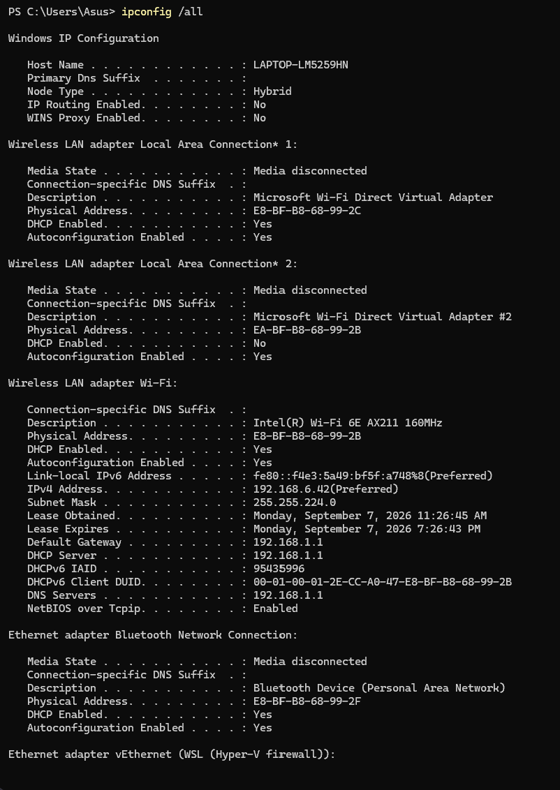
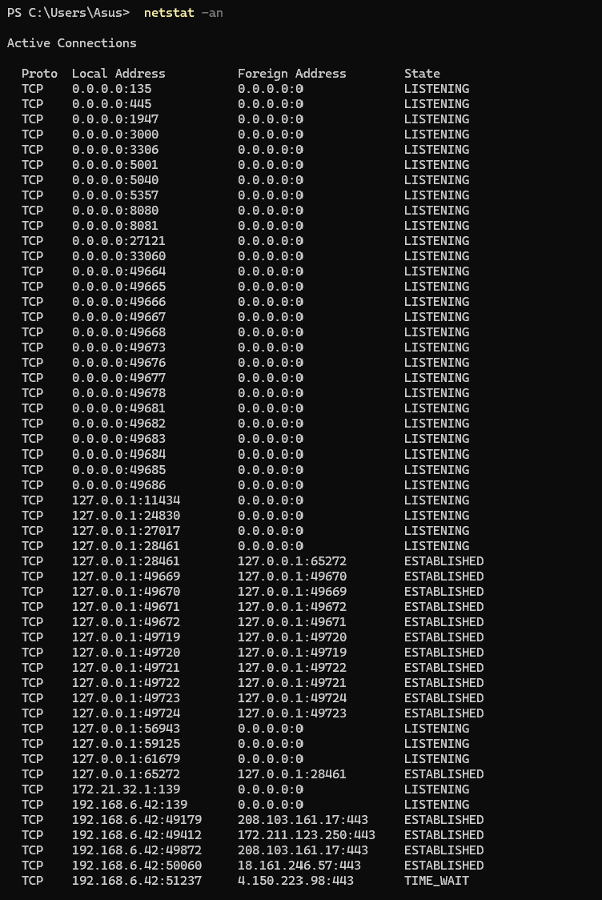
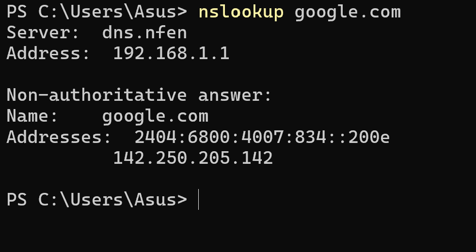

# Commands Output – Session 4 Networking

## My Ping Output

```
Pinging google.com [142.250.66.14] with 32 bytes of data:
Reply from 142.250.66.14: bytes=32 time=39ms TTL=113
Reply from 142.250.66.14: bytes=32 time=446ms TTL=113
Reply from 142.250.66.14: bytes=32 time=78ms TTL=113
Reply from 142.250.66.14: bytes=32 time=129ms TTL=113

Ping statistics for 142.250.66.14:
    Packets: Sent = 4, Received = 4, Lost = 0 (0% loss),
Approximate round trip times in milli-seconds:
    Minimum = 39ms, Maximum = 446ms, Average = 173ms
```

### What I understood

`ping` sends small ICMP "echo request" packets to a host and waits for an
"echo reply". It answers two questions: is the host reachable, and how long
does a round trip take.

From my output:

- The name `google.com` was resolved to `142.250.66.14` before any packet was
  sent, so DNS had to work first.
- `time=39ms` is the round-trip time - out and back, not one way.
- `TTL=113` is Time To Live. It starts at a fixed value (128 here) and drops
  by one at every router, so 128 - 113 means the reply crossed about 15 hops.
- `Lost = 0 (0% loss)` means every packet arrived. No packet loss.

The times vary a lot here - 39 ms, then 446 ms, then 78 ms, then 129 ms. That
spread is jitter, and on Wi-Fi it usually means interference or a busy
channel rather than a broken link. Average alone (173 ms) hides this, which is
why the min/max line matters.

---

## My Tracert Output

```
PS C:\Users\Asus> tracert -d -h 20 google.com

Tracing route to google.com [172.217.24.14]
over a maximum of 20 hops:

  1    11 ms     1 ms     5 ms  192.168.1.1
  2    82 ms     *        *     14.194.79.193
  3   131 ms   273 ms    51 ms  10.117.202.153
  4   113 ms   188 ms     6 ms  10.129.34.214
  5     *       21 ms   183 ms  10.129.34.245
  6     *        *        *     Request timed out.
  7     *        *        *     Request timed out.
  8     *       13 ms    12 ms  172.28.117.90
  9    17 ms    21 ms    32 ms  115.112.15.114
 10    46 ms    32 ms    20 ms  216.239.43.135
 11    14 ms    95 ms    20 ms  108.170.231.129
 12    13 ms    33 ms    14 ms  172.217.24.14

Trace complete.
```


### What I understood

`tracert` shows every router between my laptop and the destination. It works
by sending packets with a TTL of 1, then 2, then 3, and so on. Each router
that drops a packet for running out of TTL sends back an error, and that error
reveals the router's address. The hop list is built one router at a time.

From my output:

- Hop 1 is `192.168.1.1` - my own home router, which `ipconfig` also lists as
  the default gateway.
- Hops 3-5 and 8 are `10.x` and `172.28.x` addresses. Those are **private**
  ranges from the class notes, which means my ISP is using private addressing
  inside its own network before handing traffic to the public internet.
- Hops 10-12 are Google's network, ending at `172.217.24.14`.
- Only 12 hops to reach Google.

The `* * * Request timed out` rows at hops 6 and 7 confused me at first. They
do **not** mean the connection is broken - the trace continues past them and
reaches the target at hop 12. They mean those routers are configured not to
reply to this kind of probe. Only a timeout at the *final* hop, with nothing
after it, means a real failure.

The three time columns are three separate probes sent to the same hop, which
is why one can time out while the other two answer, as at hops 2, 5 and 8.

I used `-d` to skip reverse-DNS lookups (faster, shows IPs only) and `-h 20`
to cap the trace at 20 hops.

---

## My Checksum (CertUtil) Output

```
SHA256 hash of testfile.txt:
5891b5b522d5df086d0ff0b110fbd9d21bb4fc7163af34d08286a2e846f6be03
CertUtil: -hashfile command completed successfully.
```

### What I understood

`certutil -hashfile <file> SHA256` calculates a cryptographic hash of a file —
a fixed-length fingerprint of its contents.

The important property is that changing even one character produces a
completely different hash. That makes it useful for two things:

- **Integrity** — after downloading a file, compare its hash to the one the
  publisher lists. If they match, the file arrived complete and unmodified.
- **Comparison** — two files with the same hash have identical contents.

This is not strictly a networking command, but it belongs with them because
it verifies that data which travelled over a network arrived intact.

---

## My IPConfig Output

```
Windows IP Configuration

   Host Name . . . . . . . . . . . . : LAPTOP-LM5259HN
   Primary Dns Suffix  . . . . . . . : 
   Node Type . . . . . . . . . . . . : Hybrid
   IP Routing Enabled. . . . . . . . : No
   WINS Proxy Enabled. . . . . . . . : No

Wireless LAN adapter Local Area Connection* 1:

   Media State . . . . . . . . . . . : Media disconnected
   Connection-specific DNS Suffix  . : 
   Description . . . . . . . . . . . : Microsoft Wi-Fi Direct Virtual Adapter
   Physical Address. . . . . . . . . : E8-BF-B8-68-99-2C
   DHCP Enabled. . . . . . . . . . . : Yes
   Autoconfiguration Enabled . . . . : Yes

Wireless LAN adapter Local Area Connection* 2:

   Media State . . . . . . . . . . . : Media disconnected
   Connection-specific DNS Suffix  . : 
   Description . . . . . . . . . . . : Microsoft Wi-Fi Direct Virtual Adapter #2
   Physical Address. . . . . . . . . : EA-BF-B8-68-99-2B
   DHCP Enabled. . . . . . . . . . . : No
   Autoconfiguration Enabled . . . . : Yes

Wireless LAN adapter Wi-Fi:

   Connection-specific DNS Suffix  . : 
   Description . . . . . . . . . . . : Intel(R) Wi-Fi 6E AX211 160MHz
   Physical Address. . . . . . . . . : E8-BF-B8-68-99-2B
   DHCP Enabled. . . . . . . . . . . : Yes
   Autoconfiguration Enabled . . . . : Yes
   Link-local IPv6 Address . . . . . : fe80::f4e3:5a49:bf5f:a748%8(Preferred) 
   IPv4 Address. . . . . . . . . . . : 192.168.6.42(Preferred) 
   Subnet Mask . . . . . . . . . . . : 255.255.224.0
   Lease Obtained. . . . . . . . . . : Monday, September 7, 2026 11:26:45 AM
   Lease Expires . . . . . . . . . . : Monday, September 7, 2026 7:26:44 PM
   Default Gateway . . . . . . . . . : 192.168.1.1
   DHCP Server . . . . . . . . . . . : 192.168.1.1
   DHCPv6 IAID . . . . . . . . . . . : 95435996
   DHCPv6 Client DUID. . . . . . . . : 00-01-00-01-2E-CC-A0-47-E8-BF-B8-68-99-2B
   DNS Servers . . . . . . . . . . . : 192.168.1.1
   NetBIOS over Tcpip. . . . . . . . : Enabled

Ethernet adapter Bluetooth Network Connection:

   Media State . . . . . . . . . . . : Media disconnected
   Connection-specific DNS Suffix  . : 
   Description . . . . . . . . . . . : Bluetooth Device (Personal Area Network)
   Physical Address. . . . . . . . . : E8-BF-B8-68-99-2F
   DHCP Enabled. . . . . . . . . . . : Yes
   Autoconfiguration Enabled . . . . : Yes

Ethernet adapter vEthernet (WSL (Hyper-V firewall)):

   Connection-specific DNS Suffix  . : 
   Description . . . . . . . . . . . : Hyper-V Virtual Ethernet Adapter
   Physical Address. . . . . . . . . : 00-15-5D-A8-4E-3E
   DHCP Enabled. . . . . . . . . . . : No
   Autoconfiguration Enabled . . . . : Yes
   Link-local IPv6 Address . . . . . : fe80::9403:1f83:cadd:82c2%41(Preferred) 
   IPv4 Address. . . . . . . . . . . : 172.21.32.1(Preferred) 
   Subnet Mask . . . . . . . . . . . : 255.255.240.0
   Default Gateway . . . . . . . . . : 
   DHCPv6 IAID . . . . . . . . . . . : 687871325
   DHCPv6 Client DUID. . . . . . . . : 00-01-00-01-2E-CC-A0-47-E8-BF-B8-68-99-2B
   NetBIOS over Tcpip. . . . . . . . : Enabled
```


### What I understood

`ipconfig /all` prints the full network configuration of every adapter on the
machine. It answers "what is my address, and who do I talk to first".

The important fields on my Wi-Fi adapter:

| Field | Meaning |
|---|---|
| **IPv4 Address** | My laptop's address on the local network |
| **Subnet Mask** | Splits the address into network part and host part, so the PC knows which addresses are local |
| **Default Gateway** | The router everything leaves through to reach the internet |
| **DHCP Server** | Handed out my IP automatically, on a lease that expires |
| **DNS Servers** | Who translates names into IP addresses |
| **Physical Address** | The MAC address, fixed to the hardware, used only on the local link |

Two things I noticed:

- My gateway, DHCP server and DNS server are all the same address. On a small
  network one router usually performs all three roles.
- Most adapters say "Media disconnected" — those are virtual or unused
  adapters. Only the Wi-Fi adapter has a real configuration, because that is
  the only one actually connected.

The lease dates also explain why an IP can change: it is borrowed for a period,
not owned.

---

## My Netstat Output

```
PS C:\Users\Asus> netstat -an

Active Connections

  Proto  Local Address          Foreign Address        State
  TCP    0.0.0.0:135            0.0.0.0:0              LISTENING
  TCP    0.0.0.0:445            0.0.0.0:0              LISTENING
  TCP    0.0.0.0:1947           0.0.0.0:0              LISTENING
  TCP    0.0.0.0:3000           0.0.0.0:0              LISTENING
  TCP    0.0.0.0:3306           0.0.0.0:0              LISTENING
  TCP    0.0.0.0:5001           0.0.0.0:0              LISTENING
  TCP    0.0.0.0:5040           0.0.0.0:0              LISTENING
  TCP    0.0.0.0:5357           0.0.0.0:0              LISTENING
  TCP    0.0.0.0:8080           0.0.0.0:0              LISTENING
  TCP    0.0.0.0:8081           0.0.0.0:0              LISTENING
  TCP    0.0.0.0:27121          0.0.0.0:0              LISTENING
  TCP    0.0.0.0:33060          0.0.0.0:0              LISTENING
  TCP    0.0.0.0:49664          0.0.0.0:0              LISTENING
  TCP    0.0.0.0:49665          0.0.0.0:0              LISTENING
  TCP    0.0.0.0:49666          0.0.0.0:0              LISTENING
  TCP    0.0.0.0:49667          0.0.0.0:0              LISTENING
  TCP    0.0.0.0:49668          0.0.0.0:0              LISTENING
  TCP    0.0.0.0:49673          0.0.0.0:0              LISTENING
  TCP    0.0.0.0:49676          0.0.0.0:0              LISTENING
  TCP    0.0.0.0:49677          0.0.0.0:0              LISTENING
  TCP    0.0.0.0:49678          0.0.0.0:0              LISTENING
  TCP    0.0.0.0:49681          0.0.0.0:0              LISTENING
  TCP    0.0.0.0:49682          0.0.0.0:0              LISTENING
  TCP    0.0.0.0:49683          0.0.0.0:0              LISTENING
  TCP    0.0.0.0:49684          0.0.0.0:0              LISTENING
  TCP    0.0.0.0:49685          0.0.0.0:0              LISTENING
  TCP    0.0.0.0:49686          0.0.0.0:0              LISTENING
  TCP    127.0.0.1:11434        0.0.0.0:0              LISTENING
  TCP    127.0.0.1:24830        0.0.0.0:0              LISTENING
  TCP    127.0.0.1:27017        0.0.0.0:0              LISTENING
  TCP    127.0.0.1:28461        0.0.0.0:0              LISTENING
  TCP    127.0.0.1:28461        127.0.0.1:65272        ESTABLISHED
  TCP    127.0.0.1:49669        127.0.0.1:49670        ESTABLISHED
  TCP    127.0.0.1:49670        127.0.0.1:49669        ESTABLISHED
  TCP    127.0.0.1:49671        127.0.0.1:49672        ESTABLISHED
  TCP    127.0.0.1:49672        127.0.0.1:49671        ESTABLISHED
  TCP    127.0.0.1:49719        127.0.0.1:49720        ESTABLISHED
  TCP    127.0.0.1:49720        127.0.0.1:49719        ESTABLISHED
  TCP    127.0.0.1:49721        127.0.0.1:49722        ESTABLISHED
  TCP    127.0.0.1:49722        127.0.0.1:49721        ESTABLISHED
  TCP    127.0.0.1:49723        127.0.0.1:49724        ESTABLISHED
  TCP    127.0.0.1:49724        127.0.0.1:49723        ESTABLISHED
  TCP    127.0.0.1:56943        0.0.0.0:0              LISTENING
  TCP    127.0.0.1:59125        0.0.0.0:0              LISTENING
  TCP    127.0.0.1:61679        0.0.0.0:0              LISTENING
  TCP    127.0.0.1:65272        127.0.0.1:28461        ESTABLISHED
  TCP    172.21.32.1:139        0.0.0.0:0              LISTENING
  TCP    192.168.6.42:139       0.0.0.0:0              LISTENING
  TCP    192.168.6.42:49179     208.103.161.17:443     ESTABLISHED
  TCP    192.168.6.42:49412     172.211.123.250:443    ESTABLISHED
  TCP    192.168.6.42:49872     208.103.161.17:443     ESTABLISHED
  TCP    192.168.6.42:50060     18.161.246.57:443      ESTABLISHED
  TCP    192.168.6.42:51237     4.150.223.98:443       TIME_WAIT
```


### What I understood

`netstat -an` lists every active connection and every port the machine is
listening on. `-a` shows all connections and listening ports, `-n` shows them
as numbers instead of resolving names, which makes it much faster.

Each row reads: protocol, my address and port, the remote address and port,
and the state.

The states I saw:

| State | Meaning |
|---|---|
| `LISTENING` | A program is waiting here for incoming connections - an open door |
| `ESTABLISHED` | A live, active connection to a remote machine |
| `TIME_WAIT` | Recently closed; the port is held briefly before it can be reused |

The most useful thing I noticed: ports **3000, 5001, 8080 and 8081** are
listening on `0.0.0.0`. Those are my four Docker containers from the
Docker-Fundamental practical - Node.js, Python, Java and Apache. So this
command shows the port mappings I created with `-p` from the operating
system's side. That connected two sessions together for me.

Reading the addresses:

- `0.0.0.0` means "any address on this machine" - the service accepts
  connections on every interface.
- `127.0.0.1` entries are loopback: programs on my laptop talking to each
  other without touching the network at all. The pairs like `49669 <-> 49670`
  are two local processes connected to one another.
- `192.168.6.42` is my actual Wi-Fi address, and those rows are real outside
  connections. They all go to port `443`, which is HTTPS - browser tabs and
  background apps.

This is the command for "what is my computer connected to right now", and it
is also how you find which program is occupying a port when something refuses
to start.

---

## My NSLookup Output

```
PS C:\Users\Asus> nslookup google.com
Server:  dns.nfen
Address:  192.168.1.1

Non-authoritative answer:
Name:    google.com
Addresses:  2404:6800:4007:834::200e
          142.250.205.142
```


### What I understood

`nslookup` asks a DNS server to translate a domain name into IP addresses.
Computers route by number, not by name, so this lookup has to happen before
any connection can be made.

From my output:

- **Server / Address** at the top is the DNS server that answered -
  `192.168.1.1`, which is the same router that is my default gateway. On a
  home network one device usually acts as gateway, DHCP server and DNS
  forwarder all at once, and `ipconfig /all` confirms all three are that
  address.
- **Non-authoritative answer** means the reply came from that resolver's
  cache rather than from Google's own authoritative name servers. It is still
  correct, just second-hand, and faster because it was already stored.
- Two addresses came back: `2404:6800:4007:834::200e` is IPv6 (an AAAA
  record) and `142.250.205.142` is IPv4 (an A record). The same name has both.

One thing worth noting: this returned `142.250.205.142`, while my `ping`
returned `142.250.66.14` and `tracert` reached `172.217.24.14` - three
different addresses for the same name. That is not an error. Large sites run
many servers, and DNS hands out whichever one is closest or least busy at
that moment, so the answer can change between two lookups seconds apart.

`nslookup` is how you tell a DNS problem apart from a connection problem: if
the name will not resolve, nothing else can work.

---

## Summary

| Command | Question it answers |
|---|---|
| `ping` | Is the host reachable, and how fast? |
| `tracert` | What path do my packets take, and where do they slow down? |
| `certutil -hashfile` | Did this file arrive intact? |
| `ipconfig /all` | What is my address, gateway and DNS? |
| `netstat -an` | What is my machine connected to, and what is listening? |
| `nslookup` | What IP address does this name resolve to? |

The order I would use them when something is broken: `ipconfig` to check I
have an address and a gateway, `nslookup` to check names resolve, `ping` to
check the host answers, then `tracert` to find where along the path it fails.

---

# Part 2 — Linux `ip` Commands

The session cheat sheet (`Linux Networking Cheat Sheet.pdf`) covers the Linux
`ip` command from the iproute2 package, not the Windows commands above. The
Windows commands answer the same questions, so I ran the Linux versions too.

These were run inside an Ubuntu container:

```bash
docker run -it --rm ubuntu:22.04 bash
apt-get update && apt-get install -y iproute2 iputils-ping dnsutils traceroute
```

---

## ip addr — show IP addresses

```bash
ip addr
```

```text
1: lo: <LOOPBACK,UP,LOWER_UP> mtu 65536 qdisc noqueue state UNKNOWN group default qlen 1000
    link/loopback 00:00:00:00:00:00 brd 00:00:00:00:00:00
    inet 127.0.0.1/8 scope host lo
       valid_lft forever preferred_lft forever
    inet6 ::1/128 scope host
       valid_lft forever preferred_lft forever
2: eth0@if14: <BROADCAST,MULTICAST,UP,LOWER_UP> mtu 1500 qdisc noqueue state UP group default
    link/ether 2e:3c:5c:88:8b:2f brd ff:ff:ff:ff:ff:ff link-netnsid 0
    inet 172.17.0.7/16 brd 172.17.255.255 scope global eth0
       valid_lft forever preferred_lft forever
```

A shorter version:

```bash
ip -br addr
```

```text
lo               UNKNOWN        127.0.0.1/8 ::1/128
eth0@if14        UP             172.17.0.7/16
```

### What I understood

This is the Linux equivalent of `ipconfig /all`. It lists every interface with
its addresses.

- `lo` is loopback — the interface a machine uses to talk to itself. Always
  `127.0.0.1`.
- `eth0` is the real interface. `inet 172.17.0.7/16` is its IPv4 address, and
  `/16` is the subnet mask in CIDR form: 16 network bits, 16 host bits.
- `link/ether 2e:3c:5c:88:8b:2f` is the MAC address.
- `UP` and `LOWER_UP` mean the interface is enabled and the link is live.
- `mtu 1500` is the largest packet the interface will send in one piece.

Connecting this to the class notes on IP classes: `172.17.0.7/16` falls inside
`172.16.0.0 – 172.31.255.255`, which is a **private** range. It is not routable
on the internet — it only exists inside the Docker network.

---

## ip link — interface state

```bash
ip link
```

```text
1: lo: <LOOPBACK,UP,LOWER_UP> mtu 65536 qdisc noqueue state UNKNOWN mode DEFAULT group default qlen 1000
    link/loopback 00:00:00:00:00:00 brd ff:ff:ff:ff:ff:ff
2: eth0@if14: <BROADCAST,MULTICAST,UP,LOWER_UP> mtu 1500 qdisc noqueue state UP mode DEFAULT group default
    link/ether 2e:3c:5c:88:8b:2f brd ff:ff:ff:ff:ff:ff link-netnsid 0
```

With statistics:

```bash
ip -s link show eth0
```

```text
2: eth0@if16: <BROADCAST,MULTICAST,UP,LOWER_UP> mtu 1500 qdisc noqueue state UP mode DEFAULT group default
    link/ether 6a:fa:4d:45:e1:d6 brd ff:ff:ff:ff:ff:ff link-netnsid 0
    RX:  bytes packets errors dropped  missed   mcast
      70697712   50279      0       0       0       0
    TX:  bytes packets errors dropped carrier collsns
       1690559   24880      0       0       0       0
```

### What I understood

`ip link` works at layer 2 — the hardware/MAC level — while `ip addr` works at
layer 3, the IP level. Same interfaces, different layer.

`ip -s link` adds counters. RX is received, TX is transmitted. The useful part
is the `errors` and `dropped` columns: all zeros means a healthy link. Non-zero
values would point at a cable, driver or congestion problem rather than
anything to do with IP addressing.

An interface can also be brought up or down with `ip link set eth0 down`, which
replaces the older `ifconfig eth0 down`.

---

## ip route — the routing table

```bash
ip route
```

```text
default via 172.17.0.1 dev eth0
172.17.0.0/16 dev eth0 proto kernel scope link src 172.17.0.7
```

### What I understood

The routing table is the list of rules the kernel checks to decide where to
send a packet. It matches the most specific rule first.

- Line 2 says: anything in `172.17.0.0/16` is on my own network, so send it
  straight out `eth0` — no router needed.
- Line 1 says: anything **else** goes to `172.17.0.1`, the default gateway.

That is the whole logic of routing in two lines — local traffic goes direct,
everything else goes to the gateway. This is what the subnet mask is actually
for: it is how the machine decides which of the two rules applies.

---

## ip neigh — the ARP table

```bash
ip neigh
```

```text
172.17.0.1 dev eth0 lladdr 1e:d7:13:6f:cc:3a REACHABLE
```

### What I understood

ARP maps an IP address to a MAC address. It is needed because IP addresses are
used for routing across networks, but the actual delivery on the local wire
happens by MAC address.

So before anything can be sent to the gateway `172.17.0.1`, the machine has to
learn that address's MAC — `1e:d7:13:6f:cc:3a`. The result is cached here so it
does not have to ask again. `REACHABLE` means the entry is confirmed and
current.

This replaces the older `arp -a` command.

---

## ss — socket statistics

```bash
ss -tuln
```

```text
Netid State  Recv-Q Send-Q Local Address:Port  Peer Address:Port Process
```

### What I understood

`ss` is the modern replacement for `netstat`. The flags combine: `-t` TCP,
`-u` UDP, `-l` listening only, `-n` numeric (do not resolve names).

My output is empty, and that is the correct result — this is a fresh container
running only bash, so nothing is listening on any port. On my Windows machine
`netstat -an` showed dozens of listening ports because a full OS runs many
background services. The comparison makes the point well: a container runs one
process, not an operating system's worth of them.

---

## ping and nslookup on Linux

```bash
ping -c 4 google.com
```

```text
PING google.com (142.250.66.14) 56(84) bytes of data.
64 bytes from 142.250.66.14: icmp_seq=1 ttl=63 time=28.0 ms
64 bytes from 142.250.66.14: icmp_seq=2 ttl=63 time=27.1 ms
64 bytes from 142.250.66.14: icmp_seq=3 ttl=63 time=16.3 ms
64 bytes from 142.250.66.14: icmp_seq=4 ttl=63 time=104 ms

--- google.com ping statistics ---
4 packets transmitted, 4 received, 0% packet loss, time 3006ms
rtt min/avg/max/mdev = 16.285/43.778/103.802/34.958 ms
```

```bash
nslookup google.com
```

```text
Server:		192.168.65.7
Address:	192.168.65.7#53

Non-authoritative answer:
Name:	google.com
Address: 142.250.66.14
```

### What I understood

Two differences from Windows that I had to look up:

- Linux `ping` runs **forever** until stopped with Ctrl+C. `-c 4` limits it to
  4 packets. Windows sends 4 by default.
- The summary line `rtt min/avg/max/mdev` is more detailed than the Windows
  one. `mdev` is the variation between packets — mine was high (34 ms) because
  one packet took 104 ms while the others took under 30 ms. That variation is
  called jitter, and it matters for calls and video far more than average
  latency does.

The DNS server here is `192.168.65.7`, which is the Docker internal resolver
rather than my router. That is why this lookup returned a different Google
address than the Windows one did.

`dig +short google.com` returns just the address, which is useful in scripts.

---

## net-tools vs iproute2

The comparison table from the cheat sheet. The old commands still appear in
tutorials, but the `ip` versions are what current systems use:

| Old (net-tools) | New (iproute2) |
|---|---|
| `ifconfig -a` | `ip addr` |
| `ifconfig eth0 up` | `ip link set eth0 up` |
| `ifconfig eth0 192.168.1.1` | `ip addr add 192.168.1.1/24 dev eth0` |
| `arp -a` | `ip neigh` |
| `route` | `ip route` |
| `route add default gw 192.168.1.1` | `ip route add default via 192.168.1.1` |
| `netstat` | `ss` |
| `netstat -neopa` | `ss -neopa` |

### What I understood

net-tools is deprecated and often not installed at all on modern
distributions, which is why `ifconfig: command not found` is such a common
error. The `ip` command replaced several separate tools with one, organised by
subcommand — `ip addr`, `ip link`, `ip route`, `ip neigh`.

---

## Note on traceroute inside a container

```bash
traceroute -m 12 -w 1 google.com
```

```text
traceroute to google.com (142.250.66.14), 12 hops max, 60 byte packets
 1  172.17.0.1 (172.17.0.1)  0.639 ms  0.420 ms  0.403 ms
 2  * * *
 3  * * *
```

Only hop 1, the Docker gateway, replied. Everything after it timed out, even
though `ping` to the same host works.

The reason is that Linux `traceroute` sends UDP probes by default and those do
not survive Docker NAT, whereas `ping` uses ICMP and does. Running
`traceroute -I` for ICMP mode needs privileges the container does not have.

This is why the Windows `tracert` output earlier in this file is the usable
one — it ran directly on the host, outside the Docker network.
