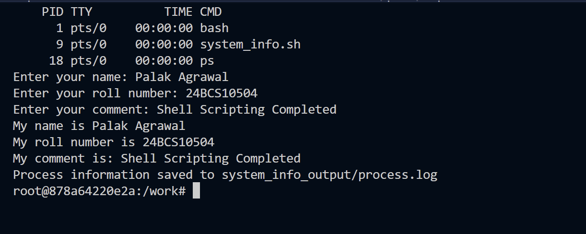

# System Information Shell Script

**Name:** Palak Agrawal
**Enrollment Number:** 24BCS10504

## Overview

A shell script that prints basic system information, stores values in
variables, takes input from the user, creates a directory and a file, and
saves the running process list into that file using output redirection.

## Requirements Covered

| Requirement | How the script does it |
|---|---|
| Print the current date | `date` stored in `$current_date` |
| Print the hostname | `hostname` stored in `$current_hostname` |
| Print the username | `whoami` stored in `$current_user` |
| Print the disk usage | `df` |
| Print the running processes | `ps` |
| Use variables | `current_date`, `current_hostname`, `current_user`, `name`, `roll_no`, `comment` |
| Take user input | `read -p` for name, roll number and comment |
| Create a directory | `mkdir -p system_info_output` |
| Create a file | `touch process.log` |
| Store processes in the file | `ps > process.log` |

## The Script

```bash
#!/bin/bash

# Create directory
mkdir -p system_info_output
cd system_info_output

# Create file using touch
touch process.log

# Store data in variables
current_date=$(date)
current_hostname=$(hostname)
current_user=$(whoami)

# Print current date
echo "Current Date: $current_date"

# Print hostname and username
echo "Hostname: $current_hostname"
echo "Username: $current_user"
who
w

# Print disk usage
echo "Disk Usage:"
df

# Print running processes
ps

# Save process info inside process.log
ps > process.log

# Take input using read -p
read -p "Enter your name: " name
read -p "Enter your roll number: " roll_no
read -p "Enter your comment: " comment

# Print the entered details
echo "My name is $name"
echo "My roll number is $roll_no"
echo "My comment is: $comment"

# Also append name, roll no, comment to process.log
echo "My name is $name" >> process.log
echo "My roll number is $roll_no" >> process.log
echo "My comment is: $comment" >> process.log

echo "Process information saved to system_info_output/process.log"
```

## How to Run

```bash
chmod +x system_info.sh
./system_info.sh
```

## Where It Was Run

The script was run inside an Ubuntu container so the Linux commands in it
(`df`, `ps`, `who`, `w`) produce real Linux output:

```bash
docker run -it --rm -v "${PWD}:/work" -w /work ubuntu:22.04 bash
./system_info.sh
```

The current folder is mounted at `/work`, so `process.log` written inside the
container appears in this folder on the host as well.

## Full Command Output

```text
Current Date: Mon Sep  7 08:14:57 UTC 2026
Hostname: 7ff555604c8f
Username: root
 08:14:57 up  2:13,  0 users,  load average: 0.18, 0.43, 0.44
USER     TTY      FROM             LOGIN@   IDLE   JCPU   PCPU WHAT
Disk Usage:
Filesystem      1K-blocks      Used Available Use% Mounted on
overlay        1055762868   8371276 993688120   1% /
tmpfs               65536         0     65536   0% /dev
shm                 65536         0     65536   0% /dev/shm
C:\             765743428 410045536 355697892  54% /work
/dev/sde       1055762868   8371276 993688120   1% /etc/hosts
tmpfs                   4         0         4   0% /proc/acpi
    PID TTY          TIME CMD
      1 ?        00:00:00 bash
      8 ?        00:00:00 bash
     17 ?        00:00:00 ps
Enter your name: Palak Agrawal
Enter your roll number: 24BCS10504
Enter your comment: Shell Scripting Completed
My name is Palak Agrawal
My roll number is 24BCS10504
My comment is: Shell Scripting Completed
Process information saved to system_info_output/process.log
```

## Screenshot



## Output File

```text
system_info_output/
└── process.log
```

Contents of `process.log`:

```text
    PID TTY          TIME CMD
      1 ?        00:00:00 bash
      8 ?        00:00:00 bash
     18 ?        00:00:00 ps
My name is Palak Agrawal
My roll number is 24BCS10504
My comment is: Shell Scripting Completed
```

## What I Understood

**Variables and command substitution.** `current_date=$(date)` runs `date` and
stores the *result*. Without `$( )` the variable would just hold the word
"date" as text. The value is captured once, when that line runs, so it does
not change later in the script.

**`>` versus `>>`.** The script uses both:

- `ps > process.log` — overwrite. Creates the file if missing, and wipes it
  if it already exists.
- `echo "..." >> process.log` — append. Adds to the end without erasing.

The order matters. `ps > process.log` runs first and clears the file, then the
three `>>` lines add the user details underneath. If those were `>` instead,
each line would erase the one before it and only the last would survive.

**`mkdir -p`.** The `-p` flag means no error if the directory already exists,
so the script can be run more than once without failing.

**`touch` before redirecting.** `ps > process.log` would create the file on
its own, so `touch` is not strictly needed here. It is in the script because
the task asks for it, and it makes the intent explicit.

**A detail I noticed in the output.** `ps` shows PID `17` on screen but `18`
inside `process.log`. That is because the script calls `ps` twice — once to
display and once to redirect — and the second call started as a new process,
so it got the next PID. Small thing, but it shows the two `ps` calls really
are separate runs rather than the same output reused.

**Why the hostname is a random string.** `Hostname: 7ff555604c8f` is the
container ID. Inside a container the hostname defaults to the container's ID
rather than the machine name, which is a clear reminder that the script is
running in an isolated environment and not on Windows directly.

**The `C:\` line in `df`.** The disk usage output lists `C:\` mounted on
`/work`. That is the bind mount — my Windows folder appearing inside the
container's filesystem, which is how `process.log` ends up back on my laptop.

**Prompts and piped input.** When the script is run interactively the
`read -p` prompts appear on screen, as in the screenshot. If input is piped in
instead, bash does not print the prompts at all, because `read -p` only
displays them when the input is coming from a terminal.

## Author

**Palak Agrawal**
**Enrollment Number: 24BCS10504**
