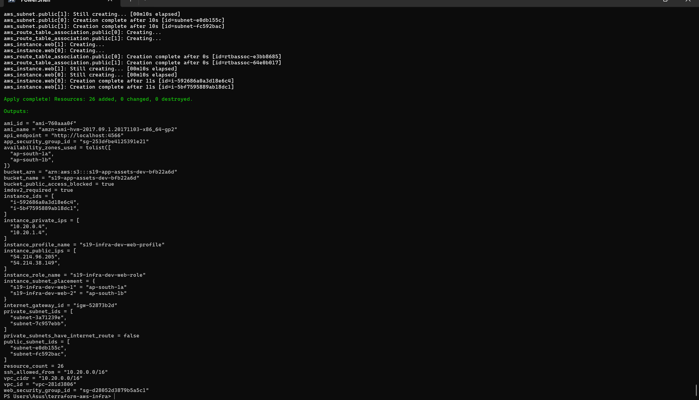
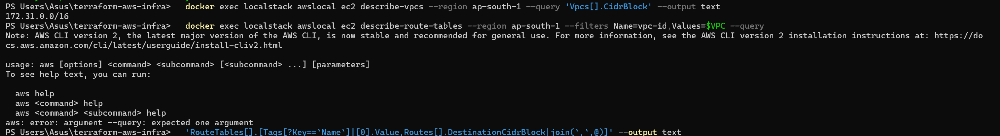
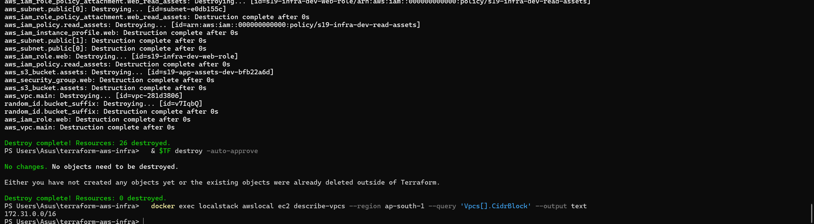

# Session 19 — Cloud & Terraform in Action

## Student Information

**Name:** Palak Agrawal
**Roll No.:** 24BCS10504

---

## Objective

Build a complete, end-to-end cloud environment with Terraform — not one
resource, but a whole architecture: network, security, compute and storage,
wired together so that each layer depends on the one below it.

Session 18 proved the workflow on a single S3 bucket. This session is the same
workflow applied to something with real structure, where the interesting part
is no longer "does `apply` work?" but **"do 26 resources come up in the right
order, and does the architecture actually enforce what it claims?"**

---

## Folder Structure

```
Cloud & Terraform in Action/
├── readme.md                       ← this file
│
├── terraform-aws-infra/
│   ├── provider.tf                 providers + endpoint wiring
│   ├── variables.tf                15 inputs, 5 with validation
│   ├── vpc.tf                      VPC, IGW, 4 subnets, 2 route tables
│   ├── security.tf                 web and app security groups
│   ├── compute.tf                  AMI data source, EC2, IMDSv2, user data
│   ├── storage.tf                  S3 bucket + the full IAM chain
│   ├── outputs.tf                  22 outputs
│   ├── user-data.sh.tftpl          bootstrap script, rendered by templatefile()
│   ├── terraform.tfvars            the values (no secrets)
│   ├── .terraform.lock.hcl         provider checksums — committed
│   ├── .gitignore                  keeps state and plugins out of git
│   └── README.md                   full write-up: diagram, workflow, evidence
│
└── images/                         screenshots
```

Full write-up, with the architecture diagram and every command's real output:
**[`terraform-aws-infra/README.md`](terraform-aws-infra/README.md)**

---

## Architecture

```
                   Internet
                      │
              Internet Gateway
                      │
  ┌───────────────────┼────────────────────────────────┐
  │ VPC 10.20.0.0/16  │                                │
  │                   │                                │
  │   route: 0.0.0.0/0 → igw                           │
  │   ┌───────────────┴───────────────┐                │
  │   │                               │                │
  │  PUBLIC 10.20.0.0/24       PUBLIC 10.20.1.0/24     │
  │  ap-south-1a               ap-south-1b             │
  │   │  web-1 (t3.micro)       │  web-2 (t3.micro)    │
  │   │  10.20.0.4              │  10.20.1.4           │
  │   └───────────┬─────────────┘                      │
  │               │  sg-web → sg-app :8080             │
  │   route: (no 0.0.0.0/0 entry)                      │
  │   ┌───────────┴───────────────┐                    │
  │  PRIVATE 10.20.10.0/24   PRIVATE 10.20.11.0/24     │
  │  ap-south-1a             ap-south-1b               │
  └────────────────────┬───────────────────────────────┘
                       │ instance profile → role → policy
                       │ (no credentials stored anywhere)
                   S3 bucket
             versioned · AES256 · all public access blocked
```

---

## What was built

**26 resources from one `terraform apply`.**

| Layer | Resources |
|-------|-----------|
| **Network** | 1 VPC, 1 internet gateway, 2 public subnets, 2 private subnets, 2 route tables, 4 associations |
| **Security** | 2 security groups — web (internet-facing) and app (reachable only from web) |
| **Compute** | 2 EC2 instances, one per Availability Zone, booting an AMI resolved by a data source |
| **Storage** | 1 S3 bucket + versioning, encryption, public access block, and an object |
| **Access** | IAM role, permissions policy, policy attachment, instance profile |

---

## Session requirements — where each one lives

| Required | Where | What it looks like |
|----------|-------|--------------------|
| **Providers** | `provider.tf` | `hashicorp/aws ~> 6.0`, `hashicorp/random ~> 3.6`, per-service endpoints |
| **Variables** | `variables.tf` | 15 inputs; 5 have `validation` blocks that fail at plan time, not mid-apply |
| **Resources** | all `.tf` | 26 across EC2, VPC, IAM, S3 |
| **Outputs** | `outputs.tf` | 22 — several are assertions, not just values |
| **Dependencies** | everywhere | 26 resources, **2** `depends_on` lines; the rest is inferred from references |
| **AWS infrastructure** | — | VPC, IGW, subnets, routing, security groups, EC2, S3, IAM |
| **Terraform state** | `terraform.tfstate` | 30 entries — 26 resources + 4 data sources |
| **`terraform plan`** | below | `Plan: 26 to add, 0 to change, 0 to destroy.` |
| **`terraform apply`** | below | `Apply complete! Resources: 26 added, 0 changed, 0 destroyed.` |
| **`terraform destroy`** | below | `Destroy complete! Resources: 26 destroyed.` |

---

## The workflow, in one block

```
terraform init        → Installed hashicorp/aws v6.67.0 (signed by HashiCorp)
                        Terraform has been successfully initialized!

terraform fmt -check  → (no output, exit 0 — already canonical)

terraform validate    → Success! The configuration is valid.

terraform plan        → Plan: 26 to add, 0 to change, 0 to destroy.

terraform apply       → Apply complete! Resources: 26 added, 0 changed, 0 destroyed.

terraform state list  → 30 entries (26 resources + 4 data sources)

terraform output      → vpc_id   = "vpc-8d5f8ea8"
                        instance_private_ips = ["10.20.0.4", "10.20.1.4"]
                        private_subnets_have_internet_route = false
                        imdsv2_required = true
                        bucket_public_access_blocked = true

terraform destroy     → Destroy complete! Resources: 26 destroyed.
```

---

## Verified against the real API

Terraform reporting success is Terraform reporting on itself. Every claim the
architecture makes was checked by querying AWS directly:

**The routing is what makes a subnet private** — the two tables differ by one
line:

```
s19-infra-dev-rt-public     10.20.0.0/16,0.0.0.0/0    local,igw-9f6d4b93
s19-infra-dev-rt-private    10.20.0.0/16              local
```

**The instances really are in different Availability Zones:**

```
i-92d097f6928611caa    t3.micro    ap-south-1b    10.20.1.4    running
i-ace7434f413ab8f65    t3.micro    ap-south-1a    10.20.0.4    running
```

**SSH is not open to the world:**

```
22     10.20.0.0/16        ← not 0.0.0.0/0
80     0.0.0.0/0
443    0.0.0.0/0
```

**The app tier's ingress source is a security group, not a CIDR** — note the
empty address column:

```
8080                       sg-94dac191921512191
```

**Nothing is left after destroy** except LocalStack's own default VPC:

```
$ awslocal ec2 describe-vpcs --region ap-south-1 --query 'Vpcs[].CidrBlock' --output text
172.31.0.0/16
```

---

## Commands Used

```bash
# --- environment -------------------------------------------------------------
docker run -d --name localstack -p 4566:4566 localstack/localstack:3
curl -s http://localhost:4566/_localstack/health

# --- the workflow ------------------------------------------------------------
cd terraform-aws-infra
terraform init
terraform fmt -check -diff
terraform validate
terraform plan -out=tfplan
terraform apply tfplan
terraform show
terraform state list
terraform output
terraform output -raw vpc_id
terraform destroy -auto-approve

# --- verification, outside Terraform -----------------------------------------
awslocal ec2 describe-vpcs            --region ap-south-1
awslocal ec2 describe-subnets         --region ap-south-1 --filters Name=vpc-id,Values=<vpc>
awslocal ec2 describe-route-tables    --region ap-south-1 --filters Name=vpc-id,Values=<vpc>
awslocal ec2 describe-instances       --region ap-south-1 --filters Name=vpc-id,Values=<vpc>
awslocal ec2 describe-security-groups --region ap-south-1 --group-ids <sg>
awslocal s3 ls
awslocal iam list-attached-role-policies --role-name s19-infra-dev-web-role
awslocal iam get-instance-profile --instance-profile-name s19-infra-dev-web-profile
```

---

## Screenshots







---

## Issues Faced & Fixes

| # | Problem | Cause | Fix |
|---|---------|-------|-----|
| 1 | `terraform validate` failed: `Call to function "templatefile" failed: ./user-data.sh.tftpl:5,51-54: Invalid expression` | A **comment** in the template contained the literal text `${...}` as an example. `templatefile` evaluates every `${}` in the file and does not care that it sits in a comment | Escaped it as `$${...}`. In a `.tftpl` file there is no such thing as a comment as far as interpolation is concerned |
| 2 | `terraform init` failed: `dial tcp: lookup registry.terraform.io: no such host` | Transient DNS failure during provider download | Re-ran `init`. A failure during provider installation is never a problem with the configuration — worth separating from a real error |
| 3 | `terraform fmt -check` failed on `outputs.tf` | Hand-aligned inline comments that `fmt` collapses | Ran `terraform fmt` and kept the result. The formatter wins; that is the point of having one |
| 4 | `awslocal ec2 describe-subnets` returned nothing although the subnets existed | The CLI defaults to `us-east-1`, the resources are in `ap-south-1` | Added `--region ap-south-1`. An empty result from a regional API nearly always means the wrong region, not missing resources |
| 5 | A real AWS AMI name found nothing | LocalStack's mock AMI catalogue only holds 2017-era images | Made the filter a variable, defaulting to LocalStack's `amzn-ami-hvm-*-x86_64-gp2` and documenting `al2023-ami-*-x86_64` for real AWS. The data source pattern is unchanged — only the filter string moves |
| 6 | Session 18's LocalStack container rejected every EC2 and IAM call: `Service 'ec2' is not enabled` | It had been started with `SERVICES=s3`, which restricts the services it will answer for | Restarted without the filter. The s3-only container was fine for one bucket and useless for an architecture |

### A limitation stated plainly

LocalStack's EC2 instances are **mocked**. They report `running`, they have IDs
and addresses, and the API behaves correctly — but no operating system boots,
so `user-data.sh.tftpl` is never executed.

- The **infrastructure** — networking, routing, security groups, IAM, storage —
  is genuinely created and verified above.
- Anything **inside** an instance is not. The nginx install and the S3 download
  are written but unexercised.

Against real AWS the identical configuration boots the instances and runs the
script. Saying so is better than implying the whole thing was proven.

---

## What I Learned

**26 resources, 2 `depends_on` lines.** Terraform derives almost the entire
ordering from the expressions you write. `vpc_id = aws_vpc.main.id` *is* the
dependency declaration. The two explicit ones are both for ordering that is
real but invisible to the graph — an instance must not boot before its role's
policy is attached, and an object must not be uploaded before the public access
block exists. If you find yourself writing a third, it is usually a missing
reference.

**A subnet is private because of one missing line.** Not a checkbox, not a
flag — the absence of `0.0.0.0/0 → igw` in its route table. Seeing the two
route tables side by side in the API output made that concrete in a way the
documentation never did.

**A security group as a source is the point of security groups.**
`security_groups = [aws_security_group.web.id]` does not say "allow this
address range", it says "allow anything wearing this group". The empty CIDR
column in the verification output is what that looks like from the API's side,
and it is why the rule survives instances being replaced and rescaled.

**Data sources are resolved at plan time.** `ami_id` was a concrete value in
the plan while `instance_ids` were still `(known after apply)` — because the
AMI lookup is a read that happens immediately, and the instances do not exist
yet. That distinction explains why a plan can be meaningfully reviewed at all.

**Outputs should assert, not echo.** `ssh_allowed_from` just restates a
variable and proves nothing. `private_subnets_have_internet_route = false` is
computed from the route table that was actually created, so it would flip to
`true` the moment someone added a NAT route. The second kind is worth writing.

**Destroy is the create graph reversed.** Leaves first, VPC last, because a VPC
cannot be deleted while a subnet still lives in it. Watching that order in the
log is the clearest picture of the dependency graph the tool ever gives you.

**`$${}` in a template.** The one genuinely surprising failure: a comment
cannot protect a `${...}` from the template renderer, because the renderer does
not know what a comment is.

---

## Conclusion

The claim being tested was whether an architecture — not a resource — can live
entirely in code. The proof is the destroy-then-apply cycle: 26 resources torn
down to nothing, then rebuilt identically from the files alone, in two
Availability Zones, with the same routing, the same security boundaries and the
same IAM chain.

What makes it convincing is not Terraform's own success messages. It is that
every claim in the architecture diagram was then checked against the AWS API
directly — the private subnets have no internet route, SSH is not open to the
world, the app tier accepts traffic only from the web tier's security group,
and no credential exists anywhere in the project. Terraform saying it worked is
not evidence; the API saying so is.
