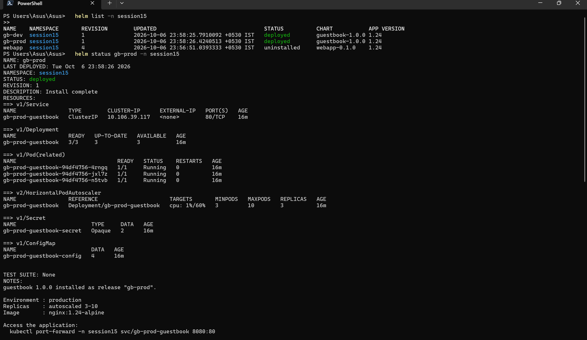
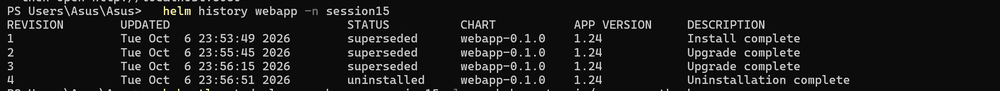
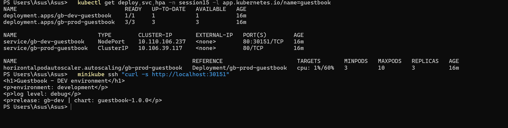

# Session 15 — Helm

## Student Information

**Name:** Palak Agrawal
**Roll No.:** 24BCS10504

---

## Objective

The objective of this practical was to practise every important **Helm** command hands-on,
to perform a complete **install → upgrade → verify → upgrade → verify → rollback → verify**
workflow and document it, and to build a **mini project** — a custom Helm chart written from
scratch that deploys the same application to two different environments from one chart.

---

## Deliverables

| Deliverable | Location |
|---|---|
| Helm chart | `webapp/` (scaffolded), `mini-project/guestbook/` (custom) |
| values.yaml | `webapp/values.yaml`, `mini-project/guestbook/values{,-dev,-prod}.yaml` |
| Templates | `mini-project/guestbook/templates/` |
| Installation | Task 1 |
| Upgrade | Task 2 |
| Rollback | Task 2 |
| Mini project | `mini-project/`, documented in Task 3 |
| Screenshots | `images/` |
| README | this file |

---

## Folder Structure

```
Helm/
├── webapp/                       # chart from "helm create"
│   ├── Chart.yaml
│   ├── values.yaml
│   └── templates/
├── mini-project/
│   └── guestbook/                # chart written from scratch
│       ├── Chart.yaml
│       ├── values.yaml           # defaults
│       ├── values-dev.yaml       # development overrides
│       ├── values-prod.yaml      # production overrides
│       └── templates/
│           ├── _helpers.tpl
│           ├── configmap.yaml
│           ├── secret.yaml
│           ├── deployment.yaml
│           ├── service.yaml
│           ├── hpa.yaml
│           └── NOTES.txt
├── packaged/
│   └── guestbook-1.0.0.tgz
├── images/
└── readme.md
```

---

## Setup — installing Helm

Helm was not present on the machine, so it was installed with winget (the same way kubectl
was installed):

```powershell
winget install --id Helm.Helm -e
```

```bash
helm version
```

```
version.BuildInfo{Version:"v4.3.0", GitCommit:"bec5b06ed841fe5269972d864d5177944fd5970f",
GitTreeState:"clean", GoVersion:"go1.27.1", KubeClientVersion:"v1.37"}
```

> The first download failed with `InternetOpenUrl() failed. 0x80072f78` and succeeded on a
> retry — a transient network error, not a packaging problem.

---

## What Helm is

Helm is the package manager for Kubernetes. Instead of applying a folder of static YAML, you
package **templates + values** into a **chart**, and Helm renders and tracks it as a
**release**.

| Term | Meaning |
|---|---|
| **Chart** | The package — templates, default values and metadata |
| **Values** | The configuration injected into templates (`values.yaml`, `--set`, `-f`) |
| **Release** | One installation of a chart into a cluster, with a name and a revision history |
| **Revision** | A numbered snapshot of a release; every install/upgrade/rollback creates one |
| **Repository** | A server hosting packaged charts |

The problem it solves: with plain YAML, deploying the same app to dev and prod means
maintaining two near-identical copies of every manifest. With Helm it is one chart and two
values files.

---

# Task 1 — Helm Commands

## 1. `helm create`

Scaffolds a working chart with sensible defaults.

```bash
helm create webapp
```

```
Creating webapp
```

```bash
find webapp -type f | sort
```

```
webapp/.helmignore
webapp/Chart.yaml
webapp/templates/_helpers.tpl
webapp/templates/deployment.yaml
webapp/templates/hpa.yaml
webapp/templates/httproute.yaml
webapp/templates/ingress.yaml
webapp/templates/NOTES.txt
webapp/templates/service.yaml
webapp/templates/serviceaccount.yaml
webapp/templates/tests/test-connection.yaml
webapp/values.yaml
```

| File | Purpose |
|---|---|
| `Chart.yaml` | Chart metadata — name, `version`, `appVersion` |
| `values.yaml` | Default configuration |
| `templates/` | The Go-templated Kubernetes manifests |
| `templates/_helpers.tpl` | Reusable template snippets (names, labels) |
| `templates/NOTES.txt` | Printed after install |
| `.helmignore` | Files excluded when packaging |

Two version fields in `Chart.yaml` that are easy to confuse:

| Field | Meaning |
|---|---|
| `version` | Version of the **chart** — bump when the templates change |
| `appVersion` | Version of the **application** — bump when the image changes |

The defaults were edited to use a locally cached image tag, since this cluster's registry
access has been intermittent:

```yaml
replicaCount: 2
image:
  repository: nginx
  tag: "1.24-alpine"
```

### Validating before installing

```bash
helm lint webapp
```
```
==> Linting webapp
[INFO] Chart.yaml: icon is recommended

1 chart(s) linted, 0 chart(s) failed
```

```bash
helm template webapp webapp | head -40
```
```
---
# Source: webapp/templates/serviceaccount.yaml
apiVersion: v1
kind: ServiceAccount
metadata:
  name: webapp
  labels:
    helm.sh/chart: webapp-0.1.0
    app.kubernetes.io/name: webapp
    app.kubernetes.io/instance: webapp
    app.kubernetes.io/version: "1.24"
    app.kubernetes.io/managed-by: Helm
```

`helm template` renders locally **without touching the cluster** — the fastest way to check
what a chart will actually produce.

## 2. `helm install`

```bash
helm install webapp ./webapp --namespace session15 --create-namespace
```

```
NAME: webapp
LAST DEPLOYED: Tue Oct  6 23:53:49 2026
NAMESPACE: session15
STATUS: deployed
REVISION: 1
DESCRIPTION: Install complete
NOTES:
1. Get the application URL by running these commands:
  export POD_NAME=$(kubectl get pods --namespace session15 -l "app.kubernetes.io/name=webapp,app.kubernetes.io/instance=webapp" -o jsonpath="{.items[0].metadata.name}")
  ...
```

```bash
kubectl get all -n session15
```

```
NAME                        READY   STATUS    RESTARTS   AGE
pod/webapp-c6b4c869-qxns8   1/1     Running   0          25s
pod/webapp-c6b4c869-vlxwc   1/1     Running   0          25s

NAME             TYPE        CLUSTER-IP      EXTERNAL-IP   PORT(S)   AGE
service/webapp   ClusterIP   10.100.15.248   <none>        80/TCP    26s

NAME                     READY   UP-TO-DATE   AVAILABLE   AGE
deployment.apps/webapp   2/2     2            2           26s
```

One command created a Deployment, a Service, a ServiceAccount and two Pods.

Useful flags: `--dry-run`, `--create-namespace`, `--set key=value`, `-f values.yaml`,
`--wait`, `--timeout`, `--atomic` (roll back automatically if the install fails).

## 3. `helm list`

```bash
helm list -n session15
```

```
NAME  	NAMESPACE	REVISION	UPDATED                              	STATUS  	CHART       	APP VERSION
webapp	session15	1       	2026-10-06 23:53:49.5717564 +0530 IST	deployed	webapp-0.1.0	1.24
```

Flags: `-A` (all namespaces), `--uninstalled`, `--failed`, `--all`.

## 4. `helm status`

```bash
helm status webapp -n session15
```

```
NAME: webapp
LAST DEPLOYED: Tue Oct  6 23:53:49 2026
NAMESPACE: session15
STATUS: deployed
REVISION: 1
DESCRIPTION: Install complete
RESOURCES:
==> v1/ServiceAccount
NAME     AGE
webapp   34s

==> v1/Service
```

Unlike `helm list`, this shows the **resources the release owns** and re-prints the NOTES.

## 5. `helm get`

Retrieves the details Helm stored about a release.

```bash
helm get values webapp -n session15
```
```
USER-SUPPLIED VALUES:
null
```

`null` because nothing was overridden at install — everything came from `values.yaml`.
`helm get values --all` would show the fully merged set.

```bash
helm get manifest webapp -n session15 | head -16
```
```
---
# Source: webapp/templates/serviceaccount.yaml
apiVersion: v1
kind: ServiceAccount
metadata:
  name: webapp
  labels:
    helm.sh/chart: webapp-0.1.0
    app.kubernetes.io/name: webapp
```

```bash
helm get metadata webapp -n session15
```
```
NAME: webapp
CHART: webapp
VERSION: 0.1.0
APP_VERSION: 1.24
LABELS: modifiedAt=1791311029,name=webapp,owner=helm,status=deployed,version=1
NAMESPACE: session15
REVISION: 1
STATUS: deployed
APPLY_METHOD: server-side apply
```

| Subcommand | Returns |
|---|---|
| `helm get values` | The values used |
| `helm get manifest` | The rendered YAML actually applied |
| `helm get notes` | The NOTES.txt output |
| `helm get hooks` | Any chart hooks |
| `helm get metadata` | Chart name, versions, revision, status |
| `helm get all` | Everything above |

`helm get manifest` is the one to reach for when a release did not produce what you expected
— it shows exactly what Helm sent to the API server.

## 6. `helm upgrade`

```bash
helm upgrade webapp ./webapp -n session15 --set replicaCount=3
```

```
Release "webapp" has been upgraded. Happy Helming!
NAME: webapp
LAST DEPLOYED: Tue Oct  6 23:55:45 2026
NAMESPACE: session15
STATUS: deployed
REVISION: 2
DESCRIPTION: Upgrade complete
```

`REVISION: 2`. Useful flags:

| Flag | Effect |
|---|---|
| `--install` | Install if the release does not exist (idempotent — common in CI) |
| `--reuse-values` | Keep previously supplied values and merge new ones |
| `--reset-values` | Discard previous overrides, go back to chart defaults |
| `--atomic` | Roll back automatically if the upgrade fails |
| `--wait` | Block until all resources are ready |

> **Gotcha:** without `--reuse-values`, `--set` values from an earlier upgrade are **not**
> carried forward. This is visible in Task 2 below.

## 7. `helm history`

```bash
helm history webapp -n session15
```

```
REVISION	UPDATED                 	STATUS    	CHART       	APP VERSION	DESCRIPTION
1       	Tue Oct  6 23:53:49 2026	superseded	webapp-0.1.0	1.24       	Install complete
2       	Tue Oct  6 23:55:45 2026	superseded	webapp-0.1.0	1.24       	Upgrade complete
3       	Tue Oct  6 23:56:15 2026	deployed  	webapp-0.1.0	1.24       	Upgrade complete
```

| Status | Meaning |
|---|---|
| `deployed` | The currently live revision |
| `superseded` | Replaced by a later revision |
| `failed` | The install/upgrade failed |
| `pending-upgrade` | In progress, or stuck |

## 8. `helm rollback`

Covered in full in **Task 2**.

## 9. `helm uninstall`

```bash
helm uninstall webapp -n session15 --dry-run
helm uninstall webapp -n session15 --keep-history
```

```
release "webapp" uninstalled
```

```bash
kubectl get all -n session15 -l app.kubernetes.io/name=webapp
```
```
No resources found in session15 namespace.
```

Every resource the release created is removed in one command — no need to know what they
were. With `--keep-history` the record survives:

```bash
helm list -n session15 --uninstalled
```
```
NAME  	NAMESPACE	REVISION	UPDATED                              	STATUS     	CHART       	APP VERSION
webapp	session15	4       	2026-10-06 23:56:51.0393333 +0530 IST	uninstalled	webapp-0.1.0	1.24
```

Without `--keep-history` the release is forgotten entirely and cannot be rolled back.

## 10. `helm repo`

```bash
helm repo add bitnami https://charts.bitnami.com/bitnami
helm repo list
helm repo update
```

```
"bitnami" has been added to your repositories

NAME   	URL
bitnami	https://charts.bitnami.com/bitnami

Hang tight while we grab the latest from your chart repositories...
...Successfully got an update from the "bitnami" chart repository
Update Complete. ⎈Happy Helming!⎈
```

`helm repo update` refreshes the local index — run it before searching, or you will see
stale versions. Also available: `helm repo remove`, `helm repo index`.

## 11. `helm search`

Searching **configured repositories**:

```bash
helm search repo nginx
```
```
NAME                            	CHART VERSION	APP VERSION	DESCRIPTION
bitnami/nginx                   	25.2.1       	1.31.6     	NGINX Open Source is a web server that can be a...
bitnami/nginx-ingress-controller	12.0.7       	1.13.1     	NGINX Ingress Controller is an Ingress controll...
bitnami/nginx-intel             	2.1.15       	0.4.9      	DEPRECATED NGINX Open Source for Intel is a lig...
```

```bash
helm search repo bitnami --versions | head -5
```
```
NAME                        	CHART VERSION	APP VERSION  	DESCRIPTION
bitnami/airflow             	25.0.2       	3.0.5        	Apache Airflow is a tool to express and execute...
bitnami/airflow             	25.0.1       	3.0.4        	Apache Airflow is a tool to express and execute...
```

Searching **Artifact Hub** (public charts not in your repo list):

```bash
helm search hub wordpress --endpoint https://artifacthub.io --max-col-width=55
```
```
URL                                                    	CHART VERSION	APP VERSION        	DESCRIPTION
https://artifacthub.io/packages/helm/slybase-wordpre...	5.5.39       	7.0.1              	Using the official WordPress image. This chart provi...
https://artifacthub.io/packages/helm/quench-wordpres...	0.0.24       	7.1.2              	Hardened WordPress CMS (PHP-FPM + nginx) on a 0-CVE ...
```

> `helm search hub` without `--endpoint` failed with
> `Error: unable to perform search against "https://hub.helm.sh"` — the legacy default
> endpoint is retired. Passing `--endpoint https://artifacthub.io` fixes it.

## 12. `helm package`

```bash
helm package mini-project/guestbook -d ./packaged
```

```
Successfully packaged chart and saved it to: packaged\guestbook-1.0.0.tgz
```

The `.tgz` is the distributable artifact — what gets uploaded to a chart repository.

## Command reference

| Command | Purpose |
|---|---|
| `helm create <name>` | Scaffold a new chart |
| `helm lint <chart>` | Validate chart structure |
| `helm template <rel> <chart>` | Render locally, no cluster needed |
| `helm install <rel> <chart>` | Create a release |
| `helm list` | List releases |
| `helm status <rel>` | Release status + owned resources |
| `helm get values/manifest/metadata <rel>` | Stored release details |
| `helm upgrade <rel> <chart>` | New revision |
| `helm history <rel>` | All revisions |
| `helm rollback <rel> <rev>` | Revert to a revision |
| `helm uninstall <rel>` | Delete the release |
| `helm repo add/list/update` | Manage repositories |
| `helm search repo/hub` | Find charts |
| `helm package <chart>` | Build a `.tgz` |

### Screenshot



---

# Task 2 — Helm Rollback

The complete workflow required by the homework:

```
Install -> Upgrade -> Verify -> Upgrade again -> Verify -> Rollback -> Verify
```

## Step 1 — Install (revision 1)

```bash
helm install webapp ./webapp --namespace session15 --create-namespace
helm list -n session15
kubectl get deploy webapp -n session15 \
  -o jsonpath='{.spec.replicas} replicas, image {.spec.template.spec.containers[0].image}'
```

```
NAME  	NAMESPACE	REVISION	STATUS  	CHART       	APP VERSION
webapp	session15	1       	deployed	webapp-0.1.0	1.24

2 replicas, image nginx:1.24-alpine
```

**State at revision 1:** 2 replicas, `nginx:1.24-alpine`.

## Step 2 — Upgrade (revision 2)

```bash
helm upgrade webapp ./webapp -n session15 --set replicaCount=3
```

```
Release "webapp" has been upgraded. Happy Helming!
REVISION: 2
DESCRIPTION: Upgrade complete
```

## Step 3 — Verify revision 2

```bash
helm list -n session15
kubectl get pods -n session15
```

```
NAME  	NAMESPACE	REVISION	STATUS  	CHART       	APP VERSION
webapp	session15	2       	deployed	webapp-0.1.0	1.24

NAME                    READY   STATUS    RESTARTS   AGE
webapp-c6b4c869-m8sg5   1/1     Running   0          21s
webapp-c6b4c869-qxns8   1/1     Running   0          2m16s
webapp-c6b4c869-vlxwc   1/1     Running   0          2m16s
```

**State at revision 2:** 3 replicas, `nginx:1.24-alpine`. Note the two original Pods are
untouched (AGE 2m16s) — only one new Pod was added.

## Step 4 — Upgrade again (revision 3)

```bash
helm upgrade webapp ./webapp -n session15 --set replicaCount=4 --set image.tag=1.25-alpine
```

```
Release "webapp" has been upgraded. Happy Helming!
REVISION: 3
DESCRIPTION: Upgrade complete
```

## Step 5 — Verify revision 3

```bash
kubectl get deploy webapp -n session15 \
  -o jsonpath='{.spec.replicas} replicas, image {.spec.template.spec.containers[0].image}'
helm get values webapp -n session15
```

```
4 replicas, image nginx:1.25-alpine

USER-SUPPLIED VALUES:
image:
  tag: 1.25-alpine
replicaCount: 4
```

**State at revision 3:** 4 replicas, `nginx:1.25-alpine`.

```bash
helm history webapp -n session15
```

```
REVISION	UPDATED                 	STATUS    	CHART       	APP VERSION	DESCRIPTION
1       	Tue Oct  6 23:53:49 2026	superseded	webapp-0.1.0	1.24       	Install complete
2       	Tue Oct  6 23:55:45 2026	superseded	webapp-0.1.0	1.24       	Upgrade complete
3       	Tue Oct  6 23:56:15 2026	deployed  	webapp-0.1.0	1.24       	Upgrade complete
```

## Step 6 — Rollback to revision 2

Imagine `nginx:1.25-alpine` turned out to be broken in production.

```bash
helm rollback webapp 2 -n session15
```

```
Rollback was a success! Happy Helming!
```

## Step 7 — Verify the rollback

```bash
helm list -n session15
kubectl get deploy webapp -n session15 \
  -o jsonpath='{.spec.replicas} replicas, image {.spec.template.spec.containers[0].image}'
helm get values webapp -n session15
```

```
NAME  	NAMESPACE	REVISION	STATUS  	CHART       	APP VERSION
webapp	session15	4       	deployed	webapp-0.1.0	1.24

3 replicas, image nginx:1.24-alpine

USER-SUPPLIED VALUES:
replicaCount: 3
```

**The state matches revision 2 exactly** — 3 replicas and `nginx:1.24-alpine`, and the
values are revision 2's values, with `image.tag` gone.

```bash
helm history webapp -n session15
```

```
REVISION	UPDATED                 	STATUS    	CHART       	APP VERSION	DESCRIPTION
1       	Tue Oct  6 23:53:49 2026	superseded	webapp-0.1.0	1.24       	Install complete
2       	Tue Oct  6 23:55:45 2026	superseded	webapp-0.1.0	1.24       	Upgrade complete
3       	Tue Oct  6 23:56:15 2026	superseded	webapp-0.1.0	1.24       	Upgrade complete
4       	Tue Oct  6 23:56:51 2026	deployed  	webapp-0.1.0	1.24       	Rollback to 2
```

```bash
kubectl get pods -n session15
```
```
NAME                    READY   STATUS    RESTARTS   AGE
webapp-c6b4c869-bpdg5   1/1     Running   0          22s
webapp-c6b4c869-n85bv   1/1     Running   0          23s
webapp-c6b4c869-st86r   1/1     Running   0          21s
```

## What the rollback actually did

| Revision | Replicas | Image | Status |
|---|---|---|---|
| 1 | 2 | `nginx:1.24-alpine` | superseded |
| 2 | 3 | `nginx:1.24-alpine` | superseded |
| 3 | 4 | `nginx:1.25-alpine` | superseded |
| **4** | **3** | **`nginx:1.24-alpine`** | **deployed** — "Rollback to 2" |

**Key observations:**

1. **A rollback creates a new revision, it does not delete any.** Revision 3 still exists as
   `superseded`, so `helm rollback webapp 3` would roll *forward* again. The history is
   append-only.

2. **The DESCRIPTION column records the intent** — `Rollback to 2` rather than
   `Upgrade complete`, so the history is self-documenting.

3. **Values are rolled back too, not just the image.** `helm get values` returned
   `replicaCount: 3` with no `image.tag` — exactly revision 2's values. Helm stores the full
   rendered manifest and the values per revision, which is what makes this reliable.

4. **`helm rollback webapp` with no revision number** goes back one revision from the
   current one.

5. This is strictly more powerful than `kubectl rollout undo`, which only reverts a single
   Deployment's Pod template. A Helm rollback reverts **every resource in the release** —
   Deployment, Service, ConfigMap, Secret and anything else — as one atomic unit.

### Screenshot



---

# Task 3 — Mini Project

> **Note on scope:** the homework says "complete the Helm mini project". That project is
> part of the instructor's repository and was not available locally, so a mini project was
> built that exercises the deliverables the homework lists: a custom **Helm chart** with
> **values.yaml**, **templates**, installation, upgrade and rollback.

## Goal

Build a chart from scratch (not `helm create`) that deploys the **same application to two
environments** — development and production — with different replica counts, service types,
log levels, resource limits and autoscaling, from **one chart and two values files**.

## Chart structure

```
mini-project/guestbook/
├── Chart.yaml
├── values.yaml           # defaults
├── values-dev.yaml       # development overrides
├── values-prod.yaml      # production overrides
└── templates/
    ├── _helpers.tpl      # reusable name/label snippets
    ├── configmap.yaml    # app config + the HTML page
    ├── secret.yaml       # DB credentials, base64-encoded at render time
    ├── deployment.yaml   # with probes, resources, config checksum
    ├── service.yaml      # ClusterIP or NodePort, depending on values
    ├── hpa.yaml          # only rendered when autoscaling is enabled
    └── NOTES.txt         # environment-aware post-install message
```

## Templating techniques used

**1. Helper templates** (`_helpers.tpl`) so names and labels are defined once:

```yaml
{{- define "guestbook.fullname" -}}
{{- printf "%s-%s" .Release.Name .Chart.Name | trunc 63 | trimSuffix "-" }}
{{- end }}
```

`trunc 63` matters — several Kubernetes name fields are limited to 63 characters by the DNS
naming spec, and a long release name would otherwise produce an invalid manifest.

**2. Conditional rendering** — the HPA only exists when enabled:

```yaml
{{- if .Values.autoscaling.enabled }}
apiVersion: autoscaling/v2
kind: HorizontalPodAutoscaler
...
{{- end }}
```

and `replicas` is omitted entirely when the HPA owns it, so the two do not fight:

```yaml
  {{- if not .Values.autoscaling.enabled }}
  replicas: {{ .Values.replicaCount }}
  {{- end }}
```

**3. Encoding at render time** — `values.yaml` stays human-readable:

```yaml
data:
  DB_USERNAME: {{ .Values.secrets.dbUsername | b64enc | quote }}
  DB_PASSWORD: {{ .Values.secrets.dbPassword | b64enc | quote }}
```

**4. Config checksum annotation** — Pods restart automatically when the ConfigMap changes:

```yaml
      annotations:
        checksum/config: {{ include (print $.Template.BasePath "/configmap.yaml") . | sha256sum }}
```

Without this, editing a ConfigMap leaves the running Pods with the old values until
something else restarts them.

**5. `toYaml` for whole blocks** instead of templating every field:

```yaml
          resources:
            {{- toYaml .Values.resources | nindent 12 }}
```

## Environment differences

| Setting | dev | prod |
|---|---|---|
| `replicaCount` | 1 | 3 |
| `service.type` | NodePort (30151) | ClusterIP |
| `config.logLevel` | `debug` | `warn` |
| `resources.limits.cpu` | 100m | 500m |
| `autoscaling.enabled` | false | **true** (3–10 @ 60%) |

## Validate

```bash
helm lint guestbook
helm lint guestbook -f guestbook/values-prod.yaml
```

```
==> Linting guestbook
[INFO] Chart.yaml: icon is recommended

1 chart(s) linted, 0 chart(s) failed
```

Linting against **each** values file matters — a template can be valid with defaults and
broken with an override.

## Install both environments

```bash
helm install gb-dev  ./guestbook -f ./guestbook/values-dev.yaml  -n session15
helm install gb-prod ./guestbook -f ./guestbook/values-prod.yaml -n session15
```

The environment-aware NOTES.txt prints a different message for each:

```
guestbook 1.0.0 installed as release "gb-dev".

Environment : development
Replicas    : 1
Image       : nginx:1.24-alpine

Access the application:
  minikube ssh "curl -s http://localhost:30151"
```

```
guestbook 1.0.0 installed as release "gb-prod".

Environment : production
Replicas    : autoscaled 3-10
Image       : nginx:1.24-alpine

Access the application:
  kubectl port-forward -n session15 svc/gb-prod-guestbook 8080:80
```

```bash
helm list -n session15
```

```
NAME   	NAMESPACE	REVISION	STATUS  	CHART          	APP VERSION
gb-dev 	session15	1       	deployed	guestbook-1.0.0	1.24
gb-prod	session15	1       	deployed	guestbook-1.0.0	1.24
```

## Verify the environments differ

```bash
kubectl get deploy,svc,hpa,pods -n session15 -l app.kubernetes.io/name=guestbook
```

```
NAME                                READY   UP-TO-DATE   AVAILABLE   AGE
deployment.apps/gb-dev-guestbook    1/1     1            1           41s
deployment.apps/gb-prod-guestbook   3/3     3            3           41s

NAME                        TYPE        CLUSTER-IP       EXTERNAL-IP   PORT(S)        AGE
service/gb-dev-guestbook    NodePort    10.110.106.237   <none>        80:30151/TCP   42s
service/gb-prod-guestbook   ClusterIP   10.106.39.117    <none>        80/TCP         41s

NAME                                                    REFERENCE                      TARGETS              MINPODS   MAXPODS   REPLICAS   AGE
horizontalpodautoscaler.autoscaling/gb-prod-guestbook   Deployment/gb-prod-guestbook   cpu: <unknown>/60%   3         10        3          41s

NAME                                   READY   STATUS    RESTARTS   AGE
pod/gb-dev-guestbook-d9bb845d9-qvzlh   1/1     Running   0          41s
pod/gb-prod-guestbook-94df4756-4rngq   1/1     Running   0          40s
pod/gb-prod-guestbook-94df4756-jxl7z   1/1     Running   0          40s
pod/gb-prod-guestbook-94df4756-n5tvb   1/1     Running   0          40s
```

**One chart, two completely different deployments:** dev has 1 Pod behind a NodePort and no
HPA; prod has 3 Pods behind a ClusterIP with an HPA scaling 3–10.

Each release got its own ConfigMap and Secret, correctly prefixed by release name:

```bash
kubectl get cm,secret -n session15 | grep guestbook
```
```
configmap/gb-dev-guestbook-config    4      44s
configmap/gb-prod-guestbook-config   4      43s
secret/gb-dev-guestbook-secret       Opaque   2   44s
secret/gb-prod-guestbook-secret      Opaque   2   43s
```

The dev release serving its templated page:

```bash
curl http://localhost:30151
```
```
<h1>Guestbook - DEV environment</h1>
<p>environment: development</p>
<p>log level: debug</p>
<p>release: gb-dev | chart: guestbook-1.0.0</p>
```

And prod with its own config and secrets injected:

```bash
kubectl exec -n session15 deploy/gb-prod-guestbook -- env | grep -E 'ENVIRONMENT|LOG_LEVEL|DB_'
```
```
ENVIRONMENT=production
LOG_LEVEL=warn
DB_PASSWORD=changeme
DB_USERNAME=guestbook
```

## Package the chart

```bash
helm package mini-project/guestbook -d ./packaged
```
```
Successfully packaged chart and saved it to: packaged\guestbook-1.0.0.tgz
```

### Screenshot



---

## Cleanup

```bash
helm uninstall gb-dev gb-prod -n session15
kubectl delete namespace session15
helm repo remove bitnami
```

---

## Conclusion

Helm was installed and every command from the homework list was exercised against a live
cluster. The point that came through most clearly is that Helm tracks a **release**, not just
a pile of YAML: `helm install` created four resources from one command, `helm uninstall`
removed all of them without needing to know what they were, and `helm get manifest` could
replay exactly what had been applied.

The rollback workflow ran the full cycle across four revisions — 2 replicas at 1.24, then 3,
then 4 replicas at 1.25, then back. The detail worth remembering is that the rollback
produced **revision 4 described as "Rollback to 2"** rather than deleting revision 3, and
that `helm get values` afterwards returned revision 2's values with `image.tag` gone — so
configuration is versioned alongside the manifests, which is what makes a Helm rollback
stronger than `kubectl rollout undo`.

The mini project showed the real reason charts exist. The `guestbook` chart was written from
scratch with helper templates, conditional HPA rendering, `b64enc` for secrets and a config
checksum annotation, and the same chart produced a 1-replica NodePort dev release with debug
logging and a 3-replica autoscaled ClusterIP prod release — from two values files and no
duplicated manifests.
