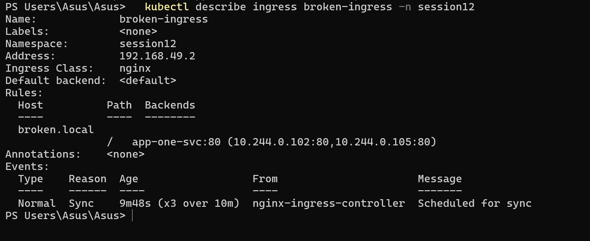

# Task 5 — Troubleshooting

**Name:** Palak Agrawal
**Roll No.:** 24BCS10504

Session 12 — Kubernetes Ingress, ConfigMaps & Secrets

---

> **Note on scope:** the homework says "use the troubleshooting folder". That folder is part
> of the instructor's repository and was not available locally, so three deliberately broken
> manifests were written covering the three objects of this session — a ConfigMap reference,
> a Secret reference and an Ingress backend. Each one is diagnosed, root-caused, fixed and
> verified below, which is the process the task asks for.

## Contents

```
05-troubleshooting/
├── README.md        <- this file
├── broken/          <- the three faulty manifests
│   ├── 01-bad-configmap-key.yaml
│   ├── 02-bad-secret-name.yaml
│   └── 03-bad-ingress-backend.yaml
└── fixed/           <- the corrected versions
    ├── 01-fixed-configmap-key.yaml
    ├── 02-fixed-secret-name.yaml
    └── 03-fixed-ingress-backend.yaml
```

## Applying the broken manifests

```bash
kubectl apply -f 05-troubleshooting/broken/
```

```
pod/broken-configmap created
pod/broken-secret created
ingress.networking.k8s.io/broken-ingress created
```

Every object was **accepted** by the API server — the YAML is syntactically valid. The
failures only appear at runtime:

```bash
kubectl get pods,ingress -n session12
```

```
NAME                   READY   STATUS                       RESTARTS   AGE
pod/broken-configmap   0/1     CreateContainerConfigError   0          21s
pod/broken-secret      0/1     ContainerCreating            0          21s
pod/configmap-demo     1/1     Running                      0          2m55s
pod/secret-demo        1/1     Running                      0          2m19s

NAME                                       CLASS   HOSTS          ADDRESS        PORTS   AGE
ingress.networking.k8s.io/broken-ingress   nginx   broken.local                  80      21s
ingress.networking.k8s.io/demo-ingress     nginx   app-one.local,...  192.168.49.2  80    87s
```

Three different symptoms already visible: a `CreateContainerConfigError`, a Pod stuck in
`ContainerCreating`, and an Ingress with an **empty ADDRESS** while the working one has
`192.168.49.2`.

---

# Problem 1 — `CreateContainerConfigError`

## 1. Identify the problem

```bash
kubectl get pod broken-configmap -n session12
```

```
NAME               READY   STATUS                       RESTARTS   AGE
broken-configmap   0/1     CreateContainerConfigError   0          33s
```

The Pod was scheduled and the image is present, but the container will not start.

## 2. Run troubleshooting commands

```bash
kubectl describe pod broken-configmap -n session12
```

```
Events:
  Type     Reason     Age               From               Message
  ----     ------     ----              ----               -------
  Normal   Scheduled  33s               default-scheduler  Successfully assigned session12/broken-configmap to minikube
  Normal   Pulled     0s (x4 over 29s)  kubelet            Container image "busybox:1.36" already present on machine
  Warning  Failed     0s (x4 over 29s)  kubelet            Error: couldn't find key DATABASE_URL in ConfigMap session12/app-config
```

`kubectl logs` is useless here — the container never started, so there are no logs:

```bash
kubectl logs broken-configmap -n session12
# Error from server (BadRequest): container "app" in pod "broken-configmap" is waiting to start
```

Confirm what the ConfigMap actually contains:

```bash
kubectl get configmap app-config -n session12 -o go-template='{{range $k,$v := .data}}{{$k}}{{"\n"}}{{end}}'
```

```
APP_ENV
APP_NAME
LOG_LEVEL
MAX_CONNECTIONS
app.properties
```

## 3. Root cause

The Pod requests a key called **`DATABASE_URL`**, which does not exist in the ConfigMap
`app-config`. The ConfigMap has five keys and that is not one of them.

```yaml
env:
  - name: DATABASE_URL
    valueFrom:
      configMapKeyRef:
        name: app-config
        key: DATABASE_URL     # <-- does not exist
```

The API server accepts this because it does **not** validate that referenced keys exist —
the ConfigMap could legitimately be created later. kubelet only discovers the problem when
it tries to build the container's environment.

## 4. Fix

Reference a key that exists (`fixed/01-fixed-configmap-key.yaml`):

```yaml
        key: APP_NAME          # <-- FIXED
```

Two other valid fixes:
- add `DATABASE_URL` to the ConfigMap, or
- mark the reference optional so the Pod starts without it:
  ```yaml
  configMapKeyRef:
    name: app-config
    key: DATABASE_URL
    optional: true
  ```

## 5. Before / after

**Before:**
```
NAME               READY   STATUS                       RESTARTS   AGE
broken-configmap   0/1     CreateContainerConfigError   0          33s
```

**After:**
```bash
kubectl delete pod broken-configmap -n session12
kubectl apply -f 05-troubleshooting/fixed/01-fixed-configmap-key.yaml
kubectl get pod broken-configmap -n session12
kubectl exec broken-configmap -n session12 -- env | grep DATABASE_URL
```

```
NAME               READY   STATUS    RESTARTS   AGE
broken-configmap   1/1     Running   0          25s

DATABASE_URL=DevOps Demo App
```

---

# Problem 2 — Pod stuck in `ContainerCreating`

## 1. Identify the problem

```bash
kubectl get pod broken-secret -n session12
```

```
NAME            READY   STATUS              RESTARTS   AGE
broken-secret   0/1     ContainerCreating   0          42s
```

`ContainerCreating` is normal for a few seconds. Stuck there for 42 seconds is not.

## 2. Run troubleshooting commands

```bash
kubectl describe pod broken-secret -n session12
```

```
Events:
  Type     Reason       Age                From               Message
  ----     ------       ----               ----               -------
  Normal   Scheduled    42s                default-scheduler  Successfully assigned session12/broken-secret to minikube
  Warning  FailedMount  10s (x7 over 41s)  kubelet            MountVolume.SetUp failed for volume "secret-volume" : secret "app-secrets" not found
```

List what actually exists:

```bash
kubectl get secrets -n session12
```

```
NAME         TYPE     DATA   AGE
app-secret   Opaque   3      2m40s
```

## 3. Root cause

A **typo**. The Pod mounts `app-secrets` (plural), the Secret is called `app-secret`
(singular).

```yaml
volumes:
  - name: secret-volume
    secret:
      secretName: app-secrets    # <-- trailing "s" - wrong
```

Because the volume cannot be mounted, kubelet never gets as far as creating the container —
which is why the status is `ContainerCreating` rather than a config error. kubelet retries
every few seconds (`x7 over 41s`) and will do so **forever**.

> This differs from Problem 1 in an important way: a missing **key** fails at container
> creation (`CreateContainerConfigError`), while a missing **volume source** fails earlier,
> at mount time (`FailedMount`). The status tells you which stage broke.

## 4. Fix

```yaml
      secretName: app-secret      # <-- FIXED
```

## 5. Before / after

**Before:**
```
NAME            READY   STATUS              RESTARTS   AGE
broken-secret   0/1     ContainerCreating   0          42s

Warning  FailedMount  ...  secret "app-secrets" not found
```

**After:**
```bash
kubectl delete pod broken-secret -n session12
kubectl apply -f 05-troubleshooting/fixed/02-fixed-secret-name.yaml
kubectl get pod broken-secret -n session12
kubectl exec broken-secret -n session12 -- ls /etc/secrets
```

```
NAME            READY   STATUS    RESTARTS   AGE
broken-secret   1/1     Running   0          25s

API_KEY
DB_PASSWORD
DB_USERNAME
```

---

# Problem 3 — Ingress returns HTTP 503

## 1. Identify the problem

```bash
kubectl get ingress -n session12
```

```
NAME             CLASS   HOSTS          ADDRESS        PORTS   AGE
broken-ingress   nginx   broken.local                  80      21s
demo-ingress     nginx   app-one.local,...  192.168.49.2  80    87s
```

`broken-ingress` has an **empty ADDRESS** while the working Ingress has `192.168.49.2`.
Testing it:

```bash
curl -H 'Host: broken.local' http://localhost:32658/
```

```
HTTP 503
```

503 (Service Unavailable), not 404 — so a rule *did* match, but the backend is unusable.

## 2. Run troubleshooting commands

```bash
kubectl describe ingress broken-ingress -n session12
```

```
Name:             broken-ingress
Namespace:        session12
Address:
Ingress Class:    nginx
Rules:
  Host          Path  Backends
  ----          ----  --------
  broken.local
                /   app-one-service:80 (<error: services "app-one-service" not found>)
```

The error is printed **inline in the Backends column**. Compare with the healthy Ingress,
which lists real Pod IPs:

```
  app-one.local
                 /   app-one-svc:80 (10.244.0.102:80,10.244.0.105:80)
```

List the Services that exist:

```bash
kubectl get svc -n session12
```

```
NAME          TYPE        CLUSTER-IP     EXTERNAL-IP   PORT(S)   AGE
app-one-svc   ClusterIP   10.110.167.1   <none>        80/TCP    108s
app-two-svc   ClusterIP   10.96.34.105   <none>        80/TCP    108s
```

## 3. Root cause

The Ingress points at a Service named **`app-one-service`**, which does not exist. The real
Service is **`app-one-svc`**.

```yaml
backend:
  service:
    name: app-one-service   # <-- wrong name
```

As with the other two, the API server accepts a reference to a non-existent Service. The
Ingress Controller then cannot build an upstream for it and returns 503 to any request that
matches the rule.

## 4. Fix

```yaml
    name: app-one-svc       # <-- FIXED
```

## 5. Before / after

**Before:**
```
Rules:
  Host          Path  Backends
  broken.local
                /   app-one-service:80 (<error: services "app-one-service" not found>)

$ curl -H 'Host: broken.local' http://localhost:32658/
HTTP 503
```

**After:**
```bash
kubectl apply -f 05-troubleshooting/fixed/03-fixed-ingress-backend.yaml
kubectl describe ingress broken-ingress -n session12
curl -H 'Host: broken.local' http://localhost:32658/
```

```
Rules:
  Host          Path  Backends
  ----          ----  --------
  broken.local
                /   app-one-svc:80 (10.244.0.102:80,10.244.0.105:80)

<h1>APP ONE</h1><p>served by app-one-5668b7cc58-p7pjr</p>
```

The ADDRESS column also populates once the backend resolves:

```
NAME             CLASS   HOSTS          ADDRESS        PORTS   AGE
broken-ingress   nginx   broken.local   192.168.49.2   80      83s
```

### Screenshot



---

# Summary

| # | Symptom | Root cause | Diagnosed with | Fix |
|---|---|---|---|---|
| 1 | `CreateContainerConfigError` | ConfigMap key `DATABASE_URL` does not exist | `describe pod` → Events | Reference an existing key |
| 2 | Stuck in `ContainerCreating` | Secret name typo (`app-secrets` vs `app-secret`) | `describe pod` → `FailedMount` | Correct the name |
| 3 | HTTP 503, empty `ADDRESS` | Ingress backend Service does not exist | `describe ingress` → inline error | Correct the Service name |

## Lessons

1. **Valid YAML is not a working deployment.** All three objects were accepted by the API
   server. Kubernetes does not validate that referenced ConfigMaps, Secrets or Services
   exist, because they may legitimately be created later.

2. **`kubectl describe` is the first command, every time.** All three root causes were
   printed verbatim in plain English — `couldn't find key DATABASE_URL`,
   `secret "app-secrets" not found`, `services "app-one-service" not found`.

3. **`kubectl logs` is useless when the container never started.** For
   `CreateContainerConfigError`, `ContainerCreating` and `ImagePullBackOff`, logs do not
   exist yet. Use `describe`.

4. **The status tells you which stage failed.**

   | Status | Failed at |
   |---|---|
   | `Pending` | Scheduling |
   | `ContainerCreating` + `FailedMount` | Volume mount |
   | `CreateContainerConfigError` | Building the container config (env vars) |
   | `ImagePullBackOff` | Image pull |
   | `CrashLoopBackOff` | The application itself — **now** read the logs |

5. **HTTP status codes narrow an Ingress problem down fast.**

   | Code | Meaning |
   |---|---|
   | **404** | No rule matched — check host and path |
   | **503** | Rule matched, backend broken — check the Service name and its endpoints |
   | **No response / timeout** | Controller not running, or the wrong port |

6. **A populated `ADDRESS` column is the health check for an Ingress.** Empty means either
   no controller is installed or the rules cannot be satisfied.

## Quick reference

```bash
# Pods
kubectl get pods -n <ns>
kubectl describe pod <pod> -n <ns>          # Events section is the answer
kubectl logs <pod> -n <ns>                  # only once the container has started

# ConfigMaps and Secrets
kubectl get configmap,secret -n <ns>
kubectl describe configmap <name> -n <ns>
kubectl get configmap <name> -n <ns> -o go-template='{{range $k,$v := .data}}{{$k}}{{"\n"}}{{end}}'

# Services and Ingress
kubectl get svc,endpoints -n <ns>           # empty endpoints = selector mismatch
kubectl get ingress -n <ns>                 # ADDRESS column must be populated
kubectl describe ingress <name> -n <ns>     # Backends column shows resolution errors
kubectl logs -n ingress-nginx -l app.kubernetes.io/component=controller --tail=50

# Cluster-wide
kubectl get events -n <ns> --sort-by=.lastTimestamp
```
