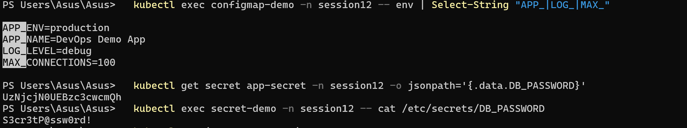

# Session 12 — Kubernetes Ingress, ConfigMaps & Secrets

## Student Information

**Name:** Palak Agrawal
**Roll No.:** 24BCS10504

---

## Objective

The objective of this practical was to perform complete hands-on demos of **ConfigMaps**
and **Secrets** — creating them, injecting them into Pods and verifying the values inside
the container — to configure an **Ingress** and verify host-based and path-based routing,
to document the difference between **Ingress and Ingress Controller**, and to work through
a set of broken manifests as a **troubleshooting** exercise.

---

## Deliverables

| Deliverable | Location |
|---|---|
| ConfigMap YAML | `01-configmap/` |
| Secret YAML | `02-secret/` |
| Ingress YAML | `03-ingress/` |
| Ingress vs Ingress Controller | [`04-ingress-vs-controller/README.md`](04-ingress-vs-controller/README.md) |
| Troubleshooting documentation | [`05-troubleshooting/README.md`](05-troubleshooting/README.md) |
| Screenshots | `images/` |

---

## Folder Structure

```
Kubernetes Ingress, ConfigMaps & Secrets/
├── 00-namespace.yaml
├── 01-configmap/
│   ├── configmap.yaml
│   └── pod.yaml
├── 02-secret/
│   ├── secret.yaml
│   └── pod.yaml
├── 03-ingress/
│   ├── app-deployments.yaml
│   ├── services.yaml
│   └── ingress.yaml
├── 04-ingress-vs-controller/README.md
├── 05-troubleshooting/
│   ├── README.md
│   ├── broken/
│   └── fixed/
├── images/
└── readme.md
```

---

## Setup

```bash
kubectl apply -f 00-namespace.yaml
```

```
namespace/session12 created
```

The Ingress tasks also need an Ingress Controller, which Minikube ships as an addon:

```bash
minikube addons enable ingress
```

```
  - Using image registry.k8s.io/ingress-nginx/controller:v1.15.1
* Verifying ingress addon...
* The 'ingress' addon is enabled
```

```bash
kubectl get pods -n ingress-nginx
kubectl get svc -n ingress-nginx
kubectl get ingressclass
```

```
NAME                                       READY   STATUS      RESTARTS   AGE
ingress-nginx-admission-create-zw8jn       0/1     Completed   0          71s
ingress-nginx-admission-patch-pggnr        0/1     Completed   2          71s
ingress-nginx-controller-d7cd8c989-r7kq8   1/1     Running     0          71s

NAME                       TYPE       CLUSTER-IP      EXTERNAL-IP   PORT(S)                      AGE
ingress-nginx-controller   NodePort   10.111.138.40   <none>        80:32658/TCP,443:31271/TCP   71s

NAME              CONTROLLER             PARAMETERS   AGE
nginx (default)   k8s.io/ingress-nginx   <none>       71s
```

The controller is reachable on **NodePort 32658**, which is what the routing tests below use.

---

# Task 1 — ConfigMap

## Create the ConfigMap

`01-configmap/configmap.yaml` stores both simple key/value pairs and a multi-line file.

```bash
kubectl apply -f 01-configmap/configmap.yaml
kubectl get configmap app-config -n session12
```

```
configmap/app-config created

NAME         DATA   AGE
app-config   5      19s
```

## Store configuration values

```bash
kubectl describe configmap app-config -n session12
```

```
Name:         app-config
Namespace:    session12

Data
====
APP_ENV:
----
production

APP_NAME:
----
DevOps Demo App

LOG_LEVEL:
----
debug

MAX_CONNECTIONS:
----
100

app.properties:
----
server.port=8080
server.timeout=30
feature.newUI=enabled
cache.enabled=true
```

Five entries: four scalar values and one multi-line file. Note that **everything is a
string** — `MAX_CONNECTIONS: "100"` must be quoted, or YAML parses it as an integer and the
API rejects it.

## Inject the ConfigMap into a Pod

`01-configmap/pod.yaml` demonstrates all three injection methods at once:

| Method | YAML | Result in the container |
|---|---|---|
| 1. Single key → env var | `configMapKeyRef` | One environment variable |
| 2. All keys → env vars | `envFrom.configMapRef` | One env var per key |
| 3. Whole ConfigMap → files | `volumes.configMap` | One file per key |

```bash
kubectl apply -f 01-configmap/pod.yaml
kubectl get pod configmap-demo -n session12
```

```
pod/configmap-demo created

NAME             READY   STATUS    RESTARTS   AGE
configmap-demo   1/1     Running   0          19s
```

## Verify the values inside the container

### As environment variables

```bash
kubectl exec configmap-demo -n session12 -- env | grep -E 'APP_|LOG_|MAX_'
```

```
APP_ENV=production
APP_NAME=DevOps Demo App
LOG_LEVEL=debug
MAX_CONNECTIONS=100
```

All four keys are present — `APP_NAME` and `LOG_LEVEL` from the explicit `configMapKeyRef`
entries, and `APP_ENV` and `MAX_CONNECTIONS` picked up by `envFrom`.

### As mounted files

```bash
kubectl exec configmap-demo -n session12 -- ls -l /etc/config
```

```
total 0
lrwxrwxrwx    1 root     root            14 Oct  6 17:26 APP_ENV -> ..data/APP_ENV
lrwxrwxrwx    1 root     root            15 Oct  6 17:26 APP_NAME -> ..data/APP_NAME
lrwxrwxrwx    1 root     root            16 Oct  6 17:26 LOG_LEVEL -> ..data/LOG_LEVEL
lrwxrwxrwx    1 root     root            22 Oct  6 17:26 MAX_CONNECTIONS -> ..data/MAX_CONNECTIONS
lrwxrwxrwx    1 root     root            21 Oct  6 17:26 app.properties -> ..data/app.properties
```

Each key became a file. They are **symlinks into a hidden `..data` directory** — that
indirection is how Kubernetes updates mounted ConfigMaps atomically, by swapping the
symlink target rather than rewriting files in place.

```bash
kubectl exec configmap-demo -n session12 -- cat /etc/config/app.properties
kubectl exec configmap-demo -n session12 -- cat /etc/config/APP_NAME
```

```
server.port=8080
server.timeout=30
feature.newUI=enabled
cache.enabled=true

DevOps Demo App
```

## env vars vs volume mounts

| | Environment variables | Volume mount |
|---|---|---|
| Updates when the ConfigMap changes | **No** — needs a Pod restart | **Yes** — within ~60s |
| Good for | Simple scalar settings | Config files, certificates |
| Visible in `kubectl describe pod` | Yes | No |
| Works with multi-line values | Awkward | Natural |

The update behaviour is the important one: a ConfigMap edit will **not** reach a container
that consumes it as an environment variable until the Pod is recreated. Mounted files update
in place.

---

# Task 2 — Secret

## Create the Secret

`02-secret/secret.yaml` uses `stringData`, which accepts plain text and lets Kubernetes do
the base64 encoding:

```bash
kubectl apply -f 02-secret/secret.yaml
kubectl get secret app-secret -n session12
```

```
secret/app-secret created

NAME         TYPE     DATA   AGE
app-secret   Opaque   3      19s
```

## Store sensitive values

```bash
kubectl describe secret app-secret -n session12
```

```
Name:         app-secret
Namespace:    session12

Type:  Opaque

Data
====
API_KEY:      24 bytes
DB_PASSWORD:  15 bytes
DB_USERNAME:  5 bytes
```

`describe` deliberately shows **only byte counts**, never the values — unlike ConfigMaps,
which print everything.

## Inject the Secret into a Pod

```bash
kubectl apply -f 02-secret/pod.yaml
```

Both methods are used: `secretKeyRef` for environment variables, and a volume mount with
`defaultMode: 0400` so the files are readable only by the owner.

## Verify the values inside the container

### As environment variables

```bash
kubectl exec secret-demo -n session12 -- env | grep DB_
```

```
DB_USERNAME=admin
DB_PASSWORD=S3cr3tP@ssw0rd!
```

### As mounted files

```bash
kubectl exec secret-demo -n session12 -- ls -l /etc/secrets
kubectl exec secret-demo -n session12 -- cat /etc/secrets/DB_PASSWORD
kubectl exec secret-demo -n session12 -- cat /etc/secrets/API_KEY
```

```
total 0
lrwxrwxrwx    1 root     root            14 Oct  6 17:26 API_KEY -> ..data/API_KEY
lrwxrwxrwx    1 root     root            18 Oct  6 17:26 DB_PASSWORD -> ..data/DB_PASSWORD
lrwxrwxrwx    1 root     root            18 Oct  6 17:26 DB_USERNAME -> ..data/DB_USERNAME

S3cr3tP@ssw0rd!
sk-demo-1234567890abcdef
```

The values arrive **decoded** — the application never sees base64.

## Why Secrets should NOT be committed directly to Git

### Base64 is encoding, not encryption

This is the single most important point. `describe` hides the values, but `-o yaml` does not:

```bash
kubectl get secret app-secret -n session12 -o yaml
```

```yaml
data:
  API_KEY: c2stZGVtby0xMjM0NTY3ODkwYWJjZGVm
  DB_PASSWORD: UzNjcjN0UEBzc3cwcmQh
  DB_USERNAME: YWRtaW4=
kind: Secret
```

That looks scrambled. It is not:

```bash
echo 'UzNjcjN0UEBzc3cwcmQh' | base64 -d
```

```
S3cr3tP@ssw0rd!
```

**One command, no key, no password.** Anyone who can read the YAML can read the secret.
Base64 exists so that binary data survives YAML/JSON transport — it provides **zero**
confidentiality.

### Why committing it is dangerous

| Risk | Explanation |
|---|---|
| **Permanent history** | Git never forgets. Deleting the file in a later commit leaves the value in history forever; the fix is a full history rewrite *and* rotating the credential. |
| **Wide blast radius** | Everyone with repo read access — including CI runners, forks and integrations — gets the credential. |
| **Automated scanning** | Bots scan public GitHub for committed keys continuously. Real-world exposure is measured in minutes. |
| **No audit trail** | A Secret in the cluster is covered by RBAC and audit logs. A Secret in Git is not. |
| **No rotation** | Rotating means a commit, review, merge and redeploy — so in practice it never happens. |

### What to do instead

| Approach | How it works |
|---|---|
| **`kubectl create secret` imperatively** | Never written to a file at all |
| **Sealed Secrets** (Bitnami) | Encrypt with a cluster public key; only the in-cluster controller can decrypt. The encrypted file **is** safe to commit |
| **External Secrets Operator** | Secrets live in AWS Secrets Manager / Vault / Azure Key Vault; the operator syncs them in |
| **SOPS + age/KMS** | Encrypt values in-place in the YAML; decrypt at deploy time |
| **Cloud-native CSI drivers** | Mount directly from a cloud secret store, nothing stored in etcd |

Creating a Secret without any file touching disk:

```bash
kubectl create secret generic app-secret \
  --from-literal=DB_USERNAME=admin \
  --from-literal=DB_PASSWORD='S3cr3tP@ssw0rd!' \
  -n session12
```

> The Secret YAML in `02-secret/secret.yaml` is committed here **only because the values are
> fake demo data for this assignment**. Real credentials would never be handled this way.

### Also worth knowing

- Secrets are stored **unencrypted in etcd** by default. Production clusters should enable
  [encryption at rest](https://kubernetes.io/docs/tasks/administer-cluster/encrypt-data/).
- Anyone who can create a Pod in a namespace can mount any Secret in that namespace — so
  RBAC on Pod creation matters as much as RBAC on Secrets.
- Prefer **volume mounts over environment variables**: env vars leak into crash dumps, child
  processes, and `kubectl describe pod` output of anything that logs its environment.

### Screenshot



---

# Task 3 — Ingress

## Deploy the application

Two distinct apps, so routing has somewhere to route *between*:

```bash
kubectl apply -f 03-ingress/app-deployments.yaml
```

```
deployment.apps/app-one created
deployment.apps/app-two created
```

## Create the Services

Ingress always reaches Pods **through a Service**, so each app gets a ClusterIP:

```bash
kubectl apply -f 03-ingress/services.yaml
kubectl get deploy,svc -n session12
```

```
NAME                      READY   UP-TO-DATE   AVAILABLE   AGE
deployment.apps/app-one   2/2     2            2           27s
deployment.apps/app-two   2/2     2            2           27s

NAME                  TYPE        CLUSTER-IP     EXTERNAL-IP   PORT(S)   AGE
service/app-one-svc   ClusterIP   10.110.167.1   <none>        80/TCP    26s
service/app-two-svc   ClusterIP   10.96.34.105   <none>        80/TCP    26s
```

Both are `ClusterIP` — they do **not** need to be NodePort or LoadBalancer, because the
Ingress Controller is already inside the cluster and reaches them internally.

## Configure the Ingress

`03-ingress/ingress.yaml` defines both routing styles:

- **Host-based** — `app-one.local` → app one, `app-two.local` → app two
- **Path-based** — `demo.local/one` → app one, `demo.local/two` → app two

```bash
kubectl apply -f 03-ingress/ingress.yaml
kubectl get ingress -n session12
```

```
ingress.networking.k8s.io/demo-ingress created

NAME           CLASS   HOSTS                                    ADDRESS        PORTS   AGE
demo-ingress   nginx   app-one.local,app-two.local,demo.local   192.168.49.2   80      87s
```

## Verify routing

```bash
kubectl describe ingress demo-ingress -n session12
```

```
Name:             demo-ingress
Namespace:        session12
Ingress Class:    nginx
Rules:
  Host           Path  Backends
  ----           ----  --------
  app-one.local
                 /   app-one-svc:80 (10.244.0.102:80,10.244.0.105:80)
  app-two.local
                 /   app-two-svc:80 (10.244.0.103:80,10.244.0.104:80)
  demo.local
                 /one(/|$)(.*)   app-one-svc:80 (10.244.0.102:80,10.244.0.105:80)
                 /two(/|$)(.*)   app-two-svc:80 (10.244.0.103:80,10.244.0.104:80)
Annotations:     nginx.ingress.kubernetes.io/rewrite-target: /$2
Events:
  Type    Reason  Age   From                      Message
  Normal  Sync    34s   nginx-ingress-controller  Scheduled for sync
```

Every rule resolved to real Pod IPs in brackets — that is the quickest way to confirm an
Ingress is wired up correctly.

## Access the application through the Ingress

Since `app-one.local` is not real DNS, the `Host` header is set manually:

### Host-based routing

```bash
curl -H 'Host: app-one.local' http://localhost:32658/
curl -H 'Host: app-two.local' http://localhost:32658/
```

```
<h1>APP ONE</h1><p>served by app-one-5668b7cc58-8lzwv</p>
<h1>APP TWO</h1><p>served by app-two-5c7ddb9774-rnxgs</p>
```

**Same IP, same port, different app** — decided purely by the `Host` header. This is the
core value of Ingress: one entry point serving many applications.

### Path-based routing

```bash
curl -H 'Host: demo.local' http://localhost:32658/one
curl -H 'Host: demo.local' http://localhost:32658/two
```

```
<h1>APP ONE</h1><p>served by app-one-5668b7cc58-8lzwv</p>
<h1>APP TWO</h1><p>served by app-two-5c7ddb9774-tb7tx</p>
```

Same host, routed by URL path. The `rewrite-target: /$2` annotation strips the `/one`
prefix so the backend receives `/`, not `/one` — without it nginx would return 404 because
the app has no `/one` page.

### Unmatched host

```bash
curl -H 'Host: unknown.local' http://localhost:32658/
```

```
HTTP 404
```

No rule matches, so the controller's default backend returns 404 — confirming the routing
is genuinely rule-driven rather than everything landing on one app.

### Accessing it from a browser

Add the hostnames to the Windows hosts file at
`C:\Windows\System32\drivers\etc\hosts` (needs Administrator):

```
127.0.0.1 app-one.local app-two.local demo.local
```

then run `minikube tunnel` in a separate terminal and open `http://app-one.local`.

### Screenshot


---

# Task 4 — Ingress vs Ingress Controller

Full write-up in **[`04-ingress-vs-controller/README.md`](04-ingress-vs-controller/README.md)**.

---

# Task 5 — Troubleshooting

Full write-up in **[`05-troubleshooting/README.md`](05-troubleshooting/README.md)**, with
three broken manifests, the diagnosis of each, the root cause, the fix and before/after
output.

---

## Cleanup

```bash
kubectl delete namespace session12
minikube addons disable ingress
```

---

## Conclusion

ConfigMaps and Secrets were both created, injected into Pods by all available methods, and
the values confirmed from inside the running containers — as environment variables and as
mounted files under `/etc/config` and `/etc/secrets`. The mounted entries turned out to be
symlinks into a hidden `..data` directory, which is the mechanism behind atomic in-place
updates and the reason mounted config refreshes without a restart while environment
variables do not.

The security point was demonstrated rather than asserted: `kubectl describe secret` shows
only `15 bytes`, but `kubectl get secret -o yaml` prints the base64 string, and
`echo '...' | base64 -d` returned `S3cr3tP@ssw0rd!` in one command with no key. Base64 is
encoding, not encryption, which is exactly why Secrets must not be committed to Git.

The Ingress demo showed one entry point on NodePort 32658 serving two different
applications, selected by `Host` header and by URL path, with an unmatched host correctly
returning 404. The troubleshooting exercise then broke a ConfigMap key reference, a Secret
name and an Ingress backend, and in all three cases `kubectl describe` named the root cause
verbatim — `couldn't find key DATABASE_URL`, `secret "app-secrets" not found`, and
`<error: services "app-one-service" not found>`.
