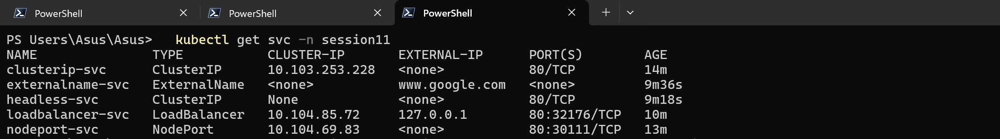
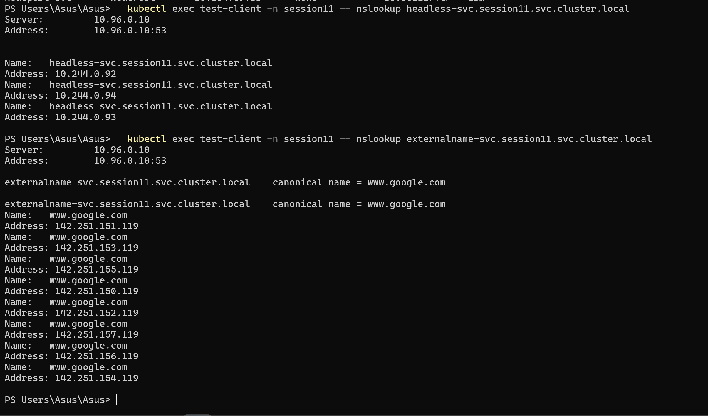

# Session 11 — Kubernetes Networking & Services

## Student Information

**Name:** Palak Agrawal
**Roll No.:** 24BCS10504

---

## Objective

The objective of this practical was to deploy and demonstrate all **five Kubernetes
Service types** — ClusterIP, NodePort, LoadBalancer, ExternalName and Headless — verifying
each one and testing connectivity, and to document how Kubernetes objects relate to each
other, how Service DNS/FQDN works, and how CoreDNS resolves those names.

---

## Deliverables

| Deliverable | Location |
|---|---|
| Service YAML files | `01-clusterip/` … `05-headless/` |
| Task 1 — all 5 Service types | this file |
| Task 2 — Comparison documentation | [`comparison/README.md`](comparison/README.md) |
| Task 3 — FQDN | [`fqdn/README.md`](fqdn/README.md) |
| Task 4 — CoreDNS | [`coredns/README.md`](coredns/README.md) |
| Screenshots | `images/` |

---

## Folder Structure

```
Kubernetes Networking & Services/
├── 00-namespace.yaml
├── 00-backend-deployment.yaml     # shared 3-replica nginx backend
├── 00-test-client.yaml            # busybox pod for in-cluster testing
├── 01-clusterip/service.yaml
├── 02-nodeport/service.yaml
├── 03-loadbalancer/service.yaml
├── 04-externalname/service.yaml
├── 05-headless/service.yaml
├── comparison/README.md           # Task 2
├── fqdn/README.md                 # Task 3
├── coredns/README.md              # Task 4
├── images/
└── readme.md
```

---

## Common Setup

All five Services point at one shared backend Deployment. Each Pod writes its own name
into `index.html`, so any response identifies which Pod served it. A busybox `test-client`
Pod is used for testing **from inside** the cluster.

```bash
kubectl apply -f 00-namespace.yaml
kubectl apply -f 00-backend-deployment.yaml
kubectl apply -f 00-test-client.yaml
kubectl get pods -n session11 -o wide
```

```
namespace/session11 created
deployment.apps/web-backend created
pod/test-client created

NAME                           READY   STATUS    RESTARTS   AGE   IP            NODE
test-client                    1/1     Running   0          25s   10.244.0.95   minikube
web-backend-5b96f69d45-r9stw   1/1     Running   0          25s   10.244.0.94   minikube
web-backend-5b96f69d45-sdf7q   1/1     Running   0          25s   10.244.0.93   minikube
web-backend-5b96f69d45-x4b4r   1/1     Running   0          25s   10.244.0.92   minikube
```

Backend Pod IPs: **10.244.0.92, .93, .94** — referenced throughout as proof of what each
Service points at.

---

# Task 1 — Kubernetes Services

## Service type summary

| Type | ClusterIP | NodePort | External access | Load balances | Use case |
|---|---|---|---|---|---|
| **ClusterIP** | Yes | No | No | Yes | Internal service-to-service calls (default) |
| **NodePort** | Yes | Yes | Yes, via `NodeIP:port` | Yes | Dev/test, or behind an external LB |
| **LoadBalancer** | Yes | Yes | Yes, via cloud LB | Yes | Production on a cloud provider |
| **ExternalName** | No | No | n/a — DNS only | No | Alias an external hostname |
| **Headless** | **None** | No | No | **No** | Per-Pod DNS: StatefulSets, databases |

Each type **builds on** the previous one: a NodePort also has a ClusterIP, and a
LoadBalancer also has both a NodePort and a ClusterIP. This is visible in the outputs below.

---

## 01 — ClusterIP

The default type. The Service gets a virtual IP reachable **only from inside** the cluster.

### Create and verify

```bash
kubectl apply -f 01-clusterip/
kubectl get svc clusterip-svc -n session11
```

```
service/clusterip-svc created

NAME            TYPE        CLUSTER-IP       EXTERNAL-IP   PORT(S)   AGE
clusterip-svc   ClusterIP   10.103.253.228   <none>        80/TCP    4s
```

```bash
kubectl describe svc clusterip-svc -n session11
```

```
Name:                     clusterip-svc
Namespace:                session11
Selector:                 app=web-backend
Type:                     ClusterIP
IP:                       10.103.253.228
Port:                     <unset>  80/TCP
TargetPort:               80/TCP
Endpoints:                10.244.0.93:80,10.244.0.92:80,10.244.0.94:80
Session Affinity:         None
Internal Traffic Policy:  Cluster
```

`EXTERNAL-IP` is `<none>` and the three `Endpoints` match the three backend Pod IPs exactly.

### Test connectivity (from inside the cluster)

```bash
kubectl exec test-client -n session11 -- wget -qO- http://clusterip-svc
```

```
Hello from pod web-backend-5b96f69d45-x4b4r
Hello from pod web-backend-5b96f69d45-r9stw
Hello from pod web-backend-5b96f69d45-r9stw
Hello from pod web-backend-5b96f69d45-r9stw
```

Different Pod names prove kube-proxy is load balancing across the endpoints.

### Prove it is NOT reachable from outside

```bash
curl --max-time 5 http://10.103.253.228      # run on the Windows host
```

```
exit code: 28
```

Exit code 28 is curl's "operation timed out". The ClusterIP `10.103.253.228` is a virtual
IP that only exists as an iptables rule on cluster nodes — it is not routable from the
host. **This is the defining property of ClusterIP.**

---

## 02 — NodePort

Opens the same port on **every node** and forwards it to the Service. A ClusterIP is still
allocated underneath.

### Create and verify

```bash
kubectl apply -f 02-nodeport/
kubectl get svc nodeport-svc -n session11
kubectl describe svc nodeport-svc -n session11
```

```
service/nodeport-svc created

NAME           TYPE       CLUSTER-IP     EXTERNAL-IP   PORT(S)        AGE
nodeport-svc   NodePort   10.104.69.83   <none>        80:30111/TCP   4s

Name:                     nodeport-svc
Selector:                 app=web-backend
Type:                     NodePort
IP:                       10.104.69.83
Port:                     <unset>  80/TCP
TargetPort:               80/TCP
NodePort:                 <unset>  30111/TCP
Endpoints:                10.244.0.92:80,10.244.0.94:80,10.244.0.93:80
External Traffic Policy:  Cluster
```

`PORT(S)` reads `80:30111/TCP` — port 80 on the ClusterIP, port 30111 on every node.
Note it **still has a ClusterIP** (`10.104.69.83`): NodePort is a superset of ClusterIP.

### Test connectivity

From the node itself:

```bash
minikube ssh "curl -s http://localhost:30111"
```

```
Hello from pod web-backend-5b96f69d45-sdf7q
Hello from pod web-backend-5b96f69d45-r9stw
Hello from pod web-backend-5b96f69d45-sdf7q
```

From inside the cluster, via its ClusterIP layer:

```bash
kubectl exec test-client -n session11 -- wget -qO- http://nodeport-svc
```

```
Hello from pod web-backend-5b96f69d45-sdf7q
```

> **Windows + docker driver note:** `curl http://$(minikube ip):30111` from the Windows
> host returns nothing, because the node IP `192.168.49.2` lives inside Docker's internal
> network and is not routable from Windows. On Linux it would work directly. On Windows
> use either `minikube ssh` as above, or `minikube service nodeport-svc -n session11 --url`
> which opens a tunnel and prints a `127.0.0.1:<port>` URL — that command must stay running
> for the tunnel to work.

### NodePort range

Valid NodePorts are **30000–32767**. Choosing one manually (as here, `30111`) risks a
collision — a port already taken by another Service is rejected with
`provided port is already allocated`. Omitting `nodePort` lets Kubernetes pick a free one.

---

## 03 — LoadBalancer

Asks the cloud provider for an external load balancer. A NodePort and a ClusterIP are both
allocated underneath.

### Create and verify

```bash
kubectl apply -f 03-loadbalancer/
kubectl get svc loadbalancer-svc -n session11
```

```
service/loadbalancer-svc created

NAME               TYPE           CLUSTER-IP     EXTERNAL-IP   PORT(S)        AGE
loadbalancer-svc   LoadBalancer   10.104.85.72   <pending>     80:32176/TCP   5s
```

`EXTERNAL-IP` is `<pending>` — Minikube has no cloud provider to satisfy the request, so
nothing ever assigns an IP. This is expected, not an error.

```bash
kubectl describe svc loadbalancer-svc -n session11
```

```
Name:                     loadbalancer-svc
Type:                     LoadBalancer
IP:                       10.104.85.72
Port:                     <unset>  80/TCP
TargetPort:               80/TCP
NodePort:                 <unset>  32176/TCP
Endpoints:                10.244.0.92:80,10.244.0.93:80,10.244.0.94:80
```

**All three layers are visible at once:** ClusterIP `10.104.85.72`, NodePort `32176`, and
a pending external IP. Even while pending, the lower layers work:

```bash
minikube ssh "curl -s http://localhost:32176"               # via the NodePort layer
kubectl exec test-client -n session11 -- wget -qO- http://loadbalancer-svc   # via ClusterIP
```

```
Hello from pod web-backend-5b96f69d45-x4b4r
Hello from pod web-backend-5b96f69d45-sdf7q

Hello from pod web-backend-5b96f69d45-r9stw
```

### Getting a real EXTERNAL-IP with `minikube tunnel`

`minikube tunnel` emulates a cloud load balancer by creating a network route on the host.
It must be left running in its own terminal.

```bash
minikube tunnel
```

```
* Tunnel successfully started
* NOTE: Please do not close this terminal as this process must stay alive for the tunnel to be accessible ...
* Starting tunnel for service loadbalancer-svc.
```

```bash
kubectl get svc loadbalancer-svc -n session11
```

```
NAME               TYPE           CLUSTER-IP     EXTERNAL-IP   PORT(S)        AGE
loadbalancer-svc   LoadBalancer   10.104.85.72   127.0.0.1     80:32176/TCP   55s
```

`EXTERNAL-IP` changed from `<pending>` to `127.0.0.1`. Now it is reachable from the
Windows host on port 80 directly:

```bash
curl http://127.0.0.1
```

```
Hello from pod web-backend-5b96f69d45-r9stw
Hello from pod web-backend-5b96f69d45-x4b4r
Hello from pod web-backend-5b96f69d45-x4b4r
```

On a real cloud provider this would be a public IP attached to an AWS ELB, GCP Network
Load Balancer or Azure Load Balancer, provisioned automatically by the
cloud-controller-manager.

### Screenshot



---

## 04 — ExternalName

A pure DNS alias. It has **no selector, no ClusterIP and no endpoints** — CoreDNS simply
returns a CNAME record and no traffic passes through Kubernetes at all.

### Create and verify

```bash
kubectl apply -f 04-externalname/
kubectl get svc externalname-svc -n session11
kubectl describe svc externalname-svc -n session11
```

```
service/externalname-svc created

NAME               TYPE           CLUSTER-IP   EXTERNAL-IP      PORT(S)   AGE
externalname-svc   ExternalName   <none>       www.google.com   <none>    4s

Name:              externalname-svc
Namespace:         session11
Selector:          <none>
Type:              ExternalName
IP Families:       <none>
IP:
IPs:               <none>
External Name:     www.google.com
```

Note `CLUSTER-IP: <none>`, `PORT(S): <none>` and `Selector: <none>`. Confirming there are
no endpoints at all:

```bash
kubectl get endpoints externalname-svc -n session11
```

```
Error from server (NotFound): endpoints "externalname-svc" not found
```

### Test connectivity

```bash
kubectl exec test-client -n session11 -- nslookup externalname-svc.session11.svc.cluster.local
```

```
Server:		10.96.0.10
Address:	10.96.0.10:53

externalname-svc.session11.svc.cluster.local	canonical name = www.google.com
Name:	www.google.com
Address: 142.251.151.119
Name:	www.google.com
Address: 142.251.154.119
Name:	www.google.com
Address: 142.251.150.119
...
```

The `canonical name =` line is the CNAME. The client then resolves `www.google.com`
normally and connects **directly** to it — the packets never touch kube-proxy.

**Use case:** point an in-cluster name such as `prod-database` at a managed external
endpoint like `mydb.abc123.eu-west-1.rds.amazonaws.com`. Application code keeps using
`prod-database`, and migrating the database later is a one-line Service change.

---

## 05 — Headless Service

Setting `clusterIP: None` disables the virtual IP and the load balancing. A DNS lookup
returns the **A records of every ready Pod** instead of one Service IP.

### Create and verify

```bash
kubectl apply -f 05-headless/
kubectl get svc headless-svc -n session11
kubectl describe svc headless-svc -n session11
```

```
service/headless-svc created

NAME           TYPE        CLUSTER-IP   EXTERNAL-IP   PORT(S)   AGE
headless-svc   ClusterIP   None         <none>        80/TCP    4s

Name:                     headless-svc
Selector:                 app=web-backend
Type:                     ClusterIP
IP:                       None
IPs:                      None
Port:                     <unset>  80/TCP
Endpoints:                10.244.0.92:80,10.244.0.93:80,10.244.0.94:80
```

`CLUSTER-IP` is literally `None`, yet endpoints still exist — they are published through
DNS rather than through a virtual IP.

### Test connectivity

```bash
kubectl exec test-client -n session11 -- nslookup headless-svc.session11.svc.cluster.local
```

```
Server:		10.96.0.10
Address:	10.96.0.10:53

Name:	headless-svc.session11.svc.cluster.local
Address: 10.244.0.92
Name:	headless-svc.session11.svc.cluster.local
Address: 10.244.0.94
Name:	headless-svc.session11.svc.cluster.local
Address: 10.244.0.93
```

Compare with the actual Pod IPs:

```bash
kubectl get pods -n session11 -l app=web-backend -o wide
```

```
NAME                           READY   STATUS    RESTARTS   AGE     IP            NODE
web-backend-5b96f69d45-r9stw   1/1     Running   0          5m52s   10.244.0.94   minikube
web-backend-5b96f69d45-sdf7q   1/1     Running   0          5m52s   10.244.0.93   minikube
web-backend-5b96f69d45-x4b4r   1/1     Running   0          5m52s   10.244.0.92   minikube
```

**Three DNS A records, three Pod IPs, exact match.** A ClusterIP Service would have
returned one IP (`10.103.253.228`); the headless Service returns all three and lets the
client decide.

**Use case:** databases and other stateful systems where the client must address a
*specific* replica — a MongoDB replica set connecting to each member, or Kafka brokers.
This is why StatefulSets are almost always paired with a headless Service.

---

## All five Services side by side

```bash
kubectl get svc -n session11
```

```
NAME               TYPE           CLUSTER-IP       EXTERNAL-IP      PORT(S)        AGE
clusterip-svc      ClusterIP      10.103.253.228   <none>           80/TCP         5m29s
externalname-svc   ExternalName   <none>           www.google.com   <none>         32s
headless-svc       ClusterIP      None             <none>           80/TCP         14s
loadbalancer-svc   LoadBalancer   10.104.85.72     127.0.0.1        80:32176/TCP   95s
nodeport-svc       NodePort       10.104.69.83     <none>           80:30111/TCP   4m55s
```

One table showing every distinguishing feature: a normal ClusterIP, `None` for headless,
`<none>` for ExternalName, a NodePort suffix on two of them, and an EXTERNAL-IP only on the
LoadBalancer.

### Screenshot



---

# Task 2 — Kubernetes Object Comparison

Full write-up in **[`comparison/README.md`](comparison/README.md)**, covering:

- Deployment vs ReplicaSet
- Deployment vs DaemonSet vs StatefulSet
- ReplicaSet vs Service

---

# Task 3 — FQDN

Full write-up in **[`fqdn/README.md`](fqdn/README.md)**, covering what an FQDN is,
Kubernetes Service DNS, the naming convention, namespace-based DNS, Pod-to-Service
communication and worked examples.

---

# Task 4 — CoreDNS

Full write-up in **[`coredns/README.md`](coredns/README.md)**, covering what CoreDNS is,
why Kubernetes uses it, service discovery, query resolution, the Corefile configuration
and DNS troubleshooting.

---

## Cleanup

```bash
kubectl delete namespace session11
```

If `minikube tunnel` is still running, stop it with `Ctrl+C`.

---

## Conclusion

All five Service types were deployed and verified against a live cluster, and the outputs
show that they form a layered stack rather than five unrelated options. ClusterIP gives a
virtual IP that timed out (`exit code 28`) when curled from the Windows host, proving it is
internal-only. NodePort added `80:30111/TCP` while keeping its ClusterIP. LoadBalancer
showed all three layers at once — ClusterIP, NodePort `32176`, and an `EXTERNAL-IP` that
moved from `<pending>` to `127.0.0.1` once `minikube tunnel` was running.

The two outliers behave completely differently. ExternalName has no ClusterIP, no selector
and no endpoints — `kubectl get endpoints` returned `NotFound` — because it is only a CNAME
record and traffic never enters kube-proxy. Headless sets `clusterIP: None` and returns all
three Pod A records instead of one virtual IP, which is exactly what a StatefulSet needs to
address an individual replica.
