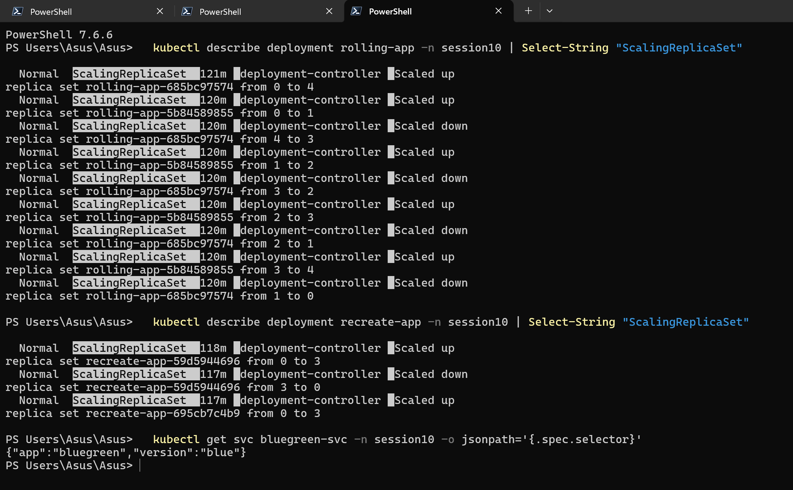
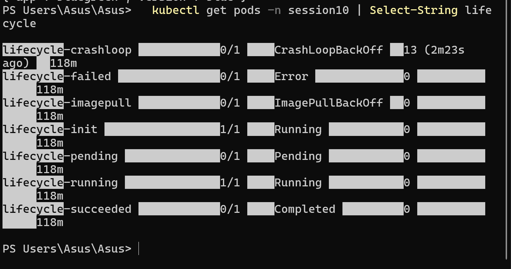

# Session 10 — Kubernetes Pods, ReplicaSets & Deployments

## Student Information

**Name:** Palak Agrawal
**Roll No.:** 24BCS10504

---

## Objective

The objective of this practical was to implement all **four Kubernetes deployment
strategies** — Rolling Update, Blue-Green, Canary and Recreate — and to study and
demonstrate the **Pod lifecycle** by applying a YAML file for each phase, observing the
resulting Pod status and explaining what happened.

---

## Environment

| Tool | Version |
|---|---|
| Minikube | v1.39.0 |
| Kubernetes | v1.37.0 |
| kubectl | v1.36.1 |
| Container runtime | containerd 2.3.4 |

All work was done in a dedicated namespace, `session10`, so the demos stay isolated:

```bash
kubectl apply -f 00-namespace.yaml
```

```
namespace/session10 created
```

---

## Folder Structure

```
Kubernetes Pods, ReplicaSets & Deployments/
├── 00-namespace.yaml
├── 01-rolling-update/
│   ├── deployment.yaml
│   └── service.yaml
├── 02-blue-green/
│   ├── blue-deployment.yaml
│   ├── green-deployment.yaml
│   └── service.yaml
├── 03-canary/
│   ├── stable-deployment.yaml
│   ├── canary-deployment.yaml
│   └── service.yaml
├── 04-recreate/
│   └── deployment.yaml
├── 05-pod-lifecycle/
│   ├── 01-pending-pod.yaml
│   ├── 02-running-pod.yaml
│   ├── 03-succeeded-pod.yaml
│   ├── 04-failed-pod.yaml
│   ├── 05-crashloop-pod.yaml
│   ├── 06-init-container-pod.yaml
│   └── 07-imagepull-pod.yaml
├── images/
└── readme.md
```

Each app writes its own version string into `index.html` at container start, so a plain
`curl` is enough to prove which version is actually serving traffic.

---

# Task 1 — Deployment Strategies

| Strategy | Downtime | Both versions live at once? | Extra resources | Rollback speed | How it is done |
|---|---|---|---|---|---|
| **Rolling Update** | No | Yes, briefly during the roll | `maxSurge` extra Pods | Minutes (another roll) | `strategy.type: RollingUpdate` |
| **Blue-Green** | No | Yes, but only one receives traffic | 2× (both stacks run) | Instant | Two Deployments, switch the Service selector |
| **Canary** | No | Yes, both receive traffic | 1 extra Pod | Instant (delete canary) | Two Deployments sharing one Service label |
| **Recreate** | **Yes** | No, never | None | Slow (full restart) | `strategy.type: Recreate` |

---

## 01 — Rolling Update

Replaces Pods gradually, a few at a time, so the app stays available throughout.
`maxSurge: 1` allows one extra Pod above the desired count, `maxUnavailable: 1` allows
one Pod to be missing at a time.

### Create the Deployment

```bash
kubectl apply -f 01-rolling-update/
```

```
deployment.apps/rolling-app created
service/rolling-app-svc created
```

```bash
kubectl get deploy,rs,pods -n session10 -l app=rolling-app
```

```
NAME                                     DESIRED   CURRENT   READY   AGE
replicaset.apps/rolling-app-685bc97574   4         4         4       26s

NAME                               READY   STATUS    RESTARTS   AGE
pod/rolling-app-685bc97574-2xn2l   1/1     Running   0          25s
pod/rolling-app-685bc97574-bmw7t   1/1     Running   0          26s
pod/rolling-app-685bc97574-jzc9v   1/1     Running   0          26s
pod/rolling-app-685bc97574-tnhjk   1/1     Running   0          26s
```

### Confirm the rolling update configuration

```bash
kubectl describe deployment rolling-app -n session10
```

```
Name:                   rolling-app
Namespace:              session10
Selector:               app=rolling-app
Replicas:               4 desired | 4 updated | 4 total | 4 available | 0 unavailable
StrategyType:           RollingUpdate
MinReadySeconds:        0
RollingUpdateStrategy:  1 max unavailable, 1 max surge
Pod Template:
  Labels:  app=rolling-app
           version=v1
  Containers:
   web:
    Image:      nginx:1.24-alpine
NewReplicaSet:   rolling-app-685bc97574 (4/4 replicas created)
Events:
  Type    Reason             Age   From                   Message
  Normal  ScalingReplicaSet  27s   deployment-controller  Scaled up replica set rolling-app-685bc97574 from 0 to 4
```

```bash
curl http://$(minikube ip):30101
```

```
ROLLING APP - VERSION 1 - pod rolling-app-685bc97574-tnhjk
```

### Perform the application update

```bash
kubectl set image deployment/rolling-app web=nginx:1.25-alpine -n session10
```

```
deployment.apps/rolling-app patched
```

### Verify old and new Pods during the roll

Polling immediately after the update catches both ReplicaSets alive at the same time:

```bash
kubectl get pods -n session10 -l app=rolling-app
```

```
NAME                           READY   STATUS              RESTARTS   AGE
rolling-app-5b84589855-r9vkb   0/1     ContainerCreating   0          0s      <- NEW
rolling-app-5b84589855-ttfh5   0/1     ContainerCreating   0          0s      <- NEW
rolling-app-685bc97574-2xn2l   1/1     Running             0          35s     <- OLD, still serving
rolling-app-685bc97574-bmw7t   1/1     Running             0          36s     <- OLD, still serving
rolling-app-685bc97574-jzc9v   1/1     Terminating         0          36s     <- OLD, going away
rolling-app-685bc97574-tnhjk   1/1     Running             0          36s     <- OLD, still serving
```

A few seconds later only the new ReplicaSet's Pods remain:

```
NAME                           READY   STATUS    RESTARTS   AGE
rolling-app-5b84589855-gr2k9   1/1     Running   0          4s
rolling-app-5b84589855-j9bp7   1/1     Running   0          3s
rolling-app-5b84589855-r9vkb   1/1     Running   0          5s
rolling-app-5b84589855-ttfh5   1/1     Running   0          5s
```

```bash
kubectl rollout status deployment/rolling-app -n session10
curl http://$(minikube ip):30101
```

```
deployment "rolling-app" successfully rolled out

ROLLING APP - VERSION 2 - pod rolling-app-5b84589855-j9bp7
```

```bash
kubectl get rs -n session10 -l app=rolling-app
```

```
NAME                     DESIRED   CURRENT   READY   AGE
rolling-app-5b84589855   4         4         4       21s    <- new, scaled to 4
rolling-app-685bc97574   0         0         0       57s    <- old, scaled to 0 but kept
```

### What the controller actually did

```bash
kubectl describe deployment rolling-app -n session10 | tail -12
```

```
Events:
  Normal  ScalingReplicaSet  4m16s  deployment-controller  Scaled up replica set rolling-app-685bc97574 from 0 to 4
  Normal  ScalingReplicaSet  3m40s  deployment-controller  Scaled up replica set rolling-app-5b84589855 from 0 to 1
  Normal  ScalingReplicaSet  3m40s  deployment-controller  Scaled down replica set rolling-app-685bc97574 from 4 to 3
  Normal  ScalingReplicaSet  3m40s  deployment-controller  Scaled up replica set rolling-app-5b84589855 from 1 to 2
  Normal  ScalingReplicaSet  3m39s  deployment-controller  Scaled down replica set rolling-app-685bc97574 from 3 to 2
  Normal  ScalingReplicaSet  3m39s  deployment-controller  Scaled up replica set rolling-app-5b84589855 from 2 to 3
  Normal  ScalingReplicaSet  3m39s  deployment-controller  Scaled down replica set rolling-app-685bc97574 from 2 to 1
  Normal  ScalingReplicaSet  3m38s  deployment-controller  Scaled up replica set rolling-app-5b84589855 from 3 to 4
  Normal  ScalingReplicaSet  3m37s  deployment-controller  Scaled down replica set rolling-app-685bc97574 from 1 to 0
```

**Observation:** the two ReplicaSets are scaled in alternating steps — up one, down one —
never dropping below `replicas - maxUnavailable` ready Pods. That interleaving is exactly
what keeps the app available during the update. The old ReplicaSet is kept at 0 rather
than deleted, which is what makes `kubectl rollout undo` instant.

---

## 02 — Blue-Green Deployment

Two complete Deployments run side by side. The Service selector decides which one is
"live", so the switch is a label change, not a Pod restart.

### Create Blue and Green versions

```bash
kubectl apply -f 02-blue-green/
```

```
deployment.apps/app-blue created
deployment.apps/app-green created
service/bluegreen-svc created
```

```bash
kubectl get pods -n session10 -l app=bluegreen
```

```
NAME                         READY   STATUS    RESTARTS   AGE
app-blue-7f9dc54755-d4894    1/1     Running   0          25s
app-blue-7f9dc54755-szqh9    1/1     Running   0          25s
app-blue-7f9dc54755-xknx8    1/1     Running   0          25s
app-green-7cc6d8d597-7lf6b   1/1     Running   0          25s
app-green-7cc6d8d597-c96zp   1/1     Running   0          25s
app-green-7cc6d8d597-fdkkj   1/1     Running   0          25s
```

Both stacks are running — six Pods — but only one gets traffic.

### Verify the active version (Blue)

```bash
kubectl get svc bluegreen-svc -n session10 -o jsonpath='{.spec.selector}'
curl http://$(minikube ip):30102
```

```
{"app":"bluegreen","version":"blue"}

BLUE VERSION (v1) - pod app-blue-7f9dc54755-xknx8
BLUE VERSION (v1) - pod app-blue-7f9dc54755-xknx8
BLUE VERSION (v1) - pod app-blue-7f9dc54755-xknx8
```

```bash
kubectl get endpoints bluegreen-svc -n session10
```

```
NAME            ENDPOINTS                                      AGE
bluegreen-svc   10.244.0.66:80,10.244.0.67:80,10.244.0.68:80   39s
```

### Switch traffic to Green

```bash
kubectl patch service bluegreen-svc -n session10 \
  -p '{"spec":{"selector":{"app":"bluegreen","version":"green"}}}'
```

```
service/bluegreen-svc patched
```

### Verify the active version (Green)

```bash
kubectl get svc bluegreen-svc -n session10 -o jsonpath='{.spec.selector}'
curl http://$(minikube ip):30102
kubectl get endpoints bluegreen-svc -n session10
```

```
{"app":"bluegreen","version":"green"}

GREEN VERSION (v2) - pod app-green-7cc6d8d597-c96zp
GREEN VERSION (v2) - pod app-green-7cc6d8d597-c96zp
GREEN VERSION (v2) - pod app-green-7cc6d8d597-fdkkj

NAME            ENDPOINTS                                      AGE
bluegreen-svc   10.244.0.69:80,10.244.0.70:80,10.244.0.71:80   44s
```

### Instant rollback

```bash
kubectl patch service bluegreen-svc -n session10 \
  -p '{"spec":{"selector":{"app":"bluegreen","version":"blue"}}}'
curl http://$(minikube ip):30102
```

```
service/bluegreen-svc patched

BLUE VERSION (v1) - pod app-blue-7f9dc54755-szqh9
```

**Observation:** the Service endpoints changed from `10.244.0.66-68` (blue Pods) to
`10.244.0.69-71` (green Pods) the moment the selector was patched. **No Pod was created,
restarted or deleted** — the cutover is pure label matching, which is why it is instant
in both directions. The cost is that both versions must be fully resourced at the same
time, i.e. double the Pods for the duration.

---

## 03 — Canary Deployment

Two Deployments share one label (`app: canary-demo`) that the Service selects on, while a
second label (`track`) distinguishes them. Because the Service ignores `track`, both sets
of Pods become endpoints and traffic splits in proportion to the Pod count.

### Deploy stable and canary versions

```bash
kubectl apply -f 03-canary/
```

```
deployment.apps/app-canary created
service/canary-svc created
deployment.apps/app-stable created
```

```bash
kubectl get pods -n session10 -l app=canary-demo --show-labels
```

```
NAME                          READY   STATUS    RESTARTS   AGE   LABELS
app-canary-6f4c98f799-qmv5z   1/1     Running   0          26s   app=canary-demo,track=canary
app-stable-54884684dc-7bp5l   1/1     Running   0          25s   app=canary-demo,track=stable
app-stable-54884684dc-b9v4f   1/1     Running   0          25s   app=canary-demo,track=stable
app-stable-54884684dc-mk9vj   1/1     Running   0          25s   app=canary-demo,track=stable
app-stable-54884684dc-vt4gv   1/1     Running   0          25s   app=canary-demo,track=stable
```

4 stable Pods + 1 canary Pod = the canary should receive roughly **1/5 = 20%** of traffic.

### Route a small percentage of traffic to the canary

```bash
kubectl get endpoints canary-svc -n session10
```

```
NAME         ENDPOINTS                                                  AGE
canary-svc   10.244.0.72:80,10.244.0.73:80,10.244.0.74:80 + 2 more...   26s
```

All five Pods are endpoints of the one Service — no extra routing config needed.

### Verify both versions

```bash
for i in $(seq 1 100); do curl -s http://$(minikube ip):30103; done | sort | uniq -c
```

```
     76 STABLE VERSION (v1)
     24 CANARY VERSION (v2)
```

Individual responses:

```
STABLE VERSION (v1) - pod app-stable-54884684dc-mk9vj
STABLE VERSION (v1) - pod app-stable-54884684dc-vt4gv
STABLE VERSION (v1) - pod app-stable-54884684dc-7bp5l
STABLE VERSION (v1) - pod app-stable-54884684dc-vt4gv
CANARY VERSION (v2) - pod app-canary-6f4c98f799-qmv5z
STABLE VERSION (v1) - pod app-stable-54884684dc-7bp5l
```

24% of requests hit the canary against an expected 20%. kube-proxy picks a backend at
random per connection, so the split only approaches the Pod ratio over a large sample —
an earlier 20-request run gave 35%, which is normal variance, not a misconfiguration.

### Promote the canary

```bash
kubectl scale deployment app-canary --replicas=4 -n session10
kubectl scale deployment app-stable --replicas=0 -n session10
```

```
deployment.apps/app-canary scaled
deployment.apps/app-stable scaled
```

```bash
kubectl get pods -n session10 -l app=canary-demo
for i in $(seq 1 10); do curl -s http://$(minikube ip):30103; done | sort | uniq -c
```

```
NAME                          READY   STATUS    RESTARTS   AGE
app-canary-6f4c98f799-8wskr   1/1     Running   0          21s
app-canary-6f4c98f799-pjnpq   1/1     Running   0          21s
app-canary-6f4c98f799-qmv5z   1/1     Running   0          68s
app-canary-6f4c98f799-zbbtg   1/1     Running   0          21s

     10 CANARY VERSION (v2)
```

**Observation:** the traffic percentage is controlled purely by the **replica ratio**, so
the granularity is limited — with 4 stable Pods the smallest canary slice is 20%. Getting
1% or 5% would need either many more replicas or a real traffic-splitting layer such as an
Ingress controller or a service mesh. Rolling back is just `kubectl delete deployment
app-canary`, which removes the canary endpoints immediately.

---

## 04 — Recreate Deployment

`strategy.type: Recreate` tells the controller to terminate **every** old Pod before
creating any new ones. This guarantees two versions never run simultaneously, at the cost
of real downtime.

### Deploy the application

```bash
kubectl apply -f 04-recreate/
kubectl get deployment recreate-app -n session10
kubectl describe deployment recreate-app -n session10 | grep StrategyType
```

```
deployment.apps/recreate-app created

NAME           READY   UP-TO-DATE   AVAILABLE   AGE
recreate-app   3/3     3            3           22s

StrategyType:       Recreate
```

```bash
kubectl get pods -n session10 -l app=recreate-app
```

```
NAME                            READY   STATUS    RESTARTS   AGE
recreate-app-59d5944696-2t9pg   1/1     Running   0          23s
recreate-app-59d5944696-7jkdg   1/1     Running   0          23s
recreate-app-59d5944696-tmccc   1/1     Running   0          23s
```

### Update the application

```bash
kubectl set image deployment/recreate-app web=nginx:1.25-alpine -n session10
```

### Observe old Pods terminating before new Pods are created

Polling every 3 seconds through the update:

```bash
kubectl get pods -n session10 -l app=recreate-app
```

```
--- t+3s ---
recreate-app-59d5944696-2t9pg   1/1   Terminating   0   31s
recreate-app-59d5944696-7jkdg   1/1   Terminating   0   31s
recreate-app-59d5944696-tmccc   1/1   Terminating   0   31s
          ^^^ ALL THREE old Pods terminating, ZERO new Pods exist - this is the downtime window

--- t+6s ---
recreate-app-695cb7c4b9-77kb6   1/1   Running   0   2s
recreate-app-695cb7c4b9-ww6dg   1/1   Running   0   2s
recreate-app-695cb7c4b9-xbn8k   1/1   Running   0   2s
          ^^^ only now do the new Pods appear
```

```bash
kubectl describe deployment recreate-app -n session10 | tail -8
```

```
OldReplicaSets:  recreate-app-59d5944696 (0/0 replicas created)
NewReplicaSet:   recreate-app-695cb7c4b9 (3/3 replicas created)
Events:
  Normal  ScalingReplicaSet  54s   deployment-controller  Scaled up replica set recreate-app-59d5944696 from 0 to 3
  Normal  ScalingReplicaSet  23s   deployment-controller  Scaled down replica set recreate-app-59d5944696 from 3 to 0
  Normal  ScalingReplicaSet  22s   deployment-controller  Scaled up replica set recreate-app-695cb7c4b9 from 0 to 3
```

**Observation:** compare these three events with the nine interleaved events from the
Rolling Update. Recreate is a clean `3 → 0`, then `0 → 3`; there is a window where no Pod
is serving. Recreate is the right choice when two versions genuinely cannot coexist — for
example when a database schema migration makes the old code incompatible, or when the app
takes an exclusive lock on shared storage.

### Screenshot



---

# Task 2 — Pod Lifecycle

## Pod phases

`status.phase` is a high-level summary with exactly five possible values:

| Phase | Meaning |
|---|---|
| **Pending** | Accepted by the cluster, but not yet running — waiting to be scheduled, or still pulling images |
| **Running** | Bound to a node, all containers created, at least one is running or starting/restarting |
| **Succeeded** | All containers exited with code 0 and will not be restarted |
| **Failed** | All containers terminated and at least one exited non-zero |
| **Unknown** | The node stopped reporting — usually a node or network failure |

`CrashLoopBackOff`, `ImagePullBackOff` and `ErrImagePull` are **not phases** — they are
container *waiting reasons* that appear in the `STATUS` column of `kubectl get pods`. This
is a common point of confusion and the table below shows both side by side.

```
                      ┌──────────────────────────────────────────────┐
   kubectl apply ───► │  PENDING                                     │
                      │  scheduling -> image pull -> init containers │
                      └───────────────────┬──────────────────────────┘
                                          │ containers started
                                          ▼
                      ┌──────────────────────────────────────────────┐
                      │  RUNNING                                     │
                      └──────┬────────────────────────────┬──────────┘
                             │ exit 0                     │ exit != 0
                             ▼                            ▼
                      ┌─────────────┐             ┌─────────────┐
                      │  SUCCEEDED  │             │   FAILED    │
                      └─────────────┘             └─────────────┘

   restartPolicy decides whether a terminated container ends the Pod
   or is restarted in place (Always -> CrashLoopBackOff on repeat failure).
```

## Applying all lifecycle manifests

```bash
kubectl apply -f 05-pod-lifecycle/
```

```
pod/lifecycle-pending created
pod/lifecycle-running created
pod/lifecycle-succeeded created
pod/lifecycle-failed created
pod/lifecycle-crashloop created
pod/lifecycle-init created
pod/lifecycle-imagepull created
```

## Status of every lifecycle Pod

```bash
kubectl get pods -n session10 | grep lifecycle
```

```
NAME                  READY   STATUS             RESTARTS      AGE
lifecycle-crashloop   0/1     CrashLoopBackOff   5 (73s ago)   4m22s
lifecycle-failed      0/1     Error              0             4m32s
lifecycle-imagepull   0/1     ImagePullBackOff   0             4m32s
lifecycle-init        1/1     Running            0             4m32s
lifecycle-pending     0/1     Pending            0             4m32s
lifecycle-running     1/1     Running            0             4m32s
lifecycle-succeeded   0/1     Completed          0             4m32s
```

Showing the real `phase` field next to the container waiting reason:

```bash
kubectl get pods -n session10 -o custom-columns=\
NAME:.metadata.name,\
PHASE:.status.phase,\
WAITING:.status.containerStatuses[0].state.waiting.reason,\
RESTARTS:.status.containerStatuses[0].restartCount
```

```
NAME                  PHASE       WAITING            RESTARTS
lifecycle-crashloop   Running     <none>             4
lifecycle-failed      Failed      <none>             0
lifecycle-imagepull   Pending     ImagePullBackOff   0
lifecycle-init        Running     <none>             0
lifecycle-pending     Pending     <none>             <none>
lifecycle-running     Running     <none>             0
lifecycle-succeeded   Succeeded   <none>             0
```

Note how `lifecycle-crashloop` is in phase **Running** even though `kubectl get pods` shows
`CrashLoopBackOff`, and `lifecycle-imagepull` is in phase **Pending**. The `STATUS` column
is a friendlier merge of phase + container state, not the phase itself.

---

### 01 — Pending

**File:** `05-pod-lifecycle/01-pending-pod.yaml` — requests 100 CPUs and 200Gi of memory.

```bash
kubectl apply -f 05-pod-lifecycle/01-pending-pod.yaml
kubectl get pod lifecycle-pending -n session10 -o wide
```

```
NAME                READY   STATUS    RESTARTS   AGE   IP       NODE
lifecycle-pending   0/1     Pending   0          10s   <none>   <none>
```

```bash
kubectl describe pod lifecycle-pending -n session10
```

```
Events:
  Type     Reason            Age                    From               Message
  ----     ------            ----                   ----               -------
  Warning  FailedScheduling  2m35s (x3 over 2m44s)  default-scheduler  0/1 nodes are available: 1 Insufficient cpu, 1 Insufficient memory. preemption: 0/1 nodes are available: 1 Preemption is not helpful for scheduling.
```

**What I observed:** the `IP` and `NODE` columns are `<none>` — the Pod object exists in
etcd but was never bound to a node. The scheduler re-queues it and retries (`x3`), so it
will sit in Pending indefinitely until a node with enough capacity appears. This is the
first and most common cause of Pending in real clusters, and `describe` names it exactly:
`Insufficient cpu, Insufficient memory`.

---

### 02 — Running

**File:** `05-pod-lifecycle/02-running-pod.yaml` — a plain nginx Pod.

```bash
kubectl apply -f 05-pod-lifecycle/02-running-pod.yaml
kubectl get pod lifecycle-running -n session10
```

```
NAME                READY   STATUS    RESTARTS   AGE
lifecycle-running   1/1     Running   0          10s
```

```bash
kubectl get pod lifecycle-running -n session10 \
  -o custom-columns=TYPE:.status.conditions[*].type,STATUS:.status.conditions[*].status
```

```
TYPE                                                                       STATUS
PodReadyToStartContainers,Initialized,Ready,ContainersReady,PodScheduled   True,True,True,True,True
```

**What I observed:** `READY 1/1` means one of one containers passed its readiness check.
All five Pod conditions are `True`, in the order they are satisfied: `PodScheduled` →
`Initialized` → `ContainersReady` → `Ready`. A Pod only receives Service traffic once
`Ready` is True, which is why that condition exists separately from the phase.

---

### 03 — Succeeded

**File:** `05-pod-lifecycle/03-succeeded-pod.yaml` — busybox that prints and exits 0, with
`restartPolicy: Never`.

```bash
kubectl apply -f 05-pod-lifecycle/03-succeeded-pod.yaml
kubectl get pod lifecycle-succeeded -n session10
kubectl logs lifecycle-succeeded -n session10
```

```
NAME                  READY   STATUS      RESTARTS   AGE
lifecycle-succeeded   0/1     Completed   0          10s

job done
```

**What I observed:** `STATUS: Completed` with phase `Succeeded`. `READY` is `0/1` because
nothing is running any more — that is expected, not a fault. The Pod object is kept so its
logs and exit status stay readable; it is not deleted automatically. `restartPolicy: Never`
is what makes this a terminal state — with the default `Always` the container would have
been restarted and the Pod would never reach Succeeded.

---

### 04 — Failed

**File:** `05-pod-lifecycle/04-failed-pod.yaml` — same as above but `exit 1`.

```bash
kubectl apply -f 05-pod-lifecycle/04-failed-pod.yaml
kubectl get pod lifecycle-failed -n session10
kubectl logs lifecycle-failed -n session10
```

```
NAME               READY   STATUS   RESTARTS   AGE
lifecycle-failed   0/1     Error    0          10s

something went wrong
```

**What I observed:** phase `Failed`, `STATUS: Error`, `RESTARTS: 0`. The only difference
from the Succeeded Pod is the container's exit code. The logs survive termination, which is
how you diagnose a failed Job — `kubectl logs` works on a dead Pod as long as the Pod object
still exists.

---

### 05 — CrashLoopBackOff

**File:** `05-pod-lifecycle/05-crashloop-pod.yaml` — container exits 1 every 3 seconds with
`restartPolicy: Always`.

```bash
kubectl apply -f 05-pod-lifecycle/05-crashloop-pod.yaml
kubectl get pod lifecycle-crashloop -n session10
```

```
NAME                  READY   STATUS             RESTARTS      AGE
lifecycle-crashloop   0/1     CrashLoopBackOff   5 (73s ago)   4m22s
```

```bash
kubectl describe pod lifecycle-crashloop -n session10
```

```
    State:          Terminated
      Reason:       Error
      Exit Code:    1
      Started:      Tue, 06 Oct 2026 20:37:51 +0530
      Finished:     Tue, 06 Oct 2026 20:37:54 +0530
    Last State:     Terminated
      Reason:       Error
      Exit Code:    1
      Started:      Tue, 06 Oct 2026 20:37:07 +0530
      Finished:     Tue, 06 Oct 2026 20:37:10 +0530
    Ready:          False
```

**What I observed:** the Pod oscillates — `kubectl get pods` alternates between `Error`
(container just died) and `CrashLoopBackOff` (kubelet is waiting before the next attempt).
The `RESTARTS` counter climbs and the gap between restarts grows: the container ran for
3 seconds but the last restart was 73 seconds ago, because kubelet backs off
10s → 20s → 40s → … up to a 5-minute cap. `State` and `Last State` together give the two
most recent attempts, which is where you find the real exit code. The Pod's phase stays
`Running` throughout — Kubernetes considers it a running Pod whose container keeps failing.

---

### 06 — Init container

**File:** `05-pod-lifecycle/06-init-container-pod.yaml` — a 20-second init container before
nginx.

```bash
kubectl apply -f 05-pod-lifecycle/06-init-container-pod.yaml
kubectl get pod lifecycle-init -n session10      # while the init container runs
```

```
NAME             READY   STATUS     RESTARTS   AGE
lifecycle-init   0/1     Init:0/1   0          10s
```

```bash
kubectl get pod lifecycle-init -n session10      # after it finishes
kubectl logs lifecycle-init -n session10 -c init-wait
```

```
NAME             READY   STATUS    RESTARTS   AGE
lifecycle-init   1/1     Running   0          4m32s

init: preparing...
init: done
```

**What I observed:** `Init:0/1` means zero of one init containers have completed. The app
container had not started at all during that window — init containers run strictly to
completion first, one after another. Reading an init container's logs requires `-c` with
its name, because `kubectl logs` defaults to the app container. This is the mechanism used
in practice to wait for a database or fetch config before an app boots.

---

### 07 — ImagePullBackOff

**File:** `05-pod-lifecycle/07-imagepull-pod.yaml` — references a tag that does not exist.

```bash
kubectl apply -f 05-pod-lifecycle/07-imagepull-pod.yaml
kubectl get pod lifecycle-imagepull -n session10
```

```
NAME                  READY   STATUS             RESTARTS   AGE
lifecycle-imagepull   0/1     ImagePullBackOff   0          4m32s
```

```bash
kubectl describe pod lifecycle-imagepull -n session10
```

```
Events:
  Type     Reason     Age                  From               Message
  ----     ------     ----                 ----               -------
  Normal   Scheduled  2m44s                default-scheduler  Successfully assigned session10/lifecycle-imagepull to minikube
  Normal   Pulling    60s (x4 over 2m43s)  kubelet            Pulling image "nginx:this-tag-does-not-exist"
  Warning  Failed     54s (x4 over 2m37s)  kubelet            Failed to pull image "nginx:this-tag-does-not-exist": rpc error: code = NotFound desc = ... not found
  Warning  Failed     54s (x4 over 2m37s)  kubelet            Error: ErrImagePull
  Normal   BackOff    2s (x9 over 2m37s)   kubelet            Back-off pulling image "nginx:this-tag-does-not-exist"
  Warning  Failed     2s (x9 over 2m37s)   kubelet            Error: ImagePullBackOff
```

**What I observed:** the Pod *was* scheduled successfully — unlike `lifecycle-pending`, it
has a node and an IP. It is stuck at the image-pull step, so its phase is `Pending` while
the container waits. The sequence is `ErrImagePull` on the first failures, then
`ImagePullBackOff` once kubelet starts spacing out retries. The event message states the
root cause verbatim (`not found`), which distinguishes a typo'd tag from an authentication
failure on a private registry.

### Screenshot



---

## Summary of Observations

| Pod | Phase | STATUS column | Why |
|---|---|---|---|
| `lifecycle-pending` | Pending | `Pending` | Resource request too large to schedule |
| `lifecycle-running` | Running | `Running` | Healthy nginx, all conditions True |
| `lifecycle-succeeded` | Succeeded | `Completed` | Exit 0 with `restartPolicy: Never` |
| `lifecycle-failed` | Failed | `Error` | Exit 1 with `restartPolicy: Never` |
| `lifecycle-crashloop` | Running | `CrashLoopBackOff` | Exit 1 with `restartPolicy: Always`, backing off |
| `lifecycle-init` | Running (was `Init:0/1`) | `Running` | Init container had to finish first |
| `lifecycle-imagepull` | Pending | `ImagePullBackOff` | Image tag does not exist |

The practical lesson across all seven: **`kubectl get pods` tells you *that* something is
wrong, `kubectl describe pod` tells you *why***. Every single failure above was explained
in plain English in the Events section, and the distinction between Pending-because-of-
scheduling and Pending-because-of-image-pull is only visible there.

---

## Cleanup

```bash
kubectl delete namespace session10
```

Deleting the namespace removes every Deployment, ReplicaSet, Pod and Service created in
this session in one command.

---

## Conclusion

All four deployment strategies were implemented and verified against a live cluster. The
`kubectl describe deployment` event logs made the difference concrete: Rolling Update
produced nine interleaved scale up/down events across two ReplicaSets, while Recreate
produced a clean `3 → 0` followed by `0 → 3` with a measurable window where no Pod existed.
Blue-Green and Canary both work without any special controller — Blue-Green by patching
the Service selector (endpoints flipped from one Pod IP set to the other with no Pod
restart), Canary by letting two Deployments share one label so the replica ratio becomes
the traffic ratio, measured at 76/24 over 100 requests against an expected 80/20.

The Pod lifecycle work showed that `status.phase` has only five values and that the
familiar `CrashLoopBackOff` and `ImagePullBackOff` are container waiting reasons layered on
top of `Running` and `Pending`. Each failure mode was reproduced deliberately from its own
YAML file, and in every case `kubectl describe pod` named the root cause directly —
`Insufficient cpu`, `Exit Code: 1`, or `not found`.
