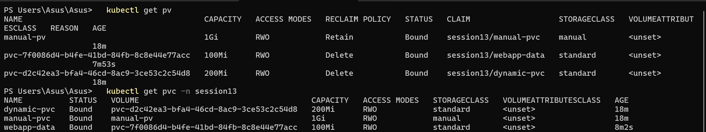
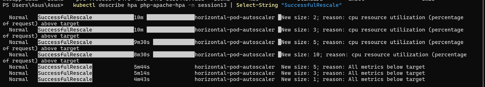
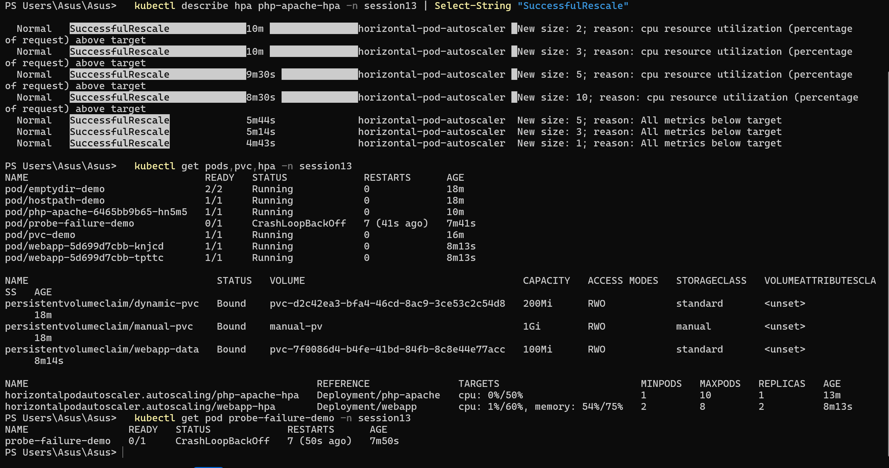

# Session 13 — Kubernetes Storage, HPA & Probes

## Student Information

**Name:** Palak Agrawal
**Roll No.:** 24BCS10504

---

## Objective

The objective of this practical was to learn and demonstrate **Kubernetes storage** —
emptyDir, hostPath, PersistentVolumes, PersistentVolumeClaims, StorageClasses and dynamic
provisioning — to perform a full **Horizontal Pod Autoscaler** hands-on with a load
generator, observing CPU utilisation and Pod scaling, and to build a **mini project**
combining storage, probes and autoscaling in one application.

---

## Deliverables

| Deliverable | Location |
|---|---|
| Volume documentation | [`01-kubernetes-volumes/README.md`](01-kubernetes-volumes/README.md) |
| Volume example manifests | `01-kubernetes-volumes/*.yaml` |
| HPA YAML | `02-hpa/hpa.yml` |
| Load generator | `02-hpa/load-generator.yaml` |
| HPA output | this file, Task 2 |
| Mini-project implementation | `03-mini-project/` |
| Screenshots | `images/` |
| README documentation | this file |

---

## Folder Structure

```
Kubernetes Storage, HPA & Probes/
├── 00-namespace.yaml
├── 01-kubernetes-volumes/
│   ├── README.md               <- Task 1 documentation
│   ├── 01-emptydir.yaml
│   ├── 02-hostpath.yaml
│   ├── 03-pv.yaml
│   ├── 04-pvc.yaml
│   ├── 05-pvc-pod.yaml
│   └── 06-dynamic-pvc.yaml
├── 02-hpa/
│   ├── deployment.yaml
│   ├── hpa.yml
│   └── load-generator.yaml
├── 03-mini-project/
│   ├── 01-storage.yaml
│   ├── 02-deployment.yaml
│   ├── 03-hpa.yaml
│   └── 04-broken-probe.yaml
├── images/
└── readme.md
```

---

## Setup

```bash
kubectl apply -f 00-namespace.yaml
```

HPA needs the **metrics-server**, which Minikube ships as an addon:

```bash
minikube addons enable metrics-server
```

```
  - Using image registry.k8s.io/metrics-server/metrics-server:v0.9.0
* The 'metrics-server' addon is enabled
```

Verify it is collecting metrics:

```bash
kubectl top pods -n session13
```

```
NAME            CPU(cores)   MEMORY(bytes)
emptydir-demo   2m           0Mi
hostpath-demo   0m           0Mi
pvc-demo        0m           0Mi
```

Without metrics-server, `kubectl top` fails and every HPA reports `<unknown>`.

---

# Task 1 — Kubernetes Volumes

Full documentation with practical examples for all six topics —
**emptyDir, hostPath, PersistentVolume, PersistentVolumeClaim, StorageClass and dynamic
provisioning** — is in **[`01-kubernetes-volumes/README.md`](01-kubernetes-volumes/README.md)**.

### Summary of what was demonstrated

| Topic | Demonstration | Result |
|---|---|---|
| **emptyDir** | Two containers sharing `/shared` | `reader` saw files written by `writer` |
| **hostPath** | Write from Pod, read on the node | `minikube ssh "cat /tmp/k8s-hostpath-demo/test.txt"` showed the same file |
| **PV** | 1Gi `Retain` PV with `storageClassName: manual` | Status `Bound` |
| **PVC** | 500Mi claim bound to the 1Gi PV | Data survived Pod deletion and recreation |
| **StorageClass** | `standard (default)`, provisioner `k8s.io/minikube-hostpath` | Default class used by dynamic claims |
| **Dynamic provisioning** | PVC with no matching PV | PV `pvc-d2c42ea3-...` created automatically at exactly 200Mi |

```bash
kubectl get pv
```

```
NAME                                       CAPACITY   ACCESS MODES   RECLAIM POLICY   STATUS   CLAIM                   STORAGECLASS   AGE
manual-pv                                  1Gi        RWO            Retain           Bound    session13/manual-pvc    manual         31s
pvc-d2c42ea3-bfa4-46cd-8ac9-3ce53c2c54d8   200Mi      RWO            Delete           Bound    session13/dynamic-pvc   standard       31s
```

Static vs dynamic side by side: one PV I wrote by hand, one created automatically by the
provisioner with a generated name and the exact requested size.

### Screenshot



---

# Task 2 — HPA Hands-on

## 1. Deploy the application

`02-hpa/deployment.yaml` runs `registry.k8s.io/hpa-example`, a PHP page that burns CPU on
every request.

```yaml
          resources:
            requests:
              cpu: 200m      # REQUIRED - HPA computes utilisation against this
            limits:
              cpu: 500m
```

> **CPU requests are mandatory for HPA.** A percentage target is meaningless without a
> baseline to measure against. A Deployment with no `requests.cpu` makes the HPA report
> `<unknown>` forever.

```bash
kubectl apply -f 02-hpa/deployment.yaml
kubectl get pods -n session13 -l app=php-apache
```

```
deployment.apps/php-apache created
service/php-apache created

NAME                          READY   STATUS    RESTARTS   AGE
php-apache-6465bb9b65-thsvz   1/1     Running   0          25s
```

## 2. Configure HPA

`02-hpa/hpa.yml`:

```yaml
apiVersion: autoscaling/v2
kind: HorizontalPodAutoscaler
metadata:
  name: php-apache-hpa
  namespace: session13
spec:
  scaleTargetRef:
    apiVersion: apps/v1
    kind: Deployment
    name: php-apache
  minReplicas: 1
  maxReplicas: 10
  metrics:
    - type: Resource
      resource:
        name: cpu
        target:
          type: Utilization
          averageUtilization: 50
  behavior:
    scaleUp:
      stabilizationWindowSeconds: 0
      policies:
        - type: Percent
          value: 100
          periodSeconds: 15
    scaleDown:
      stabilizationWindowSeconds: 60
      policies:
        - type: Percent
          value: 50
          periodSeconds: 30
```

```bash
kubectl apply -f 02-hpa/hpa.yml
```

## 3. Verify HPA

Immediately after creation the HPA reports `<unknown>`:

```
NAME             REFERENCE               TARGETS              MINPODS   MAXPODS   REPLICAS   AGE
php-apache-hpa   Deployment/php-apache   cpu: <unknown>/50%   1         10        1          45s
```

```
Conditions:
  Type            Status  Reason                   Message
  ScalingActive   False   FailedGetResourceMetric  the HPA was unable to compute the replica count: failed to get cpu utilization: did not receive metrics for targeted pods (pods might be unready)
```

This is **normal for the first ~60 seconds** — metrics-server scrapes on an interval and
the HPA needs at least one data point. After about a minute:

```bash
kubectl get hpa -n session13
```

```
NAME             REFERENCE               TARGETS       MINPODS   MAXPODS   REPLICAS   AGE
php-apache-hpa   Deployment/php-apache   cpu: 0%/50%   1         10        1          108s
```

`0%/50%` — the HPA is now reading metrics and the application is idle.

## 4. Deploy a load generator

`02-hpa/load-generator.yaml` runs 3 Pods each hammering the Service in an infinite loop:

```yaml
          args:
            - while true; do wget -q -O- http://php-apache.session13.svc.cluster.local > /dev/null; done
```

**Before load:**

```
NAME             REFERENCE               TARGETS       MINPODS   MAXPODS   REPLICAS   AGE
php-apache-hpa   Deployment/php-apache   cpu: 0%/50%   1         10        1          116s

NAME                          READY   STATUS    RESTARTS   AGE
php-apache-6465bb9b65-thsvz   1/1     Running   0          2m29s
```

```bash
kubectl apply -f 02-hpa/load-generator.yaml
```

## 5–7. Increase load, observe CPU utilisation and Pod scaling

Polling every 12 seconds:

```
--- t+12s ---   cpu: 0%/50%     replicas: 1   pods: 1
--- t+24s ---   cpu: 0%/50%     replicas: 1   pods: 1
--- t+36s ---   cpu: 0%/50%     replicas: 1   pods: 1
--- t+48s ---   cpu: 0%/50%     replicas: 1   pods: 1
--- t+60s ---   cpu: 122%/50%   replicas: 1   pods: 2     <- load registers, scaling begins
--- t+72s ---   cpu: 122%/50%   replicas: 2   pods: 3
--- t+84s ---   cpu: 122%/50%   replicas: 3   pods: 3
--- t+96s ---   cpu: 122%/50%   replicas: 3   pods: 3
--- t+108s ---  cpu: 122%/50%   replicas: 3   pods: 3
--- t+120s ---  cpu: 222%/50%   replicas: 3   pods: 5     <- load still climbing
```

The ~48 second delay before anything happens is the metrics pipeline: the container must
burn CPU, metrics-server must scrape it (15s interval), and the HPA must poll
metrics-server (15s interval).

## 8. Capture the output

### `kubectl get hpa`

```
NAME             REFERENCE               TARGETS         MINPODS   MAXPODS   REPLICAS   AGE
php-apache-hpa   Deployment/php-apache   cpu: 136%/50%   1         10        5          4m56s
```

### `kubectl get pods`

```
NAME                          READY   STATUS              RESTARTS   AGE
php-apache-6465bb9b65-2rzjp   1/1     Running             0          71s
php-apache-6465bb9b65-7v44p   1/1     Running             0          2m11s
php-apache-6465bb9b65-bccs6   1/1     Running             0          11s
php-apache-6465bb9b65-bvv8d   0/1     ContainerCreating   0          11s
php-apache-6465bb9b65-hn5m5   1/1     Running             0          116s
php-apache-6465bb9b65-mxflp   1/1     Running             0          11s
php-apache-6465bb9b65-sx7fw   0/1     ContainerCreating   0          10s
php-apache-6465bb9b65-thsvz   1/1     Running             0          5m29s
php-apache-6465bb9b65-vpz66   0/1     ContainerCreating   0          10s
php-apache-6465bb9b65-wkq9k   1/1     Running             0          71s
```

Ten Pods, with the newest still being created. Note the AGE spread — 5m29s down to 10s —
showing the successive scaling waves.

### `kubectl top pods`

```
NAME                          CPU(cores)   MEMORY(bytes)
php-apache-6465bb9b65-2rzjp   244m         14Mi
php-apache-6465bb9b65-7v44p   279m         15Mi
php-apache-6465bb9b65-hn5m5   298m         14Mi
php-apache-6465bb9b65-thsvz   273m         14Mi
php-apache-6465bb9b65-wkq9k   190m         14Mi
```

Each Pod requests `200m` and is using ~273m — roughly **136% of its request**, which is
exactly what the HPA reports.

### `kubectl describe hpa`

```
Reference:                                             Deployment/php-apache
Metrics:                                               ( current / target )
  resource cpu on pods  (as a percentage of request):  136% (273m) / 50%
Min replicas:                                          1
Max replicas:                                          10
Deployment pods:       5 current / 10 desired
Conditions:
  Type            Status  Reason            Message
  ----            ------  ------            -------
  AbleToScale     True    SucceededRescale  the HPA controller was able to update the target scale to 10
  ScalingActive   True    ValidMetricFound  the HPA was able to successfully calculate a replica count from cpu resource utilization (percentage of request)
  ScalingLimited  True    TooManyReplicas   the desired replica count is more than the maximum replica count
```

`ScalingLimited: TooManyReplicas` means the HPA **wanted more than 10 Pods** but was capped
by `maxReplicas`. The arithmetic:

```
desiredReplicas = ceil( currentReplicas × currentMetric / targetMetric )
                = ceil( 5 × 136 / 50 )
                = ceil( 13.6 )
                = 14   ->  capped at maxReplicas = 10
```

## Scale down

Removing the load generator:

```bash
kubectl delete deployment load-generator -n session13
```

```
NAME             REFERENCE               TARGETS       MINPODS   MAXPODS   REPLICAS   AGE
php-apache-hpa   Deployment/php-apache   cpu: 0%/50%   1         10        1          8m48s

NAME                          READY   STATUS    RESTARTS   AGE
php-apache-6465bb9b65-hn5m5   1/1     Running   0          5m48s
```

Back to a single Pod. The complete scaling history from the HPA's own events:

```bash
kubectl describe hpa php-apache-hpa -n session13
```

```
Events:
  Type     Reason                        Age     From                       Message
  ----     ------                        ----    ----                       -------
  Warning  FailedGetResourceMetric       8m19s   horizontal-pod-autoscaler  failed to get cpu utilization: no metrics returned from resource metrics API
  Warning  FailedGetResourceMetric       7m19s   horizontal-pod-autoscaler  did not receive metrics for targeted pods (pods might be unready)
  Normal   SuccessfulRescale             6m4s    horizontal-pod-autoscaler  New size: 2; reason: cpu resource utilization (percentage of request) above target
  Normal   SuccessfulRescale             5m49s   horizontal-pod-autoscaler  New size: 3; reason: cpu resource utilization (percentage of request) above target
  Normal   SuccessfulRescale             5m4s    horizontal-pod-autoscaler  New size: 5; reason: cpu resource utilization (percentage of request) above target
  Normal   SuccessfulRescale             4m4s    horizontal-pod-autoscaler  New size: 10; reason: cpu resource utilization (percentage of request) above target
  Normal   SuccessfulRescale             78s     horizontal-pod-autoscaler  New size: 5; reason: All metrics below target
  Normal   SuccessfulRescale             48s     horizontal-pod-autoscaler  New size: 3; reason: All metrics below target
  Normal   SuccessfulRescale             17s     horizontal-pod-autoscaler  New size: 1; reason: All metrics below target
```

**The full cycle: 1 → 2 → 3 → 5 → 10 → 5 → 3 → 1.**

Notice the asymmetry — scale-up took **2 minutes**, scale-down took **61 seconds** but only
started after a delay. That is the `behavior` block working as configured:

| | Scale up | Scale down |
|---|---|---|
| Stabilization window | `0s` — react immediately | `60s` — wait before shrinking |
| Policy | +100% per 15s | −50% per 30s |
| Observed | 1→2→3→5→10 | 10→5→3→1 |

Scaling down aggressively is risky: a brief dip in traffic would remove Pods that are
needed seconds later, causing thrashing. Scaling up fast and down slowly is the standard
production pattern.

### Screenshot



---

# Task 3 — Mini Project

> **Note on scope:** the homework says "complete the mini project provided for Session 13".
> That project is part of the instructor's repository and was not available locally, so a
> mini project was built that combines the three topics in this session's title —
> **Storage, HPA and Probes** — in a single application.

## Architecture

```
                  webapp-svc (NodePort 30131)
                            │
              ┌─────────────┴─────────────┐
              ▼                           ▼
         webapp Pod                  webapp Pod          <- scaled by webapp-hpa (2-8)
         ├── initContainer: seeds index.html
         ├── startupProbe   -> protects slow starts
         ├── readinessProbe -> gates Service traffic
         ├── livenessProbe  -> restarts a hung container
         └── mounts ─────────┐
                             ▼
                    PVC webapp-data (100Mi, dynamic)
                             │
                             ▼
                    PV pvc-7f0086d4-... (auto-provisioned)
```

## Components

| File | What it defines |
|---|---|
| `01-storage.yaml` | A 100Mi PVC using dynamic provisioning |
| `02-deployment.yaml` | Deployment with an init container, all 3 probes, CPU/memory requests, and the PVC mounted; plus a NodePort Service |
| `03-hpa.yaml` | HPA on **both** CPU (60%) and memory (75%), 2–8 replicas |
| `04-broken-probe.yaml` | A deliberately failing liveness probe, to show what happens |

## Deploy

```bash
kubectl apply -f 03-mini-project/01-storage.yaml
kubectl apply -f 03-mini-project/02-deployment.yaml
kubectl apply -f 03-mini-project/03-hpa.yaml
```

```
persistentvolumeclaim/webapp-data created
deployment.apps/webapp created
service/webapp-svc created
horizontalpodautoscaler.autoscaling/webapp-hpa created
```

## Verify storage

```bash
kubectl get pvc webapp-data -n session13
```

```
NAME          STATUS   VOLUME                                     CAPACITY   ACCESS MODES   STORAGECLASS   AGE
webapp-data   Bound    pvc-7f0086d4-b4fe-41bd-84fb-8c8e44e77acc   100Mi      RWO            standard       18s
```

The init container seeded `index.html` onto the volume, and nginx serves it:

```bash
curl http://localhost:30131
```

```
<h1>WebApp</h1><p>content seeded from the PVC</p>
```

The content is on persistent storage, not baked into the image — it survives Pod
replacement.

## Verify probes

```bash
kubectl get pods -n session13 -l app=webapp
```

```
NAME                      READY   STATUS    RESTARTS   AGE
webapp-5d699d7cbb-knjcd   1/1     Running   0          17s
webapp-5d699d7cbb-tpttc   1/1     Running   0          17s
```

```bash
kubectl describe pod -n session13 -l app=webapp
```

```
    Liveness:     http-get http://:80/ delay=10s timeout=2s period=10s #success=1 #failure=3
    Readiness:    http-get http://:80/ delay=2s timeout=2s period=5s #success=1 #failure=3
    Startup:      http-get http://:80/ delay=0s timeout=1s period=2s #success=1 #failure=30
```

### The three probe types

| Probe | Question it answers | Failure action | When it runs |
|---|---|---|---|
| **Startup** | "Has the app finished booting?" | Kill the container | At start only; **disables the other two while running** |
| **Readiness** | "Can it serve traffic right now?" | **Remove from Service endpoints** — no restart | Continuously |
| **Liveness** | "Is it alive, or hung?" | **Restart the container** | Continuously, after startup succeeds |

The distinction that matters: **readiness failing takes a Pod out of rotation; liveness
failing kills it.** Using a liveness probe where a readiness probe belongs turns a
temporary overload into a restart loop that makes the overload worse.

The startup probe here allows `30 × 2s = 60s` for the app to come up, during which liveness
cannot kill it. Without it, a container that takes 30s to boot would be killed by a
liveness probe with `initialDelaySeconds: 10`.

## Verify HPA

```bash
kubectl get hpa webapp-hpa -n session13
```

```
NAME         REFERENCE           TARGETS                        MINPODS   MAXPODS   REPLICAS   AGE
webapp-hpa   Deployment/webapp   cpu: 1%/60%, memory: 53%/75%   2         8         2          3m39s
```

Two metrics tracked at once. With multiple metrics the HPA computes a desired replica count
for **each** and takes the **highest** — so any one metric breaching its target triggers a
scale-up.

## Probe failure demonstration

`04-broken-probe.yaml` points its liveness probe at a path nginx does not serve:

```yaml
      livenessProbe:
        httpGet:
          path: /does-not-exist    # nginx returns 404 -> probe fails
          port: 80
        failureThreshold: 2
```

```bash
kubectl apply -f 03-mini-project/04-broken-probe.yaml
kubectl get pod probe-failure-demo -n session13
```

```
NAME                 READY   STATUS             RESTARTS      AGE
probe-failure-demo   0/1     CrashLoopBackOff   5 (51s ago)   3m16s
```

```bash
kubectl describe pod probe-failure-demo -n session13
```

```
Events:
  Type     Reason     Age               From     Message
  ----     ------     ----              ----     -------
  Normal   Started    3s (x3 over 27s)  kubelet  Container started
  Warning  Unhealthy  3s (x4 over 18s)  kubelet  Liveness probe failed: HTTP probe failed with statuscode: 404
  Normal   Killing    3s (x2 over 13s)  kubelet  Container web failed liveness probe, will be restarted
```

**The container is perfectly healthy — nginx is running and serving `/` correctly.** Only
the probe is wrong, and that alone is enough to put the Pod into `CrashLoopBackOff`.

This is a genuinely common production incident: a misconfigured liveness probe (wrong path,
wrong port, timeout too short for a loaded app) takes down a working service. The giveaway
is `Liveness probe failed` in the events combined with an application that works when you
`curl` it yourself.

### Screenshot



---

## Cleanup

```bash
kubectl delete namespace session13
kubectl delete pv manual-pv          # cluster-scoped, not removed with the namespace
minikube addons disable metrics-server
```

The `manual-pv` has `persistentVolumeReclaimPolicy: Retain`, so it survives the namespace
deletion and must be removed explicitly — along with `/tmp/k8s-manual-pv` on the node.

---

## Conclusion

All six storage topics were demonstrated against a live cluster, and the contrast between
them came out clearly in practice: `emptyDir` let two containers share a directory but is
destroyed with the Pod, `hostPath` wrote a file that was then readable on the node via
`minikube ssh`, and a PVC kept its data through a forced Pod deletion and recreation.
Dynamic provisioning produced a PV sized to the request exactly (200Mi) with a generated
name, next to the hand-written 1Gi PV that had to be created in advance.

The HPA exercise produced a complete autoscaling cycle — **1 → 2 → 3 → 5 → 10 → 5 → 3 → 1** —
driven by real CPU load from three load-generator Pods. `kubectl top` showed each Pod using
~273m against a 200m request, which matches the 136% the HPA reported, and
`ScalingLimited: TooManyReplicas` confirmed the autoscaler wanted 14 Pods but was capped at
10. The asymmetry between a 2-minute scale-up and a delayed 61-second scale-down was the
`behavior` block's stabilization windows working as configured.

The mini project tied all three topics together, and the broken-probe demo made the most
important point about probes: the container was healthy and serving traffic correctly, yet
a liveness probe pointed at a non-existent path was enough on its own to drive it into
`CrashLoopBackOff`.
