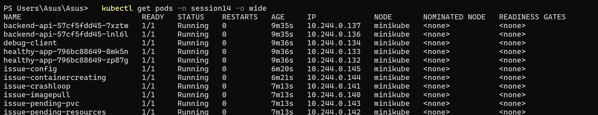
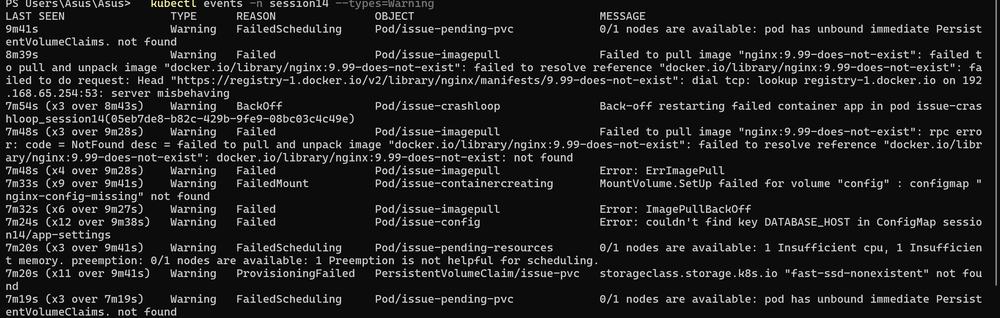
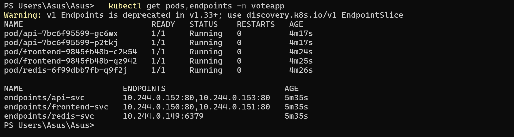

# Session 14 — Kubernetes Troubleshooting

## Student Information

**Name:** Palak Agrawal
**Roll No.:** 24BCS10504

---

## Objective

The objective of this practical was to practise all the important Kubernetes
troubleshooting commands hands-on, to deliberately reproduce and then fix the nine most
common Kubernetes failure modes — documenting problem, investigation, root cause, solution
and before/after output for each — and to complete a troubleshooting mini project with
multiple faults planted in a single application stack.

---

## Deliverables

| Deliverable | Location |
|---|---|
| Commands | Task 1, this file |
| Problem statement / Investigation / Root cause / Solution | Task 2, this file |
| Before / after output | Task 2 and Task 3 |
| Broken + fixed manifests | `02-common-issues/broken/`, `02-common-issues/fixed/` |
| Mini project | `03-mini-project/` |
| Screenshots | `images/` |

---

## Folder Structure

```
Kubernetes Troubleshooting/
├── 00-namespace.yaml
├── 00-healthy-app.yaml          # known-good reference app
├── 00-debug-client.yaml         # busybox pod for in-cluster testing
├── 02-common-issues/
│   ├── broken/                  # 8 deliberately broken manifests
│   └── fixed/                   # the corrected versions
├── 03-mini-project/
│   ├── broken-stack.yaml        # 3-tier stack with 4 planted faults
│   └── fixed-stack.yaml
├── images/
└── readme.md
```

## Setup

```bash
kubectl apply -f 00-namespace.yaml
kubectl apply -f 00-healthy-app.yaml
kubectl apply -f 00-debug-client.yaml
```

A healthy app and a busybox `debug-client` are deployed first, to act as the "working"
baseline every broken case is compared against.

---

# Task 1 — Kubernetes Commands

## 1. `kubectl get`

The first command, always. It answers *what is broken* but not *why*.

```bash
kubectl get pods -n session14
```

```
NAME                           READY   STATUS                       RESTARTS     AGE
backend-api-57cf5fdd45-7xztw   1/1     Running                      0            55s
backend-api-57cf5fdd45-lnl6l   1/1     Running                      0            55s
debug-client                   1/1     Running                      0            56s
healthy-app-796bc88649-8mk5n   1/1     Running                      0            56s
healthy-app-796bc88649-zp87g   1/1     Running                      0            56s
issue-config                   0/1     CreateContainerConfigError   0            54s
issue-containercreating        0/1     ContainerCreating            0            55s
issue-crashloop                1/1     Running                      1 (1s ago)   5s
issue-imagepull                0/1     ImagePullBackOff             0            55s
issue-pending-pvc              0/1     Pending                      0            55s
issue-pending-resources        0/1     Pending                      0            55s
```

Reading the columns:

| Column | What it tells you |
|---|---|
| `READY` | `n/m` containers passing readiness. `0/1` means not serving traffic |
| `STATUS` | The failure mode — this picks your next command |
| `RESTARTS` | A climbing count means the container keeps dying |
| `AGE` | Compare with RESTARTS: 5 restarts in 2 minutes is a crash loop |

## 2. `kubectl get -o wide`

Adds `IP` and `NODE`, which separates two very different problems:

```bash
kubectl get pods -n session14 -o wide
```

```
NAME                           READY   STATUS                       RESTARTS     AGE   IP             NODE
backend-api-57cf5fdd45-7xztw   1/1     Running                      0            55s   10.244.0.137   minikube
healthy-app-796bc88649-8mk5n   1/1     Running                      0            56s   10.244.0.133   minikube
issue-config                   0/1     CreateContainerConfigError   0            54s   10.244.0.138   minikube
issue-containercreating        0/1     ContainerCreating            0            55s   <none>         minikube
issue-crashloop                1/1     Running                      1 (1s ago)   5s    10.244.0.139   minikube
issue-imagepull                0/1     ImagePullBackOff             0            55s   10.244.0.135   minikube
issue-pending-pvc              0/1     Pending                      0            55s   <none>         <none>
issue-pending-resources        0/1     Pending                      0            55s   <none>         <none>
```

**This output is a diagnostic in itself:**

| NODE | IP | Meaning |
|---|---|---|
| `<none>` | `<none>` | **Never scheduled** — scheduler problem (resources, affinity, unbound PVC) |
| set | `<none>` | Scheduled but the **sandbox has not been created** — volume or CNI problem |
| set | set | Scheduled and networked — the problem is the **container or the app** |

So `issue-pending-*` are scheduler problems, `issue-containercreating` is a volume problem,
and `issue-imagepull` / `issue-config` are container-level problems. Three different teams
of causes, visible in one command.

## 3. `kubectl describe`

The single most useful troubleshooting command. The **Events** section at the bottom
usually states the root cause in plain English.

```bash
kubectl describe pod issue-imagepull -n session14
```

```
Events:
  Type     Reason     Age                From               Message
  ----     ------     ----               ----               -------
  Normal   Scheduled  65s                default-scheduler  Successfully assigned session14/issue-imagepull to minikube
  Warning  Failed     37s (x2 over 52s)  kubelet            Failed to pull image "nginx:9.99-does-not-exist": ... not found
  Normal   BackOff    23s (x2 over 51s)  kubelet            Back-off pulling image "nginx:9.99-does-not-exist"
  Warning  Failed     23s (x2 over 51s)  kubelet            Error: ImagePullBackOff
  Normal   Pulling    11s (x3 over 63s)  kubelet            Pulling image "nginx:9.99-does-not-exist"
  Warning  Failed     3s (x3 over 52s)   kubelet            Error: ErrImagePull
```

`(x2 over 52s)` means the event occurred twice — Kubernetes deduplicates repeated events
rather than flooding the list.

## 4. `kubectl logs`

For the **application's own output**. Only works once the container has started.

```bash
kubectl logs issue-crashloop -n session14
```

```
starting application...
ERROR: config file /etc/app/config.yaml not found
```

The app told us exactly why it died.

```bash
kubectl logs issue-crashloop -n session14 --previous
```

`--previous` reads the **previous, crashed** container — essential for a crash loop, where
the current container may have only just started and have no useful output yet.

```bash
kubectl logs -l app=healthy-app -n session14 --tail=3
```

```
2026/10/06 18:05:20 [notice] 1#1: start worker process 26
2026/10/06 18:05:20 [notice] 1#1: start worker process 27
2026/10/06 18:05:20 [notice] 1#1: start worker process 28
2026/10/06 18:05:20 [notice] 1#1: start worker process 26
```

`-l` aggregates logs across every Pod matching a label — much faster than looping over Pod
names. Other useful flags: `-f` to follow, `--since=10m`, `-c <container>` for a specific
container in a multi-container Pod.

## 5. `kubectl exec`

Runs a command **inside** a running container — the way to test connectivity from the
network position the application actually occupies.

```bash
kubectl exec debug-client -n session14 -- wget -qO- http://healthy-app-svc
```

```
healthy app on healthy-app-796bc88649-zp87g
```

```bash
kubectl exec -it debug-client -n session14 -- sh     # interactive shell
```

Testing from a Pod is not the same as testing from your laptop: ClusterIPs, Service DNS
and NetworkPolicies only apply inside the cluster.

## 6. `kubectl events`

Shows everything happening in a namespace, sorted by time. `--types=Warning` filters to
just the problems:

```bash
kubectl events -n session14 --types=Warning
```

```
LAST SEEN           TYPE      REASON               OBJECT                            MESSAGE
72s                 Warning   FailedScheduling     Pod/issue-pending-pvc             0/1 nodes are available: pod has unbound immediate PersistentVolumeClaims. not found
72s                 Warning   FailedScheduling     Pod/issue-pending-resources       0/1 nodes are available: 1 Insufficient cpu, 1 Insufficient memory.
44s (x2 over 59s)   Warning   Failed               Pod/issue-imagepull               Failed to pull image "nginx:9.99-does-not-exist": ... not found
14s                 Warning   BackOff              Pod/issue-crashloop               Back-off restarting failed container app in pod issue-crashloop_session14
14s (x5 over 72s)   Warning   ProvisioningFailed   PersistentVolumeClaim/issue-pvc   storageclass.storage.k8s.io "fast-ssd-nonexistent" not found
8s (x8 over 72s)    Warning   FailedMount          Pod/issue-containercreating       MountVolume.SetUp failed for volume "config" : configmap "nginx-config-missing" not found
3s (x7 over 69s)    Warning   Failed               Pod/issue-config                  Error: couldn't find key DATABASE_HOST in ConfigMap session14/app-settings
```

**Every root cause in the namespace, in one screen.** This is the fastest way to triage a
broken namespace — faster than describing each Pod in turn.

The older form still works and is sometimes more flexible:

```bash
kubectl get events -n session14 --sort-by=.lastTimestamp
```

> Note: events expire after **1 hour** by default. An empty event list does not mean
> nothing went wrong, only that nothing went wrong recently.

## 7. `kubectl explain`

Built-in API documentation — faster than searching the web, and always correct for the
cluster version you are on.

```bash
kubectl explain pod.spec.containers.livenessProbe
```

```
KIND:       Pod
VERSION:    v1

FIELD: livenessProbe <Probe>

DESCRIPTION:
    Periodic probe of container liveness. Container will be restarted if the
    probe fails. Cannot be updated.
    Probe describes a health check to be performed against a container to
    determine whether it is alive or ready to receive traffic.
```

```bash
kubectl explain deployment.spec.strategy --recursive
```

`--recursive` lists every nested field at once — useful for finding the exact spelling of a
field when a manifest is rejected.

## 8. `kubectl top`

Actual CPU and memory consumption, from metrics-server.

```bash
kubectl top pods -n session14
```

```
NAME                           CPU(cores)   MEMORY(bytes)
backend-api-57cf5fdd45-7xztw   7m           16Mi
backend-api-57cf5fdd45-lnl6l   14m          16Mi
debug-client                   6m           0Mi
healthy-app-796bc88649-8mk5n   11m          16Mi
healthy-app-796bc88649-zp87g   18m          16Mi
```

Only **running** Pods appear — Pending and ImagePullBackOff Pods are absent, which is a
useful signal in itself. Use `kubectl top nodes` to check whether the cluster as a whole is
out of capacity.

## Command cheat sheet

| Command | Use it when |
|---|---|
| `kubectl get pods` | Always first — what is broken? |
| `kubectl get pods -o wide` | Is it scheduled? Does it have an IP? |
| `kubectl describe pod` | **Why** is it broken — read the Events |
| `kubectl logs` | The container started but the app misbehaves |
| `kubectl logs --previous` | The container is crash-looping |
| `kubectl exec` | Test connectivity/DNS from inside the cluster |
| `kubectl events --types=Warning` | Triage a whole broken namespace at once |
| `kubectl explain` | Check a field name or its meaning |
| `kubectl top` | Suspect resource exhaustion |
| `kubectl get endpoints` | A Service is not reaching its Pods |

### Screenshot



---

# Task 2 — Troubleshoot Common Issues

All broken manifests are in `02-common-issues/broken/`, the corrections in
`02-common-issues/fixed/`.

```bash
kubectl apply -f 02-common-issues/broken/
```

---

## Issue 1 — CrashLoopBackOff

**Problem statement:** `issue-crashloop` keeps restarting and never stays up.

**Investigation**

```bash
kubectl get pods -n session14
```
```
NAME             READY   STATUS             RESTARTS      AGE
issue-crashloop  0/1     CrashLoopBackOff   5 (51s ago)   3m
```

```bash
kubectl logs issue-crashloop -n session14
```
```
starting application...
ERROR: config file /etc/app/config.yaml not found
```

```bash
kubectl describe pod issue-crashloop -n session14
```
```
    State:          Terminated
      Reason:       Error
      Exit Code:    1
```

**Root cause:** the application exits with code 1 because it cannot find its config file.
`restartPolicy` defaults to `Always`, so kubelet restarts it, it fails again, and kubelet
backs off (10s → 20s → 40s → … capped at 5 minutes).

**Solution:** fix the application or supply the missing config. The Pod's phase stays
`Running` throughout — `CrashLoopBackOff` is a *container waiting reason*, not a Pod phase.

**Before / after**

```
BEFORE:  issue-crashloop  0/1  CrashLoopBackOff  5 (51s ago)  3m
AFTER:   issue-crashloop  1/1  Running           0            88s
```

```bash
kubectl logs issue-crashloop -n session14
```
```
starting application...
config loaded successfully
```

> **Key lesson:** for `CrashLoopBackOff`, go straight to `kubectl logs`. Use `--previous`
> if the current container has just restarted and shows nothing.

---

## Issues 2 & 3 — ErrImagePull and ImagePullBackOff

**Problem statement:** `issue-imagepull` never starts; the status flips between
`ErrImagePull` and `ImagePullBackOff`.

**Investigation**

```bash
kubectl describe pod issue-imagepull -n session14
```
```
  Normal   Scheduled  65s   default-scheduler  Successfully assigned session14/issue-imagepull to minikube
  Warning  Failed     37s   kubelet            Failed to pull image "nginx:9.99-does-not-exist": rpc error: code = NotFound desc = ... docker.io/library/nginx:9.99-does-not-exist: not found
  Warning  Failed     3s    kubelet            Error: ErrImagePull
  Normal   BackOff    23s   kubelet            Back-off pulling image "nginx:9.99-does-not-exist"
  Warning  Failed     23s   kubelet            Error: ImagePullBackOff
```

**Root cause:** the tag `nginx:9.99-does-not-exist` does not exist in Docker Hub.

The two statuses are **the same problem at different stages**:

| Status | Meaning |
|---|---|
| `ErrImagePull` | A pull was just attempted and failed |
| `ImagePullBackOff` | kubelet is now **waiting** before the next attempt |

**Other causes of the same symptom** — the event message distinguishes them:

| Event message | Root cause |
|---|---|
| `not found` | Wrong image name or tag |
| `unauthorized` / `pull access denied` | Private registry, missing `imagePullSecrets` |
| `dial tcp: lookup ... server misbehaving` | **Network/DNS problem reaching the registry** |
| `toomanyrequests` | Docker Hub rate limit |

The third one occurred for real during this session:

```
Failed to pull image "nginx:9.99-does-not-exist": ... dial tcp: lookup registry-1.docker.io on 192.168.65.254:53: server misbehaving
```

Note this is a *different* message from `not found` — one means "the image isn't there",
the other means "I couldn't ask". Reading the message, not just the status, is the point.

**Solution:** use a tag that exists.

**Before / after**

```
BEFORE:  issue-imagepull  0/1  ImagePullBackOff  0  55s
AFTER:   issue-imagepull  1/1  Running           0  88s
```

---

## Issue 4 — Pending

`Pending` means the Pod has not been scheduled. There are two distinct causes, both
reproduced here.

### 4a — Insufficient resources

**Investigation**

```bash
kubectl get pods -n session14 -o wide
```
```
NAME                      READY   STATUS    RESTARTS   AGE   IP       NODE
issue-pending-resources   0/1     Pending   0          55s   <none>   <none>
```

Both `IP` and `NODE` are `<none>` — never scheduled.

```bash
kubectl describe pod issue-pending-resources -n session14
```
```
  Warning  FailedScheduling  72s  default-scheduler  0/1 nodes are available: 1 Insufficient cpu, 1 Insufficient memory. preemption: 0/1 nodes are available: 1 Preemption is not helpful for scheduling.
```

**Root cause:** the Pod requests 64 CPUs and 128Gi of memory. No node can satisfy that.

**Solution:** request a realistic amount, or add capacity.

```bash
kubectl top nodes
kubectl describe node minikube | grep -A8 "Allocated resources"
```

### 4b — Unbound PersistentVolumeClaim

**Investigation**

```bash
kubectl describe pod issue-pending-pvc -n session14
```
```
  Warning  FailedScheduling  72s  default-scheduler  0/1 nodes are available: pod has unbound immediate PersistentVolumeClaims.
```

The Pod is not the real problem — the PVC is:

```bash
kubectl events -n session14 --types=Warning
```
```
14s (x5 over 72s)  Warning  ProvisioningFailed  PersistentVolumeClaim/issue-pvc  storageclass.storage.k8s.io "fast-ssd-nonexistent" not found
```

**Root cause:** the PVC asks for StorageClass `fast-ssd-nonexistent`, which does not exist,
so the claim never binds and the Pod can never be scheduled.

**Solution:** use a StorageClass that exists (`kubectl get storageclass`).

**Before / after**

```
BEFORE:  issue-pending-resources  0/1  Pending  0  55s
         issue-pending-pvc        0/1  Pending  0  55s

AFTER:   issue-pending-resources  1/1  Running  0  88s
         issue-pending-pvc        1/1  Running  0  88s
```

```bash
kubectl get pvc -n session14
```
```
NAME              STATUS   VOLUME                                     CAPACITY   STORAGECLASS   AGE
issue-pvc-fixed   Bound    pvc-1c622eb2-2ca9-45a4-a077-951853399939   1Gi        standard       88s
```

> **Key lesson:** `Pending` is always a **scheduler** problem. Read `FailedScheduling` —
> it names the constraint. Common causes: insufficient resources, unbound PVC, node
> selector/affinity matching nothing, or an untolerated taint.

---

## Issue 5 — ContainerCreating

**Problem statement:** `issue-containercreating` sits in `ContainerCreating` indefinitely.

**Investigation**

```bash
kubectl get pods -n session14 -o wide
```
```
NAME                      READY   STATUS              RESTARTS   AGE   IP       NODE
issue-containercreating   0/1     ContainerCreating   0          55s   <none>   minikube
```

Note the difference from `Pending`: there **is** a node, but no IP. The Pod was scheduled
and then got stuck.

```bash
kubectl describe pod issue-containercreating -n session14
```
```
  Warning  FailedMount  8s (x8 over 72s)  kubelet  MountVolume.SetUp failed for volume "config" : configmap "nginx-config-missing" not found
```

**Root cause:** the Pod mounts a ConfigMap that was never created. kubelet cannot set up
the volume, so it never creates the container — and it will retry forever.

**Solution:** create the ConfigMap.

> An important practical detail: after creating the ConfigMap the Pod **still** stayed in
> `ContainerCreating`, because kubelet had cached the failure. Deleting and recreating the
> Pod cleared it.

**Before / after**

```
BEFORE:  issue-containercreating  0/1  ContainerCreating  0  3m3s
AFTER:   issue-containercreating  1/1  Running            0  36s
```

> **Key lesson:** `ContainerCreating` for more than ~30 seconds is a **volume or CNI**
> problem. `FailedMount` in the events names the missing object.

---

## Issue 6 — Service connectivity (no endpoints)

**Problem statement:** requests to `backend-svc` are refused, although the backend Pods are
`Running`.

**Investigation**

```bash
kubectl exec debug-client -n session14 -- wget -qO- --timeout=5 http://backend-svc
```
```
wget: can't connect to remote host (10.98.39.43): Connection refused
```

The Pods look fine:

```bash
kubectl get pods -n session14 -l app=backend-api
```
```
NAME                           READY   STATUS    RESTARTS   AGE
backend-api-57cf5fdd45-7xztw   1/1     Running   0          86s
backend-api-57cf5fdd45-lnl6l   1/1     Running   0          86s
```

The decisive command:

```bash
kubectl get endpoints backend-svc -n session14
```
```
NAME          ENDPOINTS   AGE
backend-svc   <none>      86s
```

**`<none>` — the Service has no backends.** Comparing labels against the selector:

```bash
kubectl get svc backend-svc -n session14 -o jsonpath='{.spec.selector}'
kubectl get pods -n session14 -l app=backend-api --show-labels
```
```
{"app":"backend"}

NAME                           READY   STATUS    AGE   LABELS
backend-api-57cf5fdd45-7xztw   1/1     Running   86s   app=backend-api,pod-template-hash=57cf5fdd45
```

**Root cause:** the Service selects `app=backend`; the Pods are labelled `app=backend-api`.
No Pod matches, so the endpoint controller has nothing to publish.

**Solution:** change the Service selector to `app: backend-api`.

**Before / after**

```
BEFORE:
  ENDPOINTS: <none>
  wget: can't connect to remote host (10.98.39.43): Connection refused

AFTER:
  ENDPOINTS: 10.244.0.136:80,10.244.0.137:80
  backend on backend-api-57cf5fdd45-lnl6l
```

---

## Issue 7 — Pod networking (wrong targetPort)

**Problem statement:** `healthy-app-wrongport` also refuses connections — but the cause is
**not** the same as Issue 6.

**Investigation**

```bash
kubectl get endpoints healthy-app-wrongport -n session14
```
```
NAME                    ENDPOINTS                             AGE
healthy-app-wrongport   10.244.0.132:8080,10.244.0.133:8080   85s
```

**Endpoints exist here** — but look at the port: `:8080`.

```bash
kubectl exec debug-client -n session14 -- wget -qO- --timeout=5 http://healthy-app-wrongport
```
```
wget: can't connect to remote host (10.105.141.4): Connection refused
```

**Root cause:** `targetPort: 8080`, but the nginx containers listen on port **80**.
kube-proxy dutifully forwards traffic to `PodIP:8080`, where nothing is listening.

**Solution:** set `targetPort: 80`.

**Before / after**

```
BEFORE:  ENDPOINTS: 10.244.0.132:8080,10.244.0.133:8080   -> Connection refused
AFTER:   ENDPOINTS: 10.244.0.132:80,10.244.0.133:80       -> healthy app on healthy-app-796bc88649-8mk5n
```

> **Key lesson:** Issues 6 and 7 produce the *identical* client error — `Connection
> refused` — but have completely different causes. `kubectl get endpoints` separates them:
>
> | Endpoints | Diagnosis |
> |---|---|
> | `<none>` | Selector does not match any Pod, or no Pod is Ready |
> | Present, wrong port | `targetPort` mismatch |
> | Present, correct port | The application itself, or a NetworkPolicy |

---

## Issue 8 — DNS issues

**Investigation** — the healthy baseline resolves correctly:

```bash
kubectl exec debug-client -n session14 -- nslookup healthy-app-svc
```
```
Name:	healthy-app-svc.session14.svc.cluster.local
Address: 10.107.161.115
```

### Failure A — wrong Service name

```bash
kubectl exec debug-client -n session14 -- nslookup healthy-app-service
```
```
** server can't find healthy-app-service.session14.svc.cluster.local: NXDOMAIN
** server can't find healthy-app-service.svc.cluster.local: NXDOMAIN
** server can't find healthy-app-service.cluster.local: NXDOMAIN
```

**Root cause:** a typo — the Service is `healthy-app-svc`, not `healthy-app-service`.
Every search-domain suffix was tried and all returned NXDOMAIN.

### Failure B — wrong namespace

```bash
kubectl exec debug-client -n session14 -- wget -qO- --timeout=5 http://healthy-app-svc.session13
```
```
wget: bad address 'healthy-app-svc.session13'
```

**Root cause:** the Service lives in `session14`, not `session13`. Short names are resolved
relative to the **calling Pod's** namespace.

### Verifying DNS itself is healthy

```bash
kubectl exec debug-client -n session14 -- cat /etc/resolv.conf
```
```
search session14.svc.cluster.local svc.cluster.local cluster.local
nameserver 10.96.0.10
options ndots:5
```

```bash
kubectl get pods -n kube-system -l k8s-app=kube-dns
```
```
NAME                       READY   STATUS    RESTARTS   AGE
coredns-559f6c778d-nkrkr   1/1     Running   0          6d
```

**Solution:** use the correct name, and the full FQDN when crossing namespaces:

```bash
kubectl exec debug-client -n session14 -- wget -qO- http://healthy-app-svc.session14.svc.cluster.local
```
```
healthy app on healthy-app-796bc88649-zp87g
```

> **Key lesson:** `bad address` / `NXDOMAIN` is a **name** problem, not a connectivity
> problem. If one Service resolves and another does not, CoreDNS is fine — the name is
> wrong. Check the Service name and the namespace first.

---

## Issue 9 — Configuration issues

**Problem statement:** `issue-config` shows `CreateContainerConfigError`.

**Investigation**

```bash
kubectl describe pod issue-config -n session14
```
```
  Warning  Failed  3s (x7 over 69s)  kubelet  Error: couldn't find key DATABASE_HOST in ConfigMap session14/app-settings
```

`kubectl logs` is useless — the container never started:

```
Error from server (BadRequest): container "app" in pod "issue-config" is waiting to start
```

Checking what the ConfigMap actually contains:

```bash
kubectl get configmap app-settings -n session14 -o go-template='{{range $k,$v := .data}}{{$k}}{{"\n"}}{{end}}'
```
```
APP_PORT
LOG_LEVEL
```

**Root cause:** the Pod references key `DATABASE_HOST`, which is not in the ConfigMap.

**Solution:** add the key (or mark the reference `optional: true`).

**Before / after**

```
BEFORE:  issue-config  0/1  CreateContainerConfigError  0  54s
AFTER:   issue-config  1/1  Running                     0  35s
```

```bash
kubectl exec issue-config -n session14 -- env | grep DATABASE_HOST
```
```
DATABASE_HOST=postgres.session14.svc.cluster.local
```

---

## Task 2 summary

| # | Issue | Status seen | Root cause | Found with |
|---|---|---|---|---|
| 1 | CrashLoopBackOff | `CrashLoopBackOff` | App exits 1 — missing config | `logs` |
| 2 | ErrImagePull | `ErrImagePull` | Tag does not exist | `describe` |
| 3 | ImagePullBackOff | `ImagePullBackOff` | Same, after back-off | `describe` |
| 4a | Pending | `Pending`, no NODE | Insufficient CPU/memory | `describe` → FailedScheduling |
| 4b | Pending | `Pending`, no NODE | Unbound PVC, missing StorageClass | `events` → ProvisioningFailed |
| 5 | ContainerCreating | `ContainerCreating`, no IP | Missing ConfigMap volume | `describe` → FailedMount |
| 6 | Service connectivity | Connection refused | Selector/label mismatch | `get endpoints` → `<none>` |
| 7 | Pod networking | Connection refused | Wrong `targetPort` | `get endpoints` → `:8080` |
| 8 | DNS | `bad address` / NXDOMAIN | Wrong name or namespace | `nslookup` |
| 9 | Configuration | `CreateContainerConfigError` | Missing ConfigMap key | `describe` |

**All nine pods and services healthy after the fixes:**

```
NAME                           READY   STATUS    RESTARTS   AGE
backend-api-57cf5fdd45-7xztw   1/1     Running   0          3m50s
backend-api-57cf5fdd45-lnl6l   1/1     Running   0          3m50s
debug-client                   1/1     Running   0          3m51s
healthy-app-796bc88649-8mk5n   1/1     Running   0          3m51s
healthy-app-796bc88649-zp87g   1/1     Running   0          3m51s
issue-config                   1/1     Running   0          35s
issue-containercreating        1/1     Running   0          36s
issue-crashloop                1/1     Running   0          88s
issue-imagepull                1/1     Running   0          88s
issue-pending-pvc              1/1     Running   0          88s
issue-pending-resources        1/1     Running   0          88s
```

### Screenshot



---

# Task 3 — Mini Project

> **Note on scope:** the homework says "complete the Kubernetes troubleshooting mini
> project". That project is part of the instructor's repository and was not available
> locally, so a mini project was built in the same spirit: a realistic three-tier stack
> with **four independent faults** planted in it, to be diagnosed using only `kubectl`.

## The stack

```
   frontend (nginx, NodePort 30141)
        │
        ▼
   api (nginx) ──> redis
```

```bash
kubectl apply -f 03-mini-project/broken-stack.yaml
```

## Problem statement

Nothing works. Not a single Pod is Ready:

```bash
kubectl get pods -n voteapp
```
```
NAME                        READY   STATUS                       RESTARTS   AGE
api-7bc6f95599-gbf6w        0/1     CreateContainerConfigError   0          12s
api-7bc6f95599-wdkdm        0/1     CreateContainerConfigError   0          12s
frontend-757fd77cf9-cwbqh   0/1     Pending                      0          12s
frontend-757fd77cf9-xpnnq   0/1     Pending                      0          12s
redis-686f6ddc46-m9t5b      0/1     ErrImagePull                 0          12s
```

```bash
kubectl get svc,endpoints -n voteapp
```
```
NAME                   TYPE        CLUSTER-IP      EXTERNAL-IP   PORT(S)        AGE
service/api-svc        ClusterIP   10.111.189.98   <none>        80/TCP         12s
service/frontend-svc   NodePort    10.103.3.42     <none>        80:30141/TCP   12s
service/redis-svc      ClusterIP   10.110.235.1    <none>        6379/TCP       12s

NAME                     ENDPOINTS   AGE
endpoints/api-svc        <none>      12s
endpoints/frontend-svc   <none>      12s
endpoints/redis-svc                  12s
```

## Investigation

One command triages the entire namespace:

```bash
kubectl events -n voteapp --types=Warning
```
```
LAST SEEN   TYPE      REASON             OBJECT                          MESSAGE
12s         Warning   FailedScheduling   Pod/frontend-757fd77cf9-cwbqh   0/1 nodes are available: 1 Insufficient memory.
12s         Warning   FailedScheduling   Pod/frontend-757fd77cf9-xpnnq   0/1 nodes are available: 1 Insufficient memory.
11s         Warning   Failed             Pod/api-7bc6f95599-gbf6w        Error: couldn't find key REDIS_HOST in ConfigMap voteapp/api-config
6s          Warning   Failed             Pod/redis-686f6ddc46-m9t5b      Failed to pull image "redis:7.4-alpine-nonexistent": ... not found
6s          Warning   Failed             Pod/redis-686f6ddc46-m9t5b      Error: ImagePullBackOff
0s          Warning   Failed             Pod/api-7bc6f95599-wdkdm        Error: couldn't find key REDIS_HOST in ConfigMap voteapp/api-config
```

That accounts for three faults. The fourth produces **no event at all** — a Service with no
endpoints is not an error condition, so nothing is logged:

```bash
kubectl get svc api-svc -n voteapp -o jsonpath='{.spec.selector}'
kubectl get pods -n voteapp -l app=api --show-labels
```
```
{"app":"api-backend"}

NAME                   READY   STATUS   LABELS
api-7bc6f95599-gbf6w   0/1     ...      app=api,pod-template-hash=7bc6f95599
```

Selector `app=api-backend`, Pod label `app=api`. They do not match.

## Root causes

| # | Component | Symptom | Root cause |
|---|---|---|---|
| **1** | `redis` Deployment | `ErrImagePull` | Image tag `redis:7.4-alpine-nonexistent` does not exist |
| **2** | `api` Deployment | `CreateContainerConfigError` | `configMapKeyRef` to `REDIS_HOST`, a key absent from `api-config` |
| **3** | `api-svc` Service | No endpoints, **silent** | Selector `app=api-backend` does not match Pod label `app=api` |
| **4** | `frontend` Deployment | `Pending` | Requests 8 CPUs and 16Gi memory — unschedulable |

Fault 3 is the instructive one: **it generates no events and no error status.** The Service
looks perfectly healthy in `kubectl get svc`. Only `kubectl get endpoints` reveals it.

## Solution

```bash
kubectl apply -f 03-mini-project/fixed-stack.yaml
kubectl delete pod -n voteapp -l app=api    # force recreation to pick up the ConfigMap
```

| # | Fix |
|---|---|
| 1 | `image: redis:7-alpine` |
| 2 | Added `REDIS_HOST: "redis-svc.voteapp.svc.cluster.local"` to the ConfigMap |
| 3 | Service selector changed to `app: api` |
| 4 | Requests reduced to `cpu: 50m`, `memory: 32Mi` |

## Before / after

**Before:**

```
NAME                        READY   STATUS                       RESTARTS   AGE
api-7bc6f95599-gbf6w        0/1     CreateContainerConfigError   0          12s
api-7bc6f95599-wdkdm        0/1     CreateContainerConfigError   0          12s
frontend-757fd77cf9-cwbqh   0/1     Pending                      0          12s
frontend-757fd77cf9-xpnnq   0/1     Pending                      0          12s
redis-686f6ddc46-m9t5b      0/1     ErrImagePull                 0          12s

endpoints/api-svc        <none>
endpoints/frontend-svc   <none>
endpoints/redis-svc
```

**After:**

```
NAME                       READY   STATUS    RESTARTS   AGE
api-7bc6f95599-gc6wx       1/1     Running   0          4s
api-7bc6f95599-p2tkj       1/1     Running   0          4s
frontend-9845fb48b-c2k54   1/1     Running   0          11s
frontend-9845fb48b-qz942   1/1     Running   0          12s
redis-6f99dbb7fb-q9f2j     1/1     Running   0          13s

NAME                     ENDPOINTS                         AGE
endpoints/api-svc        10.244.0.152:80,10.244.0.153:80   83s
endpoints/frontend-svc   10.244.0.150:80,10.244.0.151:80   83s
endpoints/redis-svc      10.244.0.149:6379                 83s
```

End-to-end verification:

```bash
curl http://localhost:30141
kubectl exec -n voteapp deploy/api -- env | grep REDIS_HOST
```
```
frontend on frontend-9845fb48b-qz942

REDIS_HOST=redis-svc.voteapp.svc.cluster.local
```

**All five Pods Running, all three Services with endpoints, frontend reachable.**

### Screenshot



---

## Troubleshooting flowchart

```
                    kubectl get pods -o wide
                              │
          ┌───────────────────┼───────────────────┐
          │                   │                   │
   NODE = <none>        NODE set, IP <none>   NODE + IP set
   not scheduled        sandbox not ready     container stage
          │                   │                   │
          ▼                   ▼                   ▼
   describe pod          describe pod        check STATUS
   FailedScheduling      FailedMount              │
          │                   │        ┌──────────┼──────────┐
   Insufficient cpu     configmap/secret │        │          │
   unbound PVC          not found    ImagePull  Crashloop  ConfigError
   taint / affinity     CNI failure      │        │          │
                                     describe   logs      describe
                                                --previous

                     App is Running but unreachable?
                              │
                    kubectl get endpoints
                              │
          ┌───────────────────┼───────────────────┐
     <none>              wrong port           correct
          │                   │                   │
   selector/label        targetPort          nslookup from a Pod
   mismatch, or          mismatch            → NXDOMAIN = name/namespace wrong
   Pods not Ready                            → resolves  = app or NetworkPolicy
```

## Cleanup

```bash
kubectl delete namespace session14
kubectl delete namespace voteapp
```

---

## Conclusion

All eight troubleshooting commands were practised against a namespace containing nine
simultaneous real failures. The most valuable discovery was how much diagnostic information
`kubectl get pods -o wide` carries on its own: `NODE = <none>` means the scheduler never
placed the Pod, a node with no IP means the sandbox could not be built, and both set means
the problem is the container or the application. That single column split nine failures into
three families before any other command was run.

The nine issues were each reproduced deliberately, diagnosed, root-caused and fixed, with
every Pod ending `1/1 Running`. The pair worth remembering is Issues 6 and 7: both returned
the identical `Connection refused` to the client, yet one was a label-selector mismatch
(`ENDPOINTS: <none>`) and the other a `targetPort` mismatch (`ENDPOINTS: 10.244.0.132:8080`).
`kubectl get endpoints` was the only command that distinguished them.

The mini project reinforced the point that not every fault announces itself. Three of its
four faults appeared in `kubectl events --types=Warning`; the fourth — a Service selector
that matched no Pods — produced no event and no error status at all, because an empty
Service is not an error as far as Kubernetes is concerned. It was only visible by explicitly
comparing `spec.selector` against the Pod labels.
