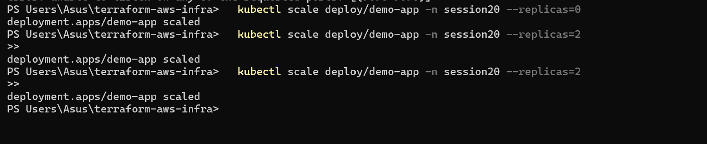
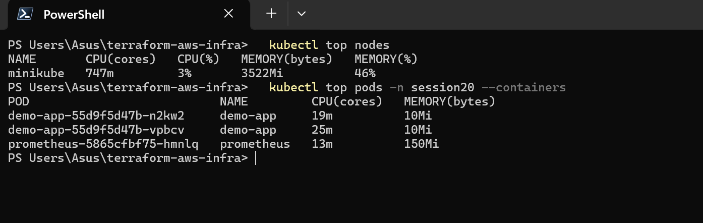
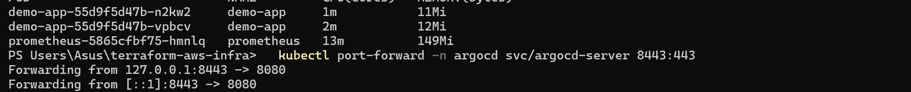

# Session 20 — Monitoring, Observability & GitOps

## Student Information

**Name:** Palak Agrawal
**Roll No.:** 24BCS10504

---

## Objective

Three tasks, each answering a different question about running software rather
than shipping it:

1. **Monitoring** — is it working, and how do I know? A real Prometheus
   deployment scraping a real application, with alerts made to fire on purpose.
2. **Observability** — when something breaks that nobody predicted, what lets
   you find out why? The three pillars, documented.
3. **GitOps** — how does change reach production safely? Argo CD keeping a
   cluster in continuous agreement with a Git repository.

Everything up to Session 19 was about getting code *out*. This session is about
what happens after it lands.

---

## Folder Structure

```
Monitoring, Observability & GitOps/
├── readme.md                        ← this file
│
├── monitoring/
│   ├── app/                         demo app: /metrics, /health, /ready
│   │   ├── server.js                no dependencies - metrics emitted by hand
│   │   └── Dockerfile
│   ├── k8s/
│   │   ├── 01-namespace.yaml
│   │   ├── 02-demo-app.yaml         requests/limits + all three probes
│   │   ├── 03-prometheus-rbac.yaml  read-only ClusterRole
│   │   ├── 04-prometheus-config.yaml  scrape config + 7 alert rules
│   │   └── 05-prometheus.yaml
│   └── README.md                    metrics, logs, alerts, CPU, memory, health
│
├── observability/
│   └── README.md                    the three pillars, tools, Kubernetes
│
├── gitops/
│   ├── gitea.yaml                   a Git server, in the cluster
│   ├── apps/guestbook.yaml          THE DESIRED STATE - what Argo reads
│   ├── argocd/application.yaml      the Argo CD Application
│   └── README.md                    GitOps, reconciliation, three drift tests
│
└── images/                          screenshots
```

| Task | Write-up |
|------|----------|
| 1. Monitoring | **[`monitoring/README.md`](monitoring/README.md)** |
| 2. Observability | **[`observability/README.md`](observability/README.md)** |
| 3. GitOps | **[`gitops/README.md`](gitops/README.md)** |

---

## What is running

```
namespace: session20        demo-app ×2  +  Prometheus
                            NodePort 30200 (app) / 30209 (Prometheus)

namespace: argocd           Argo CD v2.13.2, 7 pods

namespace: gitops           Gitea - the Git server holding the desired state

namespace: gitops-demo      guestbook - created by Argo CD from a Git commit,
                            never applied by hand
```

---

## Task 1 — Monitoring

### Metrics

The app exposes all four Prometheus metric types, by hand, so each is visible:

```
app_requests_total{path="/",status="200"} 40          counter
app_requests_total{path="/error",status="500"} 10     counter
app_ready 1                                           gauge
app_memory_bytes{area="rss"} 63291392                 gauge
app_request_duration_seconds_bucket{le="0.25"} …      histogram
app_cpu_seconds_total{mode="user"} 1.468783           counter
```

Prometheus **discovers** it rather than being told about it — the pod carries
`prometheus.io/scrape: "true"` and a relabel rule keeps annotated pods. Scale
the Deployment and the new pods are scraped with no config change:

```
demo-app               demo-app-55d9f5d47b-2gh2l      up
demo-app               demo-app-55d9f5d47b-mzhqd      up
kubernetes-cadvisor    -                              up
prometheus             -                              up
```

```
sum by (status) (app_requests_total)        200 → 204,  500 → 10
sum(rate(app_requests_total[5m]))           0.2649 req/s
histogram_quantile(0.95, …)                 0.2942 s   ← p95, not the average
```

### CPU utilisation

```
$ kubectl top pods -n session20 --containers
POD                           NAME         CPU(cores)   MEMORY(bytes)
demo-app-55d9f5d47b-2gh2l     demo-app     1m           11Mi
demo-app-55d9f5d47b-mzhqd     demo-app     2m           10Mi
prometheus-5865cfbf75-hmnlq   prometheus   18m          84Mi
```

and with history, from cAdvisor:

```
rate(container_cpu_usage_seconds_total{container="demo-app"}[2m])
  demo-app-…-2gh2l    0.0148 cores     ← took all the /work traffic
  demo-app-…-mzhqd    0.0005 cores     ← idle
```

The asymmetry is real — a per-pod view shows load imbalance a Deployment-level
average would hide.

### Memory utilisation

```
container_memory_working_set_bytes / container_spec_memory_limit_bytes
  demo-app-…-2gh2l    0.0958    → 9.6% of its limit
  demo-app-…-mzhqd    0.0892    → 8.9% of its limit
```

Measured against the **container's limit**, because that is the number at which
it gets OOM-killed — and using **working set**, not RSS, because that is what
the kernel uses to decide.

### Application health

Three probes, each answering a different question — readiness takes a pod out
of rotation, liveness kills and restarts it. Getting them the wrong way round
turns every downstream outage into a restart storm.

### Alerts

Seven rules loaded. One was made to fire by scaling the app to zero:

```
NoAppInstances     state=firing   severity=critical
    summary : No demo-app instances are up at all
```

**And the more interesting result: `AppDown` stayed silent.**

```yaml
- alert: AppDown
  expr: up{job="demo-app"} == 0          # ← never matched
- alert: NoAppInstances
  expr: absent(up{job="demo-app"}) or sum(up{job="demo-app"}) == 0
```

`up == 0` only matches a target that **exists and fails to scrape**. Scaling to
zero removed the pods from service discovery, so the `up` series vanished — and
an expression over a series that no longer exists matches nothing. The outage
where the target disappears entirely is invisible to the obvious alert, and
needs `absent()`, which fires *because* the data is missing.

---

## Task 2 — Observability

Full write-up: **[`observability/README.md`](observability/README.md)**

**Monitoring** watches for failures you already thought of. **Observability**
is being able to answer questions you did *not* think of, from the data the
system already emits.

| | Metrics | Logs | Traces |
|---|---|---|---|
| Answers | *Is something wrong?* | *What exactly happened?* | *Where did the time go?* |
| Cost | Cheap — aggregated | Expensive — per event | Moderate — sampled |
| Cardinality | **Must stay low** | Unlimited | Unlimited |

```
  Metrics          →          Traces          →          Logs
  "p99 doubled                "checkout spends           "connection pool
   at 14:20"                   2.8s in payments"          exhausted"

  something is wrong          where it is wrong          why it is wrong
```

The pillars only become observability when they share identifiers — exemplars
linking a metric sample to a trace, and a `trace_id` on every log line.
Without those joins you have three dashboards.

---

## Task 3 — GitOps

Full write-up: **[`gitops/README.md`](gitops/README.md)**

Sessions 16 and 17 deployed by **push** — the pipeline held a kubeconfig and
ran `kubectl apply`. GitOps inverts it to **pull**: an agent inside the cluster
watches a repository and applies what it finds. CI no longer deploys; it
commits.

A Git server runs in the cluster so the whole loop is demonstrable rather than
described. Argo CD was pointed at it and created everything from one commit:

```
$ kubectl get app guestbook -n argocd
NAME        SYNC     HEALTH    REVISION
guestbook   Synced   Healthy   656a23b051ebc2e71beade68c7eeaae3a58464b8

$ kubectl get all -n gitops-demo
deployment.apps/guestbook   2/2     ← the namespace, Deployment and Service
service/guestbook                     were all created by Argo, not by hand
```

### Reconciliation, tested three ways

**1 — change the cluster by hand:**

```
kubectl scale deploy/guestbook --replicas=5        23:05:10
immediately after: replicas=5
self-healed back to 2 at                           23:05:16     ← 6 seconds
```

**2 — delete a resource outright:**

```
kubectl delete svc guestbook                       23:05:16
No resources found in gitops-demo namespace.
Argo recreated it at                               23:05:19     ← 3 seconds
```

Note the new ClusterIP: Argo did not restore a backup, it rebuilt the object
from the manifest in Git.

**3 — change Git and touch nothing:**

```
pushed def7054 at 23:08:51 - NO refresh will be forced
cluster followed Git after 247s, with no manual trigger

Synced   Healthy   def705480a05fa6edcef1424a65a742edb001683
replicas=3  version=gitops-v2
```

The only action taken was `git push`. Longer than the nominal 3-minute poll
because the interval runs from the last reconciliation, not from the commit;
in production a webhook removes that delay and polling is the fallback.

The deployment history is a list of commits:

```
0  656a23b051ebc2e71beade68c7eeaae3a58464b8  2026-10-07T17:34:59Z
1  55658e91e1b2c2bab55f9356ce2f5fc5dad81b70  2026-10-07T17:38:10Z
2  def705480a05fa6edcef1424a65a742edb001683  2026-10-07T17:42:57Z
```

"What changed in production, when, and who approved it" becomes `git log`.

---

## Commands Used

```bash
# --- monitoring ----------------------------------------------------------
minikube addons enable metrics-server
docker build -t monitoring-demo:1.0.0 monitoring/app/
minikube image load monitoring-demo:1.0.0
kubectl apply -f monitoring/k8s/

kubectl port-forward -n session20 svc/prometheus 9090:9090
curl -s "http://localhost:9090/api/v1/targets?state=active"
curl -s "http://localhost:9090/api/v1/rules"
curl -s "http://localhost:9090/api/v1/alerts"

kubectl top nodes
kubectl top pods -n session20 --containers
kubectl logs -n session20 -l app=demo-app --tail=20

kubectl scale deploy/demo-app -n session20 --replicas=0   # make an alert fire
kubectl scale deploy/demo-app -n session20 --replicas=2

# --- gitops --------------------------------------------------------------
kubectl create namespace argocd
kubectl apply -n argocd -f https://raw.githubusercontent.com/argoproj/argo-cd/v2.13.2/manifests/install.yaml
kubectl apply -f gitops/gitea.yaml
kubectl exec -n gitops deploy/gitea -- gitea admin user create --username palak --password "$GITEA_PW" --email palak@example.invalid --admin
kubectl apply -f gitops/argocd/application.yaml

kubectl get app guestbook -n argocd
kubectl get all -n gitops-demo

# prove self-heal
kubectl scale deploy/guestbook -n gitops-demo --replicas=5
kubectl delete svc guestbook -n gitops-demo

# the UI, at https://localhost:8443 (user: admin)
kubectl port-forward -n argocd svc/argocd-server 8443:443
kubectl -n argocd get secret argocd-initial-admin-secret -o jsonpath='{.data.password}' | base64 -d
```

---

## Screenshots







---

## Issues Faced & Fixes

| # | Problem | Cause | Fix |
|---|---------|-------|-----|
| 1 | The `kubernetes-cadvisor` target was `down` with **403 Forbidden** | The ClusterRole granted `nodes` and `nodes/metrics`, but scraping via `/api/v1/nodes/<node>/proxy/metrics/cadvisor` is authorised by a different subresource — `nodes/proxy` | Added `nodes/proxy`. The two names look interchangeable and are not: one covers the kubelet's own endpoint, the other covers reaching it through the API server |
| 2 | `AppDown` stayed silent through a complete outage | `up{job="demo-app"} == 0` cannot match when the series does not exist, and scaling to zero removes the targets from discovery entirely | Kept it and added `NoAppInstances` using `absent()`. Both are needed — they catch different failures, and the table in the monitoring write-up says which |
| 3 | The error-ratio query returned `0` despite ten recorded 500s | `rate()` measures increase across a window; the burst had aged out of it | Not a bug. It is exactly why `HighErrorRate` is built on `rate` — it should fire while errors are happening, not forever after because a counter is non-zero |
| 4 | Prometheus and Argo CD pods stuck in `ImagePullBackOff`: `lookup quay.io on 192.168.65.254:53: server misbehaving` | Docker Desktop's DNS resolver inside the minikube VM was intermittently failing | Kubernetes' own pull backoff eventually succeeded. Adding `8.8.8.8` to the VM's resolv.conf did **not** help — it is unreachable from inside Docker Desktop's network — so that edit was reverted |
| 5 | `minikube ssh -- docker pull` failed: `dial unix /var/run/docker.sock: no such file` | minikube runs **containerd**, not Docker — there is no Docker socket in the VM | Used `minikube image pull`, which talks to whatever runtime the node actually has |
| 6 | `sudo sed -i /etc/resolv.conf` failed: `cannot rename: Device or resource busy` | `sed -i` writes a temp file and renames over the original; resolv.conf is a bind mount and the inode cannot be replaced | Rewrote the contents in place instead of replacing the file |
| 7 | The first commit→sync test was inconclusive | A forced refresh was issued within seconds of the natural poll landing, so there was no way to attribute the sync | Re-ran it with no intervention at all. The ambiguous run is described in the write-up rather than quietly dropped |

---

## What I Learned

**The obvious alert misses the obvious outage.** `up == 0` reads like the
correct way to detect a dead service, and it cannot fire when the target
disappears — which is what a scaled-down Deployment, a deleted namespace or a
broken service discovery all look like. Catching absence needs `absent()`.
That one took a deliberate outage to discover, and it is the kind of thing that
is only ever found by testing an alert rather than writing it.

**Alert on symptoms, not causes.** "CPU is high" describes a server doing its
job. "The container is being CPU-throttled" describes users waiting. The
resource alerts here pick the symptom version of each deliberately, because an
alert that fires when nothing is wrong teaches everyone to ignore alerts.

**Working set, not RSS; the limit, not the node.** The same container reports
63 MB RSS and 12 MB working set — the difference is reclaimable page cache.
The kernel OOM-kills on working set against the container's own limit, so
that is what the alert divides by. Alerting on RSS against node capacity would
be wrong twice over.

**metrics-server is not monitoring.** It holds about sixty seconds in memory
and stores nothing. It powers `kubectl top` and the HPA, and it cannot answer
"what happened at 2am". Those are different jobs and need different components.

**Self-heal is faster and blunter than expected.** A manual `kubectl scale`
lasted six seconds. A deleted Service was back in three — with a new ClusterIP,
because Argo rebuilt it from the manifest rather than restoring anything. Once
that is running, `kubectl edit` on a managed resource stops being a way to
change things and becomes a way to briefly annoy a controller.

**Declarative is what makes reconciliation possible.** An agent can apply the
same manifest every three minutes forever only because applying it twice is a
no-op. A list of commands could not be re-run that way. It is the same property
Terraform depends on in Sessions 18 and 19, surfacing in a different tool.

**Pull beats push for credentials.** In Sessions 16 and 17 the pipeline held a
kubeconfig. Here nothing outside the cluster can change it — the agent's
credentials never leave, and merge rights replace cluster access.

---

## Conclusion

Monitoring, observability and GitOps are three answers to the same question:
once software is running, how do you know what it is doing, and how do you
change it safely?

The parts that taught the most were the ones that did not behave as expected.
An alert that looked obviously correct never fired. A query that returned zero
was right to. A manual change to the cluster undid itself in six seconds. None
of those would have surfaced from reading about the tools — they came from
causing the failure on purpose and watching what actually happened.

Which is the point of the session. A monitoring setup nobody has ever seen fire
is a hypothesis, not a safety net.
