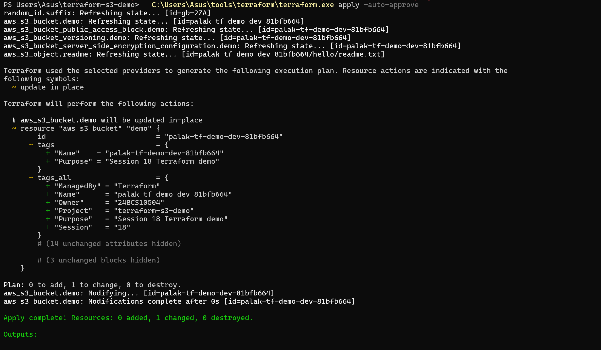
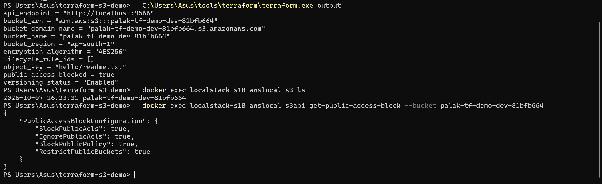
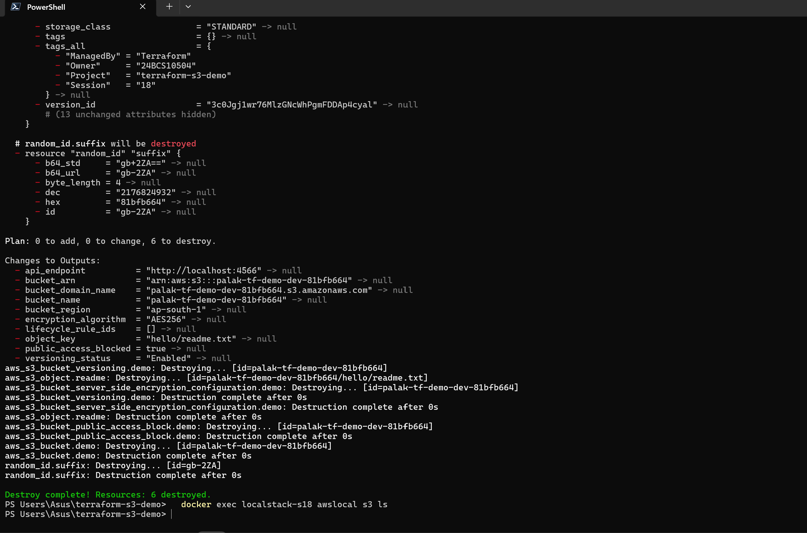

# Session 18 — Terraform & Infrastructure as Code

## Student Information

**Name:** Palak Agrawal
**Roll No.:** 24BCS10504

---

## Objective

Two tasks:

1. **Build a real Terraform project** that creates an AWS S3 bucket, and run the
   complete workflow end to end — `init`, `fmt`, `validate`, `plan`, `apply`,
   `show`, `output`, `destroy` — documenting every step with its actual output.
2. **Research five AWS service areas** — IAM, EC2, S3, VPC, and the database
   services — and write up each one.

Everything before this session configured infrastructure that already existed:
containers on a machine someone else provisioned, pods on a cluster someone
else created. This session is about creating the infrastructure itself, and
doing it as **code** — declared in files, reviewed in version control,
reproducible on demand.

---

## Folder Structure

```
Terraform & Infrastructure as Code/
├── readme.md                       ← this file
│
├── terraform-s3-demo/
│   ├── provider.tf                 terraform{} + aws/random providers
│   ├── variables.tf                every input, typed and validated
│   ├── main.tf                     the resources
│   ├── outputs.tf                  what the configuration returns
│   ├── terraform.tfvars            the values (no secrets)
│   ├── .terraform.lock.hcl         provider checksums — committed on purpose
│   ├── .gitignore                  keeps state and plugins out of git
│   └── README.md                   the full workflow, with real output
│
├── aws-services/
│   ├── 01-iam/README.md            identities, policies, least privilege
│   ├── 02-ec2/README.md            AMIs, instance types, EBS, lifecycle
│   ├── 03-s3/README.md             buckets, objects, classes, versioning
│   ├── 04-vpc/README.md            CIDR, subnets, routing, NACLs
│   └── 05-dynamodb-rds/README.md   DynamoDB and RDS, and when to use which
│
└── images/                         screenshots
```

---

## What Infrastructure as Code actually changes

The point is not "scripts that create servers". Shell scripts did that for
decades. The change is **declarative state**:

| | Script (imperative) | Terraform (declarative) |
|---|---|---|
| You write | the steps to take | the end state you want |
| Run it twice | it runs twice — probably an error the second time | **no change** the second time |
| Partial failure | you work out where it stopped | it knows what exists and continues |
| Drift | invisible | `plan` shows it |
| Deleting things | you write the teardown too | `destroy` derives it |

Terraform keeps a **state file** mapping the configuration to real resources.
Every run refreshes that state against the live API, diffs it against the
configuration, and shows the gap. That diff — the `plan` — is the feature. It
is infrastructure you can review in a pull request before anything happens.

---

## Task 1 — terraform-s3-demo

Full write-up with every command's real output: **[`terraform-s3-demo/README.md`](terraform-s3-demo/README.md)**

### What it creates

| Resource | Purpose |
|----------|---------|
| `random_id.suffix` | Four random bytes, because S3 bucket names are globally unique |
| `aws_s3_bucket.demo` | The bucket |
| `aws_s3_bucket_versioning.demo` | Old versions kept instead of overwritten |
| `aws_s3_bucket_server_side_encryption_configuration.demo` | AES256 at rest |
| `aws_s3_bucket_public_access_block.demo` | All four public-access switches on |
| `aws_s3_bucket_lifecycle_configuration.demo` | Expires old versions, aborts stalled uploads |
| `aws_s3_object.readme` | An object, so `destroy` has to handle a non-empty bucket |

### Where it runs

Against **LocalStack**, an AWS emulator serving the real AWS APIs on
`localhost:4566`. The provider, the resource types, the state file and the API
calls are all genuinely AWS's — only the endpoint moves, and it moves because
of one variable:

```hcl
use_localstack = true     # false → the same configuration applies to real AWS
```

That is the Infrastructure as Code argument compressed into a single line: the
same declaration, retargeted, with no edits to the resources.

### The workflow, in one block

```
terraform init        → Installed hashicorp/aws v6.67.0 (signed by HashiCorp)
                        Terraform has been successfully initialized!

terraform fmt -check  → (no output, exit 0 — already canonical)

terraform validate    → Success! The configuration is valid.

terraform plan        → Plan: 6 to add, 0 to change, 0 to destroy.

terraform apply       → Apply complete! Resources: 6 added, 0 changed, 0 destroyed.

terraform show        → arn = "arn:aws:s3:::palak-tf-demo-dev-4759b28d"

terraform output      → bucket_name = "palak-tf-demo-dev-4759b28d"
                        versioning_status = "Enabled"
                        encryption_algorithm = "AES256"
                        public_access_blocked = true

terraform destroy     → Destroy complete! Resources: 6 destroyed.
```

### Verified from outside Terraform

Terraform reporting success is Terraform reporting on itself, so each setting
was checked against the S3 API directly:

```
$ awslocal s3api get-bucket-versioning --bucket palak-tf-demo-dev-4759b28d
{ "Status": "Enabled" }

$ awslocal s3api get-public-access-block --bucket palak-tf-demo-dev-4759b28d
{ "PublicAccessBlockConfiguration": {
    "BlockPublicAcls": true, "IgnorePublicAcls": true,
    "BlockPublicPolicy": true, "RestrictPublicBuckets": true } }

$ awslocal s3 ls          # after destroy
$                         # nothing left
```

---

## Task 2 — AWS Services

| # | Service | Covers |
|---|---------|--------|
| 01 | **[IAM](aws-services/01-iam/README.md)** | Users, groups, roles, policies, how a request is evaluated, least privilege, best practices |
| 02 | **[EC2](aws-services/02-ec2/README.md)** | AMIs, instance type naming, key pairs, security groups, EBS, public vs private IP, the lifecycle |
| 03 | **[S3](aws-services/03-s3/README.md)** | Buckets, objects, storage classes, versioning, lifecycle, encryption, bucket policies |
| 04 | **[VPC](aws-services/04-vpc/README.md)** | CIDR, subnets, route tables, IGW, NAT, security groups vs NACLs |
| 05 | **[DynamoDB & RDS](aws-services/05-dynamodb-rds/README.md)** | Partition and sort keys, capacity modes; engines, Multi-AZ, read replicas, backups |

A few things these five kept returning to:

- **Public vs private is a routing decision, not a checkbox.** A subnet is
  public because its route table points `0.0.0.0/0` at an internet gateway.
  Change that one line and it is private.
- **Stateful vs stateless is the security group / NACL distinction**, and it is
  why NACLs need rules for ephemeral ports in the return direction and security
  groups do not.
- **Default-deny runs through all of it.** IAM starts at deny. Security groups
  start at deny inbound. New buckets block public access. The work is in
  granting the minimum, not in taking things away.
- **Temporary credentials beat static keys.** Roles over users, instance
  profiles over `.aws/credentials`, OIDC over a stored secret — the same
  argument Session 17's pipeline made when it used `GITHUB_TOKEN` instead of a
  personal access token.

---

## Commands Used

```bash
# --- tooling -----------------------------------------------------------------
terraform version
docker run -d --name localstack-s18 -p 4566:4566 -e SERVICES=s3 localstack/localstack:3
curl -s http://localhost:4566/_localstack/health

# --- the workflow ------------------------------------------------------------
cd terraform-s3-demo
terraform init
terraform fmt -check -diff
terraform validate
terraform plan -out=tfplan
terraform apply tfplan
terraform show
terraform state list
terraform output
terraform output -raw bucket_name
terraform destroy -auto-approve

# --- verification, outside Terraform -----------------------------------------
docker exec localstack-s18 awslocal s3 ls
docker exec localstack-s18 awslocal s3 ls s3://<bucket> --recursive
docker exec localstack-s18 awslocal s3api get-bucket-versioning --bucket <bucket>
docker exec localstack-s18 awslocal s3api get-bucket-encryption --bucket <bucket>
docker exec localstack-s18 awslocal s3api get-public-access-block --bucket <bucket>

# --- cleanup -----------------------------------------------------------------
docker rm -f localstack-s18
```

---

## Screenshots







---

## Issues Faced & Fixes

| # | Problem | Cause | Fix |
|---|---------|-------|-----|
| 1 | `terraform apply` hung for exactly 3 minutes on the lifecycle configuration, then failed with `context deadline exceeded` | After writing a lifecycle rule the AWS provider re-reads it and waits for the response to match what it sent. LocalStack's response omits fields real S3 returns, so it never matches | Confirmed via the raw API that the rules **were** created correctly, then gave the resource `count = var.use_localstack ? 0 : 1` with the reason in a comment — skipped on LocalStack, normal against real AWS |
| 2 | First attempted fix — writing `filter { prefix = "" }` instead of `filter {}` — did not help | The mismatch is in fields the configuration does not control, not in the filter | Kept the explicit prefix anyway (it is clearer) and moved to the `count` approach |
| 3 | A second `plan` on unchanged configuration reported `1 to change` rather than `No changes` | LocalStack accepts `PutBucketTagging` but answers `NoSuchTagSet` on read, so Terraform sees the tags missing on every refresh | Left in place and documented — it is a LocalStack gap, and it demonstrates drift detection better than anything contrived |
| 4 | `localstack/localstack:latest` exited immediately, code 55: `License activation failed!` | Current LocalStack images are the Pro build and require an auth token | Pinned `localstack/localstack:3`, the last community image |
| 5 | Writing large `.tf` and `.md` files through a shell heredoc failed with `unexpected EOF while looking for matching quote` | Backticks and quotes inside the content were interpreted before the heredoc terminated | Wrote the files directly rather than piping them through the shell |
| 6 | Nothing was installed: `terraform: command not found`, `aws: command not found`, Docker daemon not running | Fresh toolchain for this session | Downloaded the Terraform 1.16.5 binary, started Docker Desktop, used `awslocal` inside the LocalStack container instead of installing the AWS CLI |

---

## What I Learned

**The plan is the product.** Every other tool in this course did a thing and
told you afterwards. Terraform tells you first, in reviewable detail, and
`-out=tfplan` makes the apply execute exactly what was reviewed. That is the
difference between a deployment and a change you can approve.

**`(known after apply)` is not vagueness, it is honesty.** Terraform cannot
know a bucket's ARN before the bucket exists, so it says so, and resolves it
during apply. Meanwhile everything that *is* knowable is shown — which is what
makes a plan worth reading.

**Dependencies come from references, not declarations.** Seven resources, two
`depends_on` lines. Writing `bucket = aws_s3_bucket.demo.id` is what creates
the ordering. `depends_on` is only for the ordering that is real but invisible
— here, uploading the object after the public access block exists, so there is
never a window where the bucket is less protected than the code claims.

**The dependency graph is visible in the apply log.** The bucket is created,
then three settings run in parallel because none of them references the others,
then the object waits for its explicit dependency. Destroy walks the same graph
backwards. Nothing about that order is coincidence.

**State is the whole trick, and the whole risk.** It is why `plan` is fast, why
Terraform knows what it owns, and why losing the file means losing the link to
real infrastructure. It also holds every attribute in plaintext — which is why
it is gitignored here and why a real project puts it in an encrypted remote
backend with a lock.

**A perpetual diff is a feature working correctly.** The tags drift was
annoying until it was clear what it proved: Terraform does not trust its own
state, it re-reads the world first. Had someone edited that bucket by hand,
this is exactly how it would have shown up.

**The honest fix beats the quiet one — again.** The lifecycle resource could
have been deleted to make the apply green. Instead the API response showing the
rules *were* written is in the write-up, the resource stays in the code, and a
`count` with a comment says precisely why it is skipped and when it is not.
Same principle as Session 17's security findings: fix the thing, or document it
plainly — never just silence it.

---

## Conclusion

The session's claim — "infrastructure as code" — only means something if the
code is the source of truth. The proof is `destroy` followed by `apply`:
everything comes back, identical, from the files alone. Nothing was clicked,
nothing is remembered on anyone's laptop, and the whole of it fits in a pull
request.

Three LocalStack gaps turned up on the way. Each one got the same treatment the
security findings got in Session 17 — verified against the raw API, fixed where
a fix existed, and documented where it did not. The write-up says which is
which.
